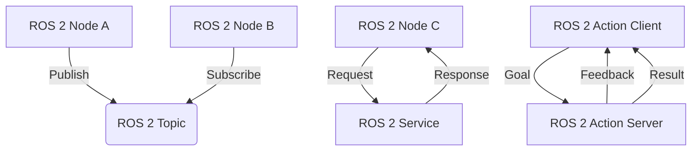

# Introduction to ROS 2: The Robotic Nervous System

## Learning Objectives

By the end of this chapter, you will be able to:
- Define what ROS 2 is and explain its role in robotics
- Understand why ROS 2 is called the "robotic nervous system"
- Identify the key components and architecture of ROS 2
- Explain the difference between ROS 1 and ROS 2
- Recognize the main use cases and applications of ROS 2

## What is ROS 2?

ROS 2 (Robot Operating System 2) is not an actual operating system, but rather a flexible framework for writing robot software. It is a collection of tools, libraries, and conventions that aim to simplify the task of creating complex and robust robot behavior across a wide variety of robot platforms.

ROS 2 is the next generation of the Robot Operating System, designed to address the limitations of the original ROS (ROS 1) and provide a more robust, scalable, and production-ready platform for robotics development.

## Why is ROS 2 Called the "Robotic Nervous System"?

The term "robotic nervous system" aptly describes ROS 2's role in robotics. Just as the nervous system in biological organisms:

- Processes sensory information from the environment
- Coordinates responses across different body parts
- Enables communication between different systems
- Provides a framework for complex behaviors

ROS 2 serves as the communication backbone that allows different software components in a robot to interact seamlessly. It provides:

- **Sensing**: Interfaces for cameras, lidars, IMUs, and other sensors
- **Processing**: Tools for perception, planning, and decision-making
- **Actuation**: Control interfaces for motors, grippers, and other actuators
- **Coordination**: Communication protocols that tie everything together

## Key Components of ROS 2 Architecture

ROS 2 is built on a distributed architecture where different processes (called "nodes") communicate with each other through messages. Here are the main components:

### Nodes
A node is a process that performs computation. In ROS 2, nodes are designed to be modular and focused on specific tasks. Multiple nodes work together to form a complete robotic application.

### Topics and Messages
Topics are named buses over which nodes exchange messages. Messages are the data packets sent between nodes. This publisher-subscriber model allows for asynchronous communication.

### Services
Services provide a request-response communication pattern. A node sends a request and waits for a response from a service server.

### Actions
Actions are similar to services but designed for long-running tasks. They provide feedback during execution and can be canceled.

### Parameters
Parameters are configuration values that can be set at runtime and shared between nodes.

## ROS 2 vs ROS 1: Key Differences

ROS 2 was designed to address several limitations of ROS 1:

- **Middleware**: ROS 2 uses DDS (Data Distribution Service) as its middleware, providing better scalability and real-time performance
- **Security**: ROS 2 includes built-in security features for authentication, access control, and encryption
- **Real-time Support**: Better support for real-time systems with deterministic behavior
- **Cross-platform**: Improved support for different operating systems including Windows and macOS
- **Quality of Service**: Configurable communication policies for different network conditions

## Communication Patterns in ROS 2

## Common Use Cases

ROS 2 is used across various robotics applications:

- **Autonomous Vehicles**: Self-driving cars and delivery robots
- **Industrial Automation**: Manufacturing and warehouse robots
- **Service Robots**: Cleaning, assistance, and hospitality robots
- **Research Platforms**: Academic and commercial research robots
- **Agriculture**: Autonomous tractors and harvesting robots
- **Healthcare**: Surgical and rehabilitation robots

## Getting Started with ROS 2

To work with ROS 2, you'll typically need:

1. A supported operating system (Ubuntu Linux, Windows 10/11, or macOS)
2. The ROS 2 distribution installed (Humble Hawksbill is the current LTS)
3. A workspace to organize your projects
4. Basic knowledge of the command-line tools

## Summary

ROS 2 serves as the foundation for modern robotics development, providing a comprehensive ecosystem of tools and libraries. Understanding its architecture and communication patterns is crucial for developing complex robotic systems. As the "robotic nervous system," ROS 2 enables the coordination of multiple components to achieve sophisticated robot behaviors.

In the next chapter, we'll dive deeper into the core concepts of nodes, topics, and messages, which form the foundation of ROS 2 communication.