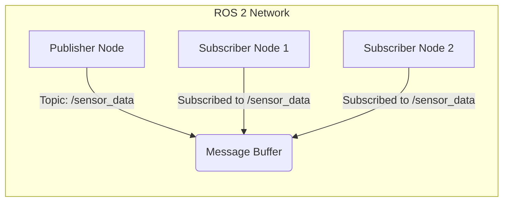

# Core Concepts - Nodes, Topics, and Messages

## Learning Objectives

By the end of this chapter, you will be able to:
- Define nodes, topics, and messages in ROS 2
- Explain the publisher-subscriber communication pattern
- Create simple publisher and subscriber nodes in Python
- Understand message types and their structure
- Implement basic communication between ROS 2 nodes

## Understanding Nodes

In ROS 2, a **node** is a process that performs computation. Nodes are the fundamental building blocks of a ROS 2 program. Each node operates independently and communicates with other nodes through messages.

Nodes are designed to be modular and focused on specific tasks. For example, one node might handle sensor data processing, another might handle path planning, and yet another might handle motor control. This modularity allows for flexible and reusable robot software architectures.

### Creating a Node

In Python, a node is typically created by subclassing the `rclpy.node.Node` class:

```python
import rclpy
from rclpy.node import Node

class MinimalPublisher(Node):
    def __init__(self):
        super().__init__('minimal_publisher')
        # Node initialization code here
```

## Topics and Publisher-Subscriber Pattern

**Topics** are named buses over which nodes exchange messages. The publisher-subscriber pattern is the primary communication mechanism in ROS 2, enabling asynchronous communication between nodes.

- **Publisher**: A node that sends messages to a topic
- **Subscriber**: A node that receives messages from a topic
- **Topic**: The named channel through which messages flow

This pattern allows for loose coupling between nodes - publishers don't need to know who is subscribing to their messages, and subscribers don't need to know who is publishing to their topics.

## Message Types

Messages are the data structures that are passed between nodes. ROS 2 provides a variety of built-in message types and allows users to define custom message types. Common message types include:

- `std_msgs`: Basic data types like integers, floats, strings
- `sensor_msgs`: Sensor data like images, laser scans, IMU data
- `geometry_msgs`: Geometric primitives like points, poses, twists
- `nav_msgs`: Navigation-related messages like paths and odometry

## Communication Pattern Diagram



## Implementing a Simple Publisher-Subscriber Example

Let's implement a simple publisher that sends "Hello" messages and a subscriber that receives and prints them.

### Publisher Node

```python
# publisher_member_function.py
import rclpy
from rclpy.node import Node
from std_msgs.msg import String

class MinimalPublisher(Node):
    def __init__(self):
        super().__init__('minimal_publisher')
        self.publisher_ = self.create_publisher(String, 'topic', 10)
        timer_period = 0.5  # seconds
        self.timer = self.create_timer(timer_period, self.timer_callback)
        self.i = 0

    def timer_callback(self):
        msg = String()
        msg.data = 'Hello World: %d' % self.i
        self.publisher_.publish(msg)
        self.get_logger().info('Publishing: "%s"' % msg.data)
        self.i += 1

def main(args=None):
    rclpy.init(args=args)
    minimal_publisher = MinimalPublisher()
    rclpy.spin(minimal_publisher)
    minimal_publisher.destroy_node()
    rclpy.shutdown()

if __name__ == '__main__':
    main()
```

### Subscriber Node

```python
# subscriber_member_function.py
import rclpy
from rclpy.node import Node
from std_msgs.msg import String

class MinimalSubscriber(Node):
    def __init__(self):
        super().__init__('minimal_subscriber')
        self.subscription = self.create_subscription(
            String,
            'topic',
            self.listener_callback,
            10)
        self.subscription  # prevent unused variable warning

    def listener_callback(self, msg):
        self.get_logger().info('I heard: "%s"' % msg.data)

def main(args=None):
    rclpy.init(args=args)
    minimal_subscriber = MinimalSubscriber()
    rclpy.spin(minimal_subscriber)
    minimal_subscriber.destroy_node()
    rclpy.shutdown()

if __name__ == '__main__':
    main()
```

## Running the Example

To run this example:

1. Make sure your ROS 2 environment is sourced:
   ```bash
   source /opt/ros/humble/setup.bash  # or your ROS 2 distribution
   ```

2. Run the publisher in one terminal:
   ```bash
   python3 publisher_member_function.py
   ```

3. Run the subscriber in another terminal:
   ```bash
   python3 subscriber_member_function.py
   ```

You should see the publisher sending messages and the subscriber receiving them.

## Quality of Service (QoS) Settings

ROS 2 provides Quality of Service (QoS) settings that allow you to configure communication behavior:

- **Reliability**: Whether messages should be guaranteed to be delivered
- **Durability**: Whether late-joining subscribers should receive old messages
- **History**: How many messages to store for late-joining subscribers
- **Depth**: How many messages to store in the history

```python
from rclpy.qos import QoSProfile

qos_profile = QoSProfile(depth=10)
publisher = node.create_publisher(String, 'topic', qos_profile)
```

## Advanced Topics

### Multiple Publishers and Subscribers

A single topic can have multiple publishers and subscribers. This enables flexible system architectures where multiple nodes can contribute to or consume the same data stream.

### Topic Namespaces

Topics can be organized using namespaces to avoid naming conflicts:

```python
publisher = node.create_publisher(String, '/robot1/sensor_data', 10)
```

### Command-Line Tools

ROS 2 provides command-line tools to inspect the system:

- `ros2 topic list`: List all topics
- `ros2 topic echo <topic_name>`: Print messages from a topic
- `ros2 topic info <topic_name>`: Get information about a topic
- `ros2 topic pub <topic_name> <msg_type> <args>`: Publish a message

## Best Practices

1. **Use descriptive topic names**: Follow naming conventions and use meaningful names
2. **Match QoS settings**: Publishers and subscribers should have compatible QoS settings
3. **Handle message rates**: Be mindful of message rates to avoid overwhelming the system
4. **Use appropriate message types**: Choose the right message type for your data
5. **Error handling**: Implement proper error handling in your nodes

## Summary

Nodes, topics, and messages form the foundation of ROS 2 communication. The publisher-subscriber pattern enables flexible, decoupled system architectures. Understanding these concepts is essential for building robust robotic systems with ROS 2.

In the next chapter, we'll explore services and actions, which provide different communication patterns for request-response interactions and long-running tasks.