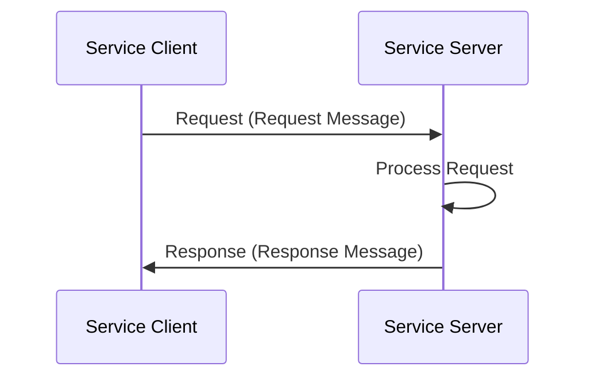
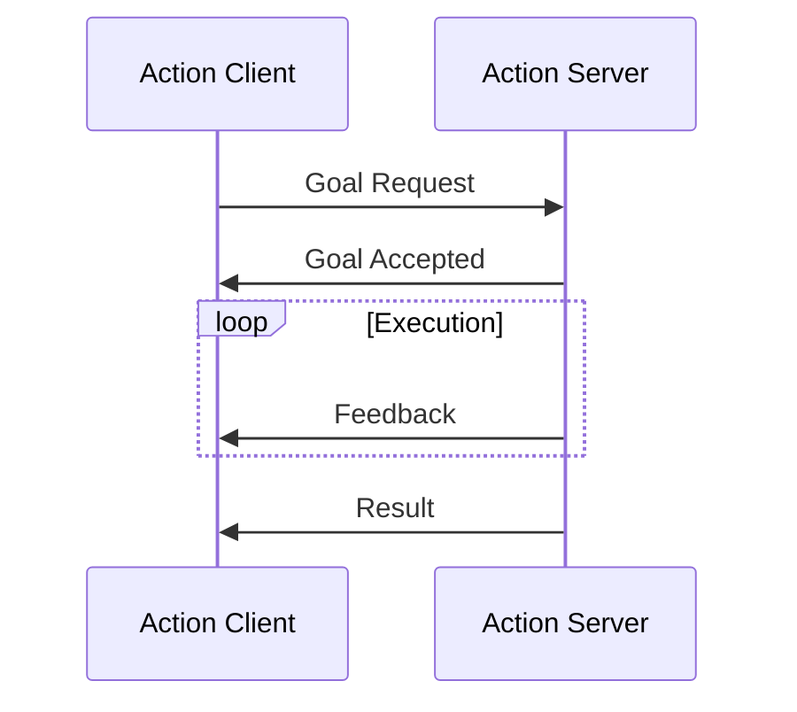

# Services and Actions: Request-Response Communication and Long-Running Tasks

## Learning Objectives

By the end of this chapter, you will be able to:
- Define services and actions in ROS 2
- Understand when to use services vs. actions vs. topics
- Create service servers and clients in Python
- Implement action servers and clients for long-running tasks
- Compare the different communication patterns in ROS 2

## Services in ROS 2

Services in ROS 2 provide a request-response communication pattern, which is synchronous. Unlike the asynchronous publisher-subscriber model used with topics, services follow a client-server architecture where:

- A **service client** sends a request and waits for a response
- A **service server** receives the request, processes it, and sends back a response

This pattern is appropriate for operations that:
- Have a clear beginning and end
- Require a specific response to a request
- Are relatively fast to execute (typically less than a few seconds)

### Service Architecture



### Service Message Types

Services use `.srv` files that define both request and response message structures. For example:

```
# Request (before the --- separator)
string name
int32 age
---
# Response (after the --- separator)
bool success
string message
```

## Creating a Service Server

Here's an example of a simple service server in Python:

```python
# service_member_function.py
import rclpy
from rclpy.node import Node
from example_interfaces.srv import AddTwoInts

class MinimalService(Node):
    def __init__(self):
        super().__init__('minimal_service')
        self.srv = self.create_service(AddTwoInts, 'add_two_ints', self.add_two_ints_callback)

    def add_two_ints_callback(self, request, response):
        response.sum = request.a + request.b
        self.get_logger().info('Incoming request\na: %d b: %d' % (request.a, request.b))
        return response

def main(args=None):
    rclpy.init(args=args)
    minimal_service = MinimalService()
    rclpy.spin(minimal_service)
    rclpy.shutdown()

if __name__ == '__main__':
    main()
```

## Creating a Service Client

Here's how to create a client for the service:

```python
# client_member_function.py
import sys
import rclpy
from rclpy.node import Node
from example_interfaces.srv import AddTwoInts

class MinimalClient(Node):
    def __init__(self):
        super().__init__('minimal_client')
        self.cli = self.create_client(AddTwoInts, 'add_two_ints')
        while not self.cli.wait_for_service(timeout_sec=1.0):
            self.get_logger().info('service not available, waiting again...')
        self.req = AddTwoInts.Request()

    def send_request(self, a, b):
        self.req.a = a
        self.req.b = b
        self.future = self.cli.call_async(self.req)
        rclpy.spin_until_future_complete(self, self.future)
        return self.future.result()

def main(args=None):
    rclpy.init(args=args)
    minimal_client = MinimalClient()
    response = minimal_client.send_request(int(sys.argv[1]), int(sys.argv[2]))
    minimal_client.get_logger().info(
        'Result of add_two_ints: %d' % response.sum)
    minimal_client.destroy_node()
    rclpy.shutdown()

if __name__ == '__main__':
    main()
```

## Actions in ROS 2

Actions are designed for long-running tasks that may take seconds, minutes, or even hours to complete. Unlike services, actions provide:

- **Feedback**: Updates during execution
- **Goal management**: Ability to cancel or update goals
- **Result**: Final outcome when the action completes

Actions are appropriate for operations that:
- Take a long time to complete
- Need to provide periodic feedback
- May need to be canceled or preempted
- Have a clear goal and result structure

### Action Architecture



### Action Message Types

Actions use `.action` files with three parts:
- **Goal**: The request to start the action
- **Result**: The final outcome
- **Feedback**: Intermediate status updates

Example:
```
# Goal
int32 order
---
# Result
int32[] sequence
---
# Feedback
int32[] sequence
```

## Creating an Action Server

Here's an example of a simple action server:

```python
# action_server.py
import time
import rclpy
from rclpy.action import ActionServer
from rclpy.node import Node
from example_interfaces.action import Fibonacci

class FibonacciActionServer(Node):
    def __init__(self):
        super().__init__('fibonacci_action_server')
        self._action_server = ActionServer(
            self,
            Fibonacci,
            'fibonacci',
            self.execute_callback)

    def execute_callback(self, goal_handle):
        self.get_logger().info('Executing goal...')

        feedback_msg = Fibonacci.Feedback()
        feedback_msg.sequence = [0, 1]

        for i in range(1, goal_handle.request.order):
            if goal_handle.is_cancel_requested:
                goal_handle.canceled()
                self.get_logger().info('Goal canceled')
                return Fibonacci.Result()

            feedback_msg.sequence.append(
                feedback_msg.sequence[i] + feedback_msg.sequence[i-1])

            goal_handle.publish_feedback(feedback_msg)
            time.sleep(1)

        goal_handle.succeed()
        result = Fibonacci.Result()
        result.sequence = feedback_msg.sequence
        self.get_logger().info('Returning result: {0}'.format(result.sequence))

        return result

def main(args=None):
    rclpy.init(args=args)
    fibonacci_action_server = FibonacciActionServer()
    rclpy.spin(fibonacci_action_server)
    fibonacci_action_server.destroy_node()
    rclpy.shutdown()

if __name__ == '__main__':
    main()
```

## Creating an Action Client

Here's how to create an action client:

```python
# action_client.py
import time
import rclpy
from rclpy.action import ActionClient
from rclpy.node import Node
from example_interfaces.action import Fibonacci

class FibonacciActionClient(Node):
    def __init__(self):
        super().__init__('fibonacci_action_client')
        self._action_client = ActionClient(
            self,
            Fibonacci,
            'fibonacci')

    def send_goal(self, order):
        goal_msg = Fibonacci.Goal()
        goal_msg.order = order

        self._action_client.wait_for_server()
        self._send_goal_future = self._action_client.send_goal_async(
            goal_msg,
            feedback_callback=self.feedback_callback)

        self._send_goal_future.add_done_callback(self.goal_response_callback)

    def goal_response_callback(self, future):
        goal_handle = future.result()
        if not goal_handle.accepted:
            self.get_logger().info('Goal rejected :(')
            return

        self.get_logger().info('Goal accepted :)')
        self._get_result_future = goal_handle.get_result_async()
        self._get_result_future.add_done_callback(self.get_result_callback)

    def feedback_callback(self, feedback_msg):
        feedback = feedback_msg.feedback
        self.get_logger().info('Received feedback: {0}'.format(feedback.sequence))

    def get_result_callback(self, future):
        result = future.result().result
        self.get_logger().info('Result: {0}'.format(result.sequence))
        rclpy.shutdown()

def main(args=None):
    rclpy.init(args=args)
    action_client = FibonacciActionClient()
    action_client.send_goal(10)
    rclpy.spin(action_client)

if __name__ == '__main__':
    main()
```

## Comparing Communication Patterns

| Pattern | Type | Use Case | Characteristics |
|---------|------|----------|-----------------|
| Topics | Publisher-Subscriber | Continuous data streams | Asynchronous, many-to-many |
| Services | Request-Response | Quick operations | Synchronous, one-to-one |
| Actions | Goal-Feedback-Result | Long-running tasks | Asynchronous with feedback |

## When to Use Each Pattern

- **Topics**: Sensor data, status updates, continuous control commands
- **Services**: Configuration changes, triggering actions, calculations
- **Actions**: Navigation goals, complex manipulations, data processing

## Command-Line Tools

ROS 2 provides tools to inspect services and actions:

- `ros2 service list`: List all services
- `ros2 service call <service_name> <service_type> <args>`: Call a service
- `ros2 action list`: List all actions
- `ros2 action send_goal <action_name> <action_type> <goal>`: Send an action goal

## Summary

Services and actions provide alternative communication patterns to topics. Services are ideal for quick request-response interactions, while actions are designed for long-running tasks that need feedback. Understanding when to use each pattern is crucial for designing effective ROS 2 systems.

In the next chapter, we'll explore parameters and dynamic configuration in ROS 2.