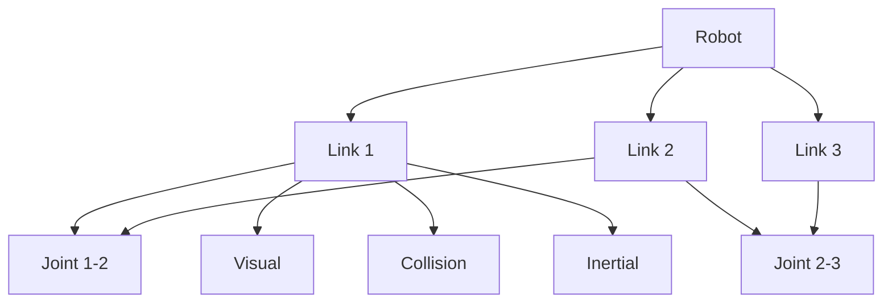

# URDF Fundamentals: Unified Robot Description Format

## Learning Objectives

By the end of this chapter, you will be able to:
- Define URDF and explain its purpose in robotics
- Create basic URDF files for simple robots
- Understand the structure of URDF elements: links, joints, and materials
- Visualize URDF models in RViz
- Model kinematic chains and robot geometries
- Use Xacro for more complex and parameterized URDF descriptions

## What is URDF?

URDF (Unified Robot Description Format) is an XML-based format used in ROS to describe robot models. It provides a complete definition of a robot's physical properties including:

- **Kinematic structure**: How different parts are connected
- **Visual properties**: How the robot looks in simulation and visualization
- **Collision properties**: How the robot interacts with the environment
- **Inertial properties**: Mass, center of mass, and moments of inertia

URDF is essential for:
- Robot simulation in Gazebo
- Robot visualization in RViz
- Kinematic calculations
- Motion planning algorithms

## URDF Structure

A URDF file is composed of several key elements:

### Links
Links represent rigid bodies of the robot. Each link has:
- Visual properties (how it looks)
- Collision properties (how it interacts with the environment)
- Inertial properties (mass, center of mass, etc.)

### Joints
Joints connect links together and define the kinematic relationship between them:
- Joint type (fixed, revolute, continuous, prismatic, etc.)
- Joint limits and dynamics
- Origin transformation between links

## Basic URDF Example

Here's a simple URDF for a 2-link robot arm:

```xml
<?xml version="1.0"?>
<robot name="simple_arm" xmlns:xacro="http://www.ros.org/wiki/xacro">
  <!-- Base link -->
  <link name="base_link">
    <visual>
      <geometry>
        <cylinder length="0.1" radius="0.1"/>
      </geometry>
      <material name="blue">
        <color rgba="0 0 1 1"/>
      </material>
    </visual>
    <collision>
      <geometry>
        <cylinder length="0.1" radius="0.1"/>
      </geometry>
    </collision>
    <inertial>
      <mass value="1"/>
      <inertia ixx="0.01" ixy="0" ixz="0" iyy="0.01" iyz="0" izz="0.01"/>
    </inertial>
  </link>

  <!-- First link -->
  <link name="link1">
    <visual>
      <geometry>
        <box size="0.05 0.05 0.5"/>
      </geometry>
      <material name="red">
        <color rgba="1 0 0 1"/>
      </material>
    </visual>
    <collision>
      <geometry>
        <box size="0.05 0.05 0.5"/>
      </geometry>
    </collision>
    <inertial>
      <mass value="0.5"/>
      <inertia ixx="0.005" ixy="0" ixz="0" iyy="0.005" iyz="0" izz="0.001"/>
    </inertial>
  </link>

  <!-- Joint connecting base to first link -->
  <joint name="joint1" type="revolute">
    <parent link="base_link"/>
    <child link="link1"/>
    <origin xyz="0 0 0.05" rpy="0 0 0"/>
    <axis xyz="0 0 1"/>
    <limit lower="-1.57" upper="1.57" effort="100" velocity="1"/>
  </joint>
</robot>
```

## URDF Elements Explained

### Links
```xml
<link name="link_name">
  <visual>
    <!-- How the link appears visually -->
    <geometry>
      <box size="0.1 0.1 0.1"/>  <!-- or <cylinder>, <sphere>, <mesh> -->
    </geometry>
    <material name="mat_name">
      <color rgba="1 0 0 1"/>  <!-- Red -->
    </material>
  </visual>

  <collision>
    <!-- How the link interacts with physics -->
    <geometry>
      <box size="0.1 0.1 0.1"/>
    </geometry>
  </collision>

  <inertial>
    <!-- Physical properties for simulation -->
    <mass value="1.0"/>
    <inertia ixx="0.1" ixy="0" ixz="0" iyy="0.1" iyz="0" izz="0.1"/>
  </inertial>
</link>
```

### Joints
```xml
<joint name="joint_name" type="joint_type">
  <parent link="parent_link_name"/>
  <child link="child_link_name"/>
  <origin xyz="x y z" rpy="roll pitch yaw"/>
  <axis xyz="x y z"/>  <!-- Only for revolute/prismatic joints -->
  <limit lower="-1.57" upper="1.57" effort="100" velocity="1"/>
</joint>
```

## Joint Types

- **Fixed**: No movement between links
- **Revolute**: Rotational movement around a single axis with limits
- **Continuous**: Rotational movement without limits
- **Prismatic**: Linear movement along a single axis with limits
- **Planar**: Movement in a plane
- **Floating**: 6-DOF movement

## URDF Visualization with RViz

To visualize your URDF model in RViz:

1. **Launch RViz**:
   ```bash
   ros2 run rviz2 rviz2
   ```

2. **Add RobotModel display**:
   - Click "Add" in the Displays panel
   - Select "RobotModel" under "By display type"
   - Set the "Robot Description" parameter to your URDF parameter name

3. **Load URDF with robot_state_publisher**:
   ```bash
   ros2 run robot_state_publisher robot_state_publisher --ros-args -p robot_description:='$(cat urdf_file.urdf)'
   ```

## URDF Hierarchy Diagram



## Advanced URDF Features

### Materials
```xml
<material name="my_material">
  <color rgba="0.8 0.2 0.2 1.0"/>
  <!-- or -->
  <texture filename="package://my_package/meshes/texture.png"/>
</material>
```

### Mesh Geometry
```xml
<visual>
  <geometry>
    <mesh filename="package://my_package/meshes/link1.stl" scale="1 1 1"/>
  </geometry>
</visual>
```

## Xacro: XML Macros for URDF

Xacro is a macro language for XML that makes URDF files more maintainable:

```xml
<?xml version="1.0"?>
<robot xmlns:xacro="http://www.ros.org/wiki/xacro" name="xacro_arm">
  <!-- Properties -->
  <xacro:property name="M_PI" value="3.1415926535897931" />
  <xacro:property name="base_radius" value="0.1" />
  <xacro:property name="link_length" value="0.5" />

  <!-- Macro for repeated elements -->
  <xacro:macro name="simple_link" params="name length radius">
    <link name="${name}">
      <visual>
        <geometry>
          <cylinder length="${length}" radius="${radius}"/>
        </geometry>
        <material name="blue">
          <color rgba="0 0 1 1"/>
        </material>
      </visual>
      <collision>
        <geometry>
          <cylinder length="${length}" radius="${radius}"/>
        </geometry>
      </collision>
    </link>
  </xacro:macro>

  <!-- Use the macro -->
  <xacro:simple_link name="base_link" length="0.1" radius="${base_radius}"/>
  <xacro:simple_link name="link1" length="${link_length}" radius="0.05"/>

  <!-- Joint -->
  <joint name="base_to_link1" type="revolute">
    <parent link="base_link"/>
    <child link="link1"/>
    <origin xyz="0 0 0.05" rpy="0 0 0"/>
    <axis xyz="0 0 1"/>
    <limit lower="${-M_PI/2}" upper="${M_PI/2}" effort="100" velocity="1"/>
  </joint>
</robot>
```

## URDF Validation

Before using your URDF, validate it:

```bash
# Check URDF syntax
check_urdf my_robot.urdf

# Get information about the robot
urdf_to_graphiz my_robot.urdf
```

## Best Practices for URDF

1. **Proper naming**: Use consistent, descriptive names for links and joints
2. **Kinematic chains**: Ensure proper parent-child relationships
3. **Units**: Use meters for distances, radians for angles
4. **Mass properties**: Include realistic inertial properties for simulation
5. **Collision vs. visual**: Use simple collision geometry for performance
6. **Parameterization**: Use Xacro for complex, parameterized models
7. **Organization**: Keep URDF files organized in a package structure

## Common URDF Issues

- **Missing joints**: All links must be connected to the robot tree
- **Invalid geometry**: Ensure all geometric shapes have valid parameters
- **Inconsistent units**: Use consistent units throughout the model
- **Inertial properties**: Include proper inertial properties for simulation

## Integration with ROS 2

URDF models are typically loaded into ROS 2 using the `robot_state_publisher` node, which:

1. Reads the URDF from a parameter
2. Publishes TF transforms based on joint positions
3. Publishes the robot description

```bash
ros2 run robot_state_publisher robot_state_publisher --ros-args -p robot_description:='$(cat my_robot.urdf)'
```

## Summary

URDF is fundamental for describing robot models in ROS 2. It enables simulation, visualization, and kinematic calculations. Understanding URDF structure and best practices is essential for robotics development. Xacro enhances URDF capabilities by providing macros and parameterization.

In the next chapter, we'll explore how to bridge AI agents with ROS 2 communication systems.