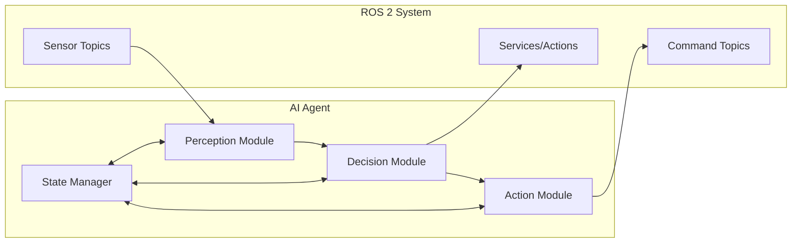

# Bridging Python AI Agents with rclpy: Connecting AI to ROS 2

## Learning Objectives

By the end of this chapter, you will be able to:
- Integrate Python AI agents with ROS 2 communication systems
- Create ROS 2 nodes that interface with AI models
- Use topics, services, and actions to connect AI agents to robotic systems
- Implement bidirectional communication between AI and robotics components
- Design AI-ROS integration patterns for real-world applications

## Introduction to AI-ROS Integration

The integration of AI agents with ROS 2 enables intelligent decision-making in robotic systems. This connection allows AI models to:
- Receive sensor data from robotic platforms
- Send control commands to actuators
- Coordinate with other ROS 2 nodes
- Access robot state information
- Interface with navigation and planning systems

This integration creates the "cognitive layer" that transforms simple robotic systems into intelligent agents capable of perception, reasoning, and action.

## Basic AI Agent Structure

A typical AI agent in ROS 2 consists of:
- **Perception module**: Processes sensor data from ROS 2 topics
- **Decision module**: Implements AI logic using external models
- **Action module**: Sends commands to ROS 2 topics, services, or actions
- **State management**: Maintains internal state and context

## Simple AI Agent Example

Here's a basic AI agent that processes sensor data and makes decisions:

```python
# ai_agent_node.py
import rclpy
from rclpy.node import Node
from sensor_msgs.msg import LaserScan
from geometry_msgs.msg import Twist
from std_msgs.msg import String
import numpy as np
import random  # Placeholder for AI logic

class AIAgentNode(Node):
    def __init__(self):
        super().__init__('ai_agent_node')

        # Create subscribers for sensor data
        self.laser_sub = self.create_subscription(
            LaserScan,
            '/scan',
            self.laser_callback,
            10
        )

        # Create publisher for robot commands
        self.cmd_vel_pub = self.create_publisher(
            Twist,
            '/cmd_vel',
            10
        )

        # Create publisher for AI status
        self.status_pub = self.create_publisher(
            String,
            '/ai_status',
            10
        )

        # Internal state
        self.safety_threshold = 0.5  # meters
        self.current_behavior = "exploring"

        self.get_logger().info('AI Agent Node initialized')

    def laser_callback(self, msg):
        """Process laser scan data and make decisions"""
        # Convert laser data to numpy array for processing
        ranges = np.array(msg.ranges)
        ranges = ranges[np.isfinite(ranges)]  # Remove invalid readings

        if len(ranges) == 0:
            return

        # AI Decision Logic
        min_distance = np.min(ranges)

        # Simple obstacle avoidance AI
        cmd_vel = Twist()

        if min_distance < self.safety_threshold:
            # Obstacle detected - turn away
            cmd_vel.linear.x = 0.0
            cmd_vel.angular.z = 0.5  # Turn right
            self.current_behavior = "avoiding_obstacle"
        else:
            # Clear path - move forward
            cmd_vel.linear.x = 0.3
            cmd_vel.angular.z = 0.0
            self.current_behavior = "exploring"

        # Publish command
        self.cmd_vel_pub.publish(cmd_vel)

        # Publish status
        status_msg = String()
        status_msg.data = f"Behavior: {self.current_behavior}, Distance: {min_distance:.2f}"
        self.status_pub.publish(status_msg)

def main(args=None):
    rclpy.init(args=args)
    ai_agent = AIAgentNode()

    try:
        rclpy.spin(ai_agent)
    except KeyboardInterrupt:
        ai_agent.get_logger().info('AI Agent stopped by user')
    finally:
        ai_agent.destroy_node()
        rclpy.shutdown()

if __name__ == '__main__':
    main()
```

## Using Services for AI Queries

AI agents can use ROS 2 services to request specific information or trigger actions:

```python
# ai_with_service_client.py
import rclpy
from rclpy.node import Node
from rclpy.action import ActionClient
from rclpy.qos import QoSProfile
from std_srvs.srv import SetBool
from geometry_msgs.msg import PoseStamped
import time

class AIAgentWithServices(Node):
    def __init__(self):
        super().__init__('ai_agent_with_services')

        # Create service client for navigation
        self.nav_service = self.create_client(SetBool, '/start_navigation')
        while not self.nav_service.wait_for_service(timeout_sec=1.0):
            self.get_logger().info('Navigation service not available, waiting again...')

        # Create action client for complex tasks
        self.nav_action_client = ActionClient(
            self,
            MoveBaseAction,  # Placeholder for navigation action
            'move_base'
        )

        # Timer to periodically run AI logic
        self.timer = self.create_timer(1.0, self.ai_decision_loop)

    def ai_decision_loop(self):
        """Main AI decision loop"""
        # Example: Request navigation service
        request = SetBool.Request()
        request.data = True  # Start navigation

        future = self.nav_service.call_async(request)
        future.add_done_callback(self.navigation_response_callback)

    def navigation_response_callback(self, future):
        try:
            response = future.result()
            if response.success:
                self.get_logger().info('Navigation started successfully')
            else:
                self.get_logger().warn('Navigation failed to start')
        except Exception as e:
            self.get_logger().error(f'Service call failed: {e}')

def main(args=None):
    rclpy.init(args=args)
    ai_agent = AIAgentWithServices()
    rclpy.spin(ai_agent)
    ai_agent.destroy_node()
    rclpy.shutdown()

if __name__ == '__main__':
    main()
```

## Integrating External AI Models

For more sophisticated AI, you can integrate external models:

```python
# ai_with_ml_model.py
import rclpy
from rclpy.node import Node
from sensor_msgs.msg import Image, LaserScan
from geometry_msgs.msg import Twist
from cv_bridge import CvBridge
import cv2
import numpy as np
# Import your AI framework (e.g., TensorFlow, PyTorch, scikit-learn)
# import tensorflow as tf

class AIWithMLModel(Node):
    def __init__(self):
        super().__init__('ai_with_ml_model')

        # Initialize CV bridge for image processing
        self.cv_bridge = CvBridge()

        # Subscribe to camera and laser data
        self.image_sub = self.create_subscription(
            Image,
            '/camera/image_raw',
            self.image_callback,
            10
        )

        self.laser_sub = self.create_subscription(
            LaserScan,
            '/scan',
            self.laser_callback,
            10
        )

        # Publisher for commands
        self.cmd_vel_pub = self.create_publisher(Twist, '/cmd_vel', 10)

        # Load AI model (placeholder)
        # self.model = self.load_model()

        self.get_logger().info('AI with ML Model Node initialized')

    def load_model(self):
        """Load your AI model here"""
        # Example: Load a pre-trained model
        # model = tf.keras.models.load_model('path/to/model')
        # return model
        pass

    def image_callback(self, msg):
        """Process image data with AI model"""
        try:
            # Convert ROS Image message to OpenCV image
            cv_image = self.cv_bridge.imgmsg_to_cv2(msg, desired_encoding='bgr8')

            # Process image with AI model (placeholder)
            # prediction = self.model.predict(cv_image)

            # For now, simple color-based detection
            hsv = cv2.cvtColor(cv_image, cv2.COLOR_BGR2HSV)

            # Detect red color (example)
            lower_red = np.array([0, 50, 50])
            upper_red = np.array([10, 255, 255])
            mask = cv2.inRange(hsv, lower_red, upper_red)

            # Calculate center of detected object
            if cv2.countNonZero(mask) > 1000:  # If significant red detected
                # Move towards the object
                cmd_vel = Twist()
                cmd_vel.linear.x = 0.2
                cmd_vel.angular.z = 0.0  # Adjust based on object position
                self.cmd_vel_pub.publish(cmd_vel)

        except Exception as e:
            self.get_logger().error(f'Error processing image: {e}')

    def laser_callback(self, msg):
        """Process laser data for navigation"""
        ranges = np.array(msg.ranges)
        ranges = ranges[np.isfinite(ranges)]

        if len(ranges) > 0 and np.min(ranges) < 0.5:
            # Emergency stop if obstacle too close
            cmd_vel = Twist()
            cmd_vel.linear.x = 0.0
            cmd_vel.angular.z = 0.0
            self.cmd_vel_pub.publish(cmd_vel)

def main(args=None):
    rclpy.init(args=args)
    ai_agent = AIWithMLModel()
    rclpy.spin(ai_agent)
    ai_agent.destroy_node()
    rclpy.shutdown()

if __name__ == '__main__':
    main()
```

## AI Agent Communication Patterns

### Publisher-Subscriber Pattern
AI agents often use the pub-sub pattern for continuous data flow:

```python
# AI agent receiving sensor data and publishing decisions
class SensorBasedAIAgent(Node):
    def __init__(self):
        super().__init__('sensor_based_ai_agent')

        # Multiple sensor subscriptions
        self.imu_sub = self.create_subscription(Imu, '/imu/data', self.imu_callback, 10)
        self.odom_sub = self.create_subscription(Odometry, '/odom', self.odom_callback, 10)
        self.laser_sub = self.create_subscription(LaserScan, '/scan', self.laser_callback, 10)

        # Multiple command publishers
        self.cmd_vel_pub = self.create_publisher(Twist, '/cmd_vel', 10)
        self.gripper_pub = self.create_publisher(Bool, '/gripper/command', 10)

        # Internal state
        self.robot_pose = None
        self.imu_data = None
        self.laser_data = None

    def ai_logic(self):
        """Central AI logic that processes all sensor inputs"""
        if self.robot_pose and self.imu_data and self.laser_data:
            # Implement your AI algorithm here
            # Example: Decision based on multiple inputs
            cmd_vel = self.make_decision()
            self.cmd_vel_pub.publish(cmd_vel)
```

### Action-Based Pattern
For complex, long-running AI tasks:

```python
# AI agent with action interface
from rclpy.action import ActionServer, GoalResponse, CancelResponse
from your_interfaces.action import AIPlanning

class AIActionAgent(Node):
    def __init__(self):
        super().__init__('ai_action_agent')
        self._action_server = ActionServer(
            self,
            AIPlanning,
            'ai_plan',
            execute_callback=self.execute_callback,
            goal_callback=self.goal_callback,
            cancel_callback=self.cancel_callback
        )

    def goal_callback(self, goal_request):
        """Accept or reject goals"""
        self.get_logger().info('Received goal request')
        return GoalResponse.ACCEPT

    def cancel_callback(self, goal_handle):
        """Handle goal cancellation"""
        self.get_logger().info('Received cancel request')
        return CancelResponse.ACCEPT

    def execute_callback(self, goal_handle):
        """Execute the AI planning task"""
        self.get_logger().info('Executing goal...')

        # AI planning logic here
        feedback_msg = AIPlanning.Feedback()
        result = AIPlanning.Result()

        # Simulate planning process
        for i in range(10):
            if goal_handle.is_cancel_requested:
                goal_handle.canceled()
                result.success = False
                return result

            # Publish feedback
            feedback_msg.progress = i * 10
            goal_handle.publish_feedback(feedback_msg)
            time.sleep(0.5)  # Simulate work

        goal_handle.succeed()
        result.success = True
        result.plan = "Optimal path found"

        return result
```

## Best Practices for AI-ROS Integration

1. **Modular Design**: Keep AI logic separate from ROS communication
2. **Error Handling**: Implement robust error handling for AI model failures
3. **Performance**: Consider computational requirements of AI models
4. **Safety**: Implement safety checks and fallback behaviors
5. **State Management**: Maintain consistent state across AI decisions
6. **Logging**: Log AI decisions for debugging and analysis
7. **Testing**: Test AI-ROS integration thoroughly

## Integration Architecture



## Real-World Applications

AI-ROS integration enables applications such as:
- Autonomous navigation with deep learning perception
- Object recognition and manipulation
- Human-robot interaction with natural language processing
- Adaptive control systems
- Predictive maintenance
- Swarm robotics coordination

## Debugging AI-ROS Integration

Common debugging approaches:
- Monitor topic data with `ros2 topic echo`
- Use RViz for visualization
- Log AI decisions and inputs
- Test AI models independently
- Check timing and synchronization

## Summary

Bridging AI agents with ROS 2 enables intelligent robotic systems that can perceive, reason, and act. By properly structuring the integration between AI models and ROS 2 communication systems, you can create sophisticated robotic applications. The key is to maintain clean separation between AI logic and ROS communication while ensuring robust error handling and safety.

In the next chapter, we'll cover debugging, visualization, and best practices for ROS 2 development.