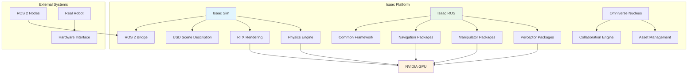

# Introduction to NVIDIA Isaac Platform for Physical AI

## Overview

The NVIDIA Isaac Platform represents a revolutionary approach to robotics development, combining high-fidelity simulation, perception, and navigation capabilities to accelerate the development of intelligent robotic systems. Built on NVIDIA's Omniverse platform, Isaac Sim provides a photorealistic simulation environment where robots can be designed, trained, and tested before deployment in the real world.

This chapter introduces the core components of the NVIDIA Isaac ecosystem, including Isaac Sim for simulation, Isaac ROS for hardware-accelerated perception and navigation, and their integration with the Robot Operating System (ROS 2). We'll explore how these tools work together to create a comprehensive development pipeline for physical AI applications.

## The Isaac Platform Architecture

The NVIDIA Isaac Platform consists of several interconnected components that work together to provide a complete robotics development solution:



### Isaac Sim: The Simulation Engine

Isaac Sim is a photorealistic simulation application built on NVIDIA Omniverse, specifically designed for robotics development. It features:

- **High-Fidelity Physics**: Accurate simulation of real-world physics using PhysX engine
- **Multi-Sensor RTX Rendering**: Real-time ray tracing for camera, LiDAR, and other sensor simulation
- **GPU-Accelerated Simulation**: Leverages NVIDIA RTX GPUs for high-performance simulation
- **USD-Based Scene Description**: Uses Universal Scene Description for flexible scene composition
- **ROS 2 Bridge**: Seamless integration with ROS 2 for robot control and communication

### Isaac ROS: Hardware-Accelerated Packages

Isaac ROS provides a collection of perception and navigation packages that leverage NVIDIA's GPU acceleration:

- **Perceptor**: Hardware-accelerated perception algorithms including stereo disparity, visual odometry, and object detection
- **Manipulator**: Advanced manipulation algorithms for robotic arms and end-effectors
- **Navigation**: GPU-accelerated navigation stack for path planning and obstacle avoidance
- **Common Framework**: Standardized interfaces and tools for building robotics applications

## Key Concepts and Terminology

### Universal Scene Description (USD)

USD is the foundational technology for Isaac Sim, providing a scalable and flexible format for 3D scene representation. Key concepts include:

- **Prims**: Basic building blocks of USD scenes (Primitives)
- **Xforms**: Transformations applied to objects in 3D space
- **Materials**: Physically-based materials for realistic rendering
- **Schemas**: Standardized object definitions for common robotics elements

### Omniverse Nucleus

Omniverse Nucleus is the collaboration and streaming engine that enables multiple users to work on the same simulation simultaneously:

- **Centralized Asset Management**: Shared repository for 3D models and scenes
- **Real-time Collaboration**: Multiple users can modify scenes simultaneously
- **Streaming Technology**: Efficient streaming of complex scenes to clients

## Isaac Sim Capabilities

### Photorealistic Rendering

Isaac Sim leverages NVIDIA RTX technology to provide:

- **Real-time Ray Tracing**: Accurate lighting and reflections
- **Physically-Based Rendering**: Materials that behave like real-world counterparts
- **Multi-Sensor Simulation**: Cameras, LiDAR, IMU, and other sensors
- **Dynamic Lighting**: Day/night cycle and variable lighting conditions

### Physics Simulation

The physics engine in Isaac Sim provides:

- **Rigid Body Dynamics**: Accurate simulation of collisions and interactions
- **Articulated Systems**: Support for complex robot kinematics
- **Soft Body Simulation**: Deformable objects and materials
- **Fluid Dynamics**: Water, air, and other fluid interactions

### Synthetic Data Generation

One of Isaac Sim's key strengths is its ability to generate synthetic training data:

- **Labeled Data**: Automatic ground truth generation for training ML models
- **Variety**: Multiple viewpoints, lighting conditions, and scene configurations
- **Volume**: Generate thousands of training samples quickly
- **Diversity**: Easily create edge cases and rare scenarios

## Isaac ROS Integration

### ROS 2 Bridge

The ROS 2 bridge enables seamless communication between Isaac Sim and ROS 2 nodes:

```python
# Example: Basic ROS 2 publisher in Isaac Sim
import rclpy
from sensor_msgs.msg import Image
from geometry_msgs.msg import Twist

def publish_robot_data():
    # Initialize ROS 2 node
    rclpy.init()
    node = rclpy.create_node('isaac_sim_robot')

    # Create publishers for robot data
    image_pub = node.create_publisher(Image, '/camera/rgb/image_raw', 10)
    cmd_vel_pub = node.create_publisher(Twist, '/cmd_vel', 10)

    # Publish data from Isaac Sim sensors
    # (Implementation would connect to Isaac Sim sensors)
```

### Isaac ROS Packages

Isaac ROS packages provide hardware-accelerated functionality:

- **Stereo Disparity**: GPU-accelerated depth estimation from stereo cameras
- **Visual Odometry**: Real-time pose estimation from visual input
- **DNN Inference**: Accelerated neural network inference for perception
- **SLAM**: Simultaneous Localization and Mapping with GPU acceleration

## Use Cases and Applications

### Robotics Research

Isaac Sim and Isaac ROS are ideal for:

- **Algorithm Development**: Test and refine robotics algorithms in simulation
- **Perception Training**: Generate synthetic data for training perception models
- **Navigation Testing**: Validate path planning and obstacle avoidance algorithms
- **Humanoid Robotics**: Develop and test bipedal locomotion algorithms

### Industrial Applications

The platform supports:

- **Warehouse Automation**: Mobile robot navigation and manipulation
- **Manufacturing**: Robot programming and validation
- **Agriculture**: Autonomous vehicle and robot development
- **Healthcare**: Assistive robotics and teleoperation

## Getting Started with Isaac Platform

### Prerequisites

Before diving into Isaac Sim and Isaac ROS, ensure you have:

- **NVIDIA GPU**: RTX 4080 or higher recommended
- **CUDA**: Compatible with your GPU and driver
- **ROS 2**: Humble Hawksbill or Jazzy Jalisco installed
- **Isaac Sim**: Version 5.0 or higher
- **Isaac ROS**: Version 3.2 packages

### Basic Workflow

The typical development workflow with Isaac Platform includes:

1. **Environment Setup**: Configure Isaac Sim and ROS 2 integration
2. **Scene Creation**: Build or import 3D environments
3. **Robot Definition**: Create or import robot models
4. **Simulation**: Run physics and sensor simulation
5. **Algorithm Testing**: Develop and test robotics algorithms
6. **Data Generation**: Create synthetic datasets for training
7. **Deployment**: Transfer learned behaviors to real robots

## Code Examples

### Simple Isaac Sim Application

```python
from isaacsim import SimulationApp

# Launch Isaac Sim application
config = {"headless": False}
simulation_app = SimulationApp(config)

# Import required modules
from isaacsim.core import World
from isaacsim.utils import set_carb_setting

# Create simulation world
world = World(stage_units_in_meters=1.0)

# Add default ground plane
world.scene.add_default_ground_plane()

# Run simulation steps
for i in range(100):
    world.step(render=True)

# Shutdown application
simulation_app.close()
```

### USD Scene Definition

```usd
#usda 1.0
(
    doc = "Simple Isaac Sim scene"
    metersPerUnit = 1
)

def Xform "World"
{
    def Xform "GroundPlane"
    {
        add references = @./assets/ground_plane.usd@
    }

    def Xform "Robot"
    {
        add references = @./assets/franka_panda.usd@
        prepend apiSchemas = ["PhysicsRigidBodyAPI"]
    }
}
```

## Summary

The NVIDIA Isaac Platform provides a comprehensive solution for robotics development, combining high-fidelity simulation with hardware-accelerated perception and navigation. Isaac Sim enables the creation of photorealistic virtual environments where robots can be designed, trained, and tested, while Isaac ROS provides the computational power needed for real-time perception and navigation algorithms.

For practical setup and configuration, continue with [Chapter 2: Setting Up NVIDIA Isaac Sim and ROS 2 Integration](02-setting-up-isaac-sim-ros2.md) which covers installation, configuration, and basic verification steps. To dive deeper into photorealistic humanoid simulation, see [Chapter 3: Photorealistic Simulation and Humanoid Robot Assets in Isaac Sim](03-photorealistic-simulation-humanoids.md). For perception system development, check out [Chapter 5: Introduction to Isaac ROS: Hardware-Accelerated Packages](05-introduction-isaac-ros-packages.md) and [Chapter 6: Visual SLAM and Perception with Isaac ROS](06-visual-slam-perception-isaac-ros.md).