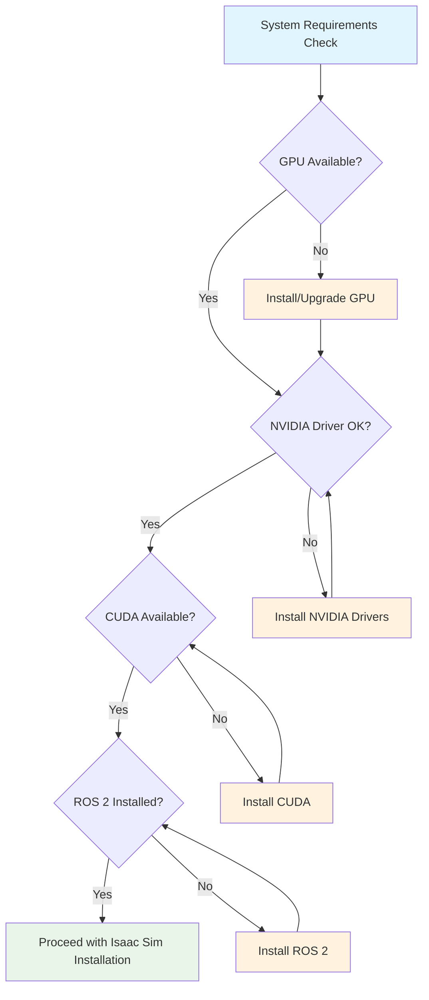

# Setting Up NVIDIA Isaac Sim and ROS 2 Integration

## Overview

This chapter provides a comprehensive guide to installing and configuring NVIDIA Isaac Sim with ROS 2 integration. We'll cover the complete setup process, from system requirements verification to basic verification of the Isaac Sim-ROS 2 bridge. By the end of this chapter, you'll have a fully functional Isaac Sim environment integrated with ROS 2, ready for robotics development and simulation.

## System Requirements Verification

Before installing Isaac Sim, verify that your system meets the requirements:



### Hardware Requirements
- **GPU**: NVIDIA RTX 4080 or higher (RTX 5080 recommended)
- **Memory**: 32GB RAM or more
- **Storage**: 50GB+ free space for Isaac Sim and assets
- **CPU**: Modern multi-core processor

### Software Requirements
- **OS**: Ubuntu 22.04 LTS (recommended) or Ubuntu 24.04 LTS
- **NVIDIA Driver**: Version 535 or higher
- **CUDA**: Version 12.0 or higher
- **ROS 2**: Humble Hawksbill or Jazzy Jalisco

### Verification Commands
```bash
# Check NVIDIA driver
nvidia-smi

# Check CUDA version
nvcc --version

# Check ROS 2 installation
source /opt/ros/humble/setup.bash  # or jazzy
ros2 --version
```

## Installing Isaac Sim 5.0

### Method 1: Using Omniverse Launcher (Recommended)

1. **Download Omniverse Launcher**
   - Visit the [NVIDIA Omniverse website](https://developer.nvidia.com/omniverse)
   - Download and install the Omniverse Launcher
   - Create an NVIDIA Developer account if needed

2. **Install Isaac Sim**
   - Launch Omniverse Launcher
   - Navigate to the "Apps" tab
   - Find "Isaac Sim" in the applications list
   - Click "Install" to download and install Isaac Sim 5.0

3. **Verify Installation**
   - Launch Isaac Sim from the Omniverse Launcher
   - Check that the application starts without errors
   - Verify the version in the "Help" menu

### Method 2: Docker Installation

For a containerized installation:

```bash
# Pull the Isaac Sim Docker image
docker pull nvcr.io/nvidia/isaac-sim:5.0.0

# Create a run script (run_isaac_sim.sh)
#!/bin/bash
xhost +local:docker
docker run --gpus all -it --rm \
  --env "DISPLAY" \
  --env "QT_X11_NO_MITSHM=1" \
  --volume "/tmp/.X11-unix:/tmp/.X11-unix:rw" \
  --volume "$HOME/.Xauthority:/root/.Xauthority" \
  --network host \
  --name isaac_sim_container \
  nvcr.io/nvidia/isaac-sim:5.0.0
```

## Installing ROS 2 Humble/Jazzy

### System Setup

```bash
# Add ROS 2 repository
sudo apt update && sudo apt install -y curl gnupg lsb-release
curl -sSL https://raw.githubusercontent.com/ros/rosdistro/master/ros.key | sudo gpg --dearmor -o /usr/share/keyrings/ros-archive-keyring.gpg

echo "deb [arch=$(dpkg --print-architecture) signed-by=/usr/share/keyrings/ros-archive-keyring.gpg] http://packages.ros.org/ros2/ubuntu $(source /etc/os-release && echo $UBUNTU_CODENAME) main" | sudo tee /etc/apt/sources.list.d/ros2.list > /dev/null

sudo apt update
sudo apt upgrade
```

### Install ROS 2 Desktop Package

```bash
# For Humble Hawksbill
sudo apt install ros-humble-desktop

# For Jazzy Jalisco
sudo apt install ros-jazzy-desktop

# Install additional dependencies
sudo apt install python3-colcon-common-extensions python3-rosdep python3-vcstool
```

### Environment Setup

Add to your `~/.bashrc`:
```bash
# ROS 2 Setup
source /opt/ros/humble/setup.bash  # or jazzy for ROS 2 Jazzy

# Colcon completion
if [ -f /usr/share/colcon_argcomplete/hook.bash ]; then
  source /usr/share/colcon_argcomplete/hook.bash
fi
```

Then source the environment:
```bash
source ~/.bashrc
```

## Installing Isaac ROS 3.2 Packages

### Using Debian Packages

```bash
# Update package lists
sudo apt update

# Install Isaac ROS common packages
sudo apt install ros-humble-isaac-ros-common
sudo apt install ros-humble-isaac-ros-perceptor
sudo apt install ros-humble-isaac-ros-manipulator
sudo apt install ros-humble-isaac-ros-navigation
```

For ROS 2 Jazzy, replace `humble` with `jazzy` in the package names.

### Building from Source (Alternative)

If you prefer to build from source:

```bash
# Create workspace
mkdir -p ~/isaac_ros_ws/src
cd ~/isaac_ros_ws

# Clone Isaac ROS common repository
git clone https://github.com/NVIDIA-ISAAC-ROS/isaac_ros_common.git -b ros2
cd src
vcs import < isaac_ros_common/isaac_ros_common.repos

# Install dependencies
cd ~/isaac_ros_ws
rosdep install --from-paths src --ignore-src -r -y

# Build the workspace
colcon build --symlink-install
source install/setup.bash
```

## Configuring Isaac Sim-ROS 2 Bridge

### Setting up the Bridge

The Isaac Sim-ROS 2 bridge enables communication between Isaac Sim and ROS 2 nodes. The bridge is typically located in the Isaac Sim installation directory:

```bash
# Navigate to Isaac Sim directory (if using Omniverse Launcher installation)
cd ~/.nvidia-omniverse/kit/cache/tkg/isaac-sim-5.0.0/isaac_ros_ws

# Or if using Docker, the bridge is already configured
```

### Installing Bridge Dependencies

```bash
# Source ROS 2
source /opt/ros/humble/setup.bash  # or jazzy

# Navigate to Isaac Sim ROS workspace (if using source installation)
cd ~/isaac_ros_ws
source install/setup.bash

# Verify bridge packages are available
ros2 pkg list | grep ros_bridge
```

## Basic Verification Steps

### Launch Isaac Sim Standalone

1. **Launch Isaac Sim**
   - Start Isaac Sim from Omniverse Launcher
   - Wait for the application to load completely

2. **Test Basic Functionality**
   - Create a new stage (File → New Stage)
   - Add a cube (Create → Primitive → Cube)
   - Verify physics simulation by playing the timeline

### Test ROS 2 Connection

Create a simple test script to verify ROS 2 functionality:

```python
# test_ros_connection.py
import rclpy
from rclpy.node import Node
from std_msgs.msg import String

class TestPublisher(Node):
    def __init__(self):
        super().__init__('test_publisher')
        self.publisher = self.create_publisher(String, 'test_topic', 10)
        timer_period = 0.5  # seconds
        self.timer = self.create_timer(timer_period, self.timer_callback)

    def timer_callback(self):
        msg = String()
        msg.data = 'Hello Isaac Sim!'
        self.publisher.publish(msg)
        self.get_logger().info(f'Publishing: "{msg.data}"')

def main(args=None):
    rclpy.init(args=args)
    test_publisher = TestPublisher()
    rclpy.spin(test_publisher)
    test_publisher.destroy_node()
    rclpy.shutdown()

if __name__ == '__main__':
    main()
```

Run the test:
```bash
# Source ROS 2
source /opt/ros/humble/setup.bash

# Run the test script
python3 test_ros_connection.py
```

In another terminal, verify the topic is being published:
```bash
# Source ROS 2
source /opt/ros/humble/setup.bash

# Echo the test topic
ros2 topic echo /test_topic std_msgs/msg/String
```

## Isaac Sim-ROS 2 Integration Test

### Launch Isaac Sim with ROS 2 Bridge

1. **Launch Isaac Sim with ROS Bridge Extension**
   - In Isaac Sim, go to Window → Extensions
   - Search for "ROS" and enable the "ROS2 Bridge" extension
   - The extension should appear in the toolbar

2. **Create a Simple Robot in Isaac Sim**
   ```usd
   #usda 1.0
   (
       doc = "Simple robot for ROS 2 testing"
       metersPerUnit = 1
   )

   def Xform "World"
   {
       def Xform "Robot"
       {
           def Cube "Base"
           {
               add references = </World/Robot/Base>
           }
       }
   }
   ```

3. **Connect ROS 2 Nodes to Isaac Sim**
   - In Isaac Sim, use the ROS Bridge to publish/subscribe to topics
   - Verify that Isaac Sim can receive commands from ROS 2 nodes
   - Verify that Isaac Sim can publish sensor data to ROS 2 topics

### Testing with a Sample Robot

Download and test with a sample robot:

```bash
# Create a directory for sample files
mkdir -p ~/isaac_sim_samples
cd ~/isaac_sim_samples

# Create a simple launch file for testing
cat > test_robot.launch.py << EOF
import launch
from launch_ros.actions import Node
from ament_index_python.packages import get_package_share_directory

def generate_launch_description():
    return launch.LaunchDescription([
        Node(
            package='tf2_ros',
            executable='static_transform_publisher',
            name='static_transform_publisher',
            arguments=['0', '0', '0', '0', '0', '0', 'world', 'base_link']
        ),
    ])
EOF

# Launch the test
source /opt/ros/humble/setup.bash
ros2 launch test_robot.launch.py
```

## Troubleshooting Common Issues

### GPU and CUDA Issues

**Problem**: Isaac Sim fails to start or shows rendering errors
**Solution**:
```bash
# Verify GPU is detected
nvidia-smi

# Check CUDA installation
nvidia-ml-py3 --version  # or check CUDA samples

# Ensure proper drivers are installed
sudo apt install nvidia-driver-535  # or latest version
```

### ROS 2 Connection Issues

**Problem**: ROS 2 bridge fails to connect
**Solution**:
```bash
# Check ROS 2 environment
printenv | grep ROS

# Verify ROS 2 domain ID
echo $ROS_DOMAIN_ID

# Check network settings
ifconfig | grep -A 1 "inet.*broadcast"
```

### Isaac Sim Extensions Not Loading

**Problem**: ROS 2 Bridge extension doesn't appear
**Solution**:
1. Ensure Isaac ROS packages are installed
2. Check Isaac Sim logs for extension loading errors
3. Verify Isaac Sim was launched with proper environment variables

## Performance Optimization

### Isaac Sim Settings for Better Performance

1. **Graphics Settings**
   - Go to Window → Settings → Renderer
   - Adjust quality settings based on your GPU
   - Consider using "Low" quality for development

2. **Physics Settings**
   - Go to Window → Settings → Physics
   - Adjust substeps and solver settings for performance
   - Use fixed timestep for consistent simulation

### ROS 2 Configuration

```bash
# Set environment variables for better performance
export RMW_IMPLEMENTATION=rmw_cyclonedx_cpp
export ROS_DOMAIN_ID=0
```

## Code Examples

### Basic Isaac Sim Application with ROS 2 Integration

```python
from isaacsim import SimulationApp

# Launch Isaac Sim with ROS 2 support
config = {
    "headless": False,
    "render": True,
    "subscribers": [
        "omni.isaac.ros_bridge.ros2_bridge_subscriber",
    ],
    "publishers": [
        "omni.isaac.ros_bridge.ros2_bridge_publisher",
    ]
}

simulation_app = SimulationApp(config)

# Import ROS 2 modules
import rclpy
from geometry_msgs.msg import Twist
from sensor_msgs.msg import Image

# Initialize ROS 2
rclpy.init()

# Create a ROS 2 node for robot control
class RobotController:
    def __init__(self):
        self.node = rclpy.create_node('isaac_sim_robot_controller')
        self.cmd_vel_pub = self.node.create_publisher(Twist, '/cmd_vel', 10)
        self.image_sub = self.node.create_subscription(
            Image, '/camera/rgb/image_raw', self.image_callback, 10
        )

    def image_callback(self, msg):
        # Process image data from Isaac Sim
        print(f"Received image: {msg.width}x{msg.height}")

    def send_command(self, linear_x, angular_z):
        cmd_msg = Twist()
        cmd_msg.linear.x = linear_x
        cmd_msg.angular.z = angular_z
        self.cmd_vel_pub.publish(cmd_msg)

# Create controller instance
controller = RobotController()

# Import Isaac Sim modules
from isaacsim.core import World
from isaacsim.utils import set_carb_setting

# Create simulation world
world = World(stage_units_in_meters=1.0)
world.scene.add_default_ground_plane()

# Add a simple robot (for demonstration)
# In practice, you would import a robot USD file

# Simulation loop
for i in range(1000):
    # Send a simple movement command
    if i % 100 == 0:
        controller.send_command(0.5, 0.0)  # Move forward

    world.step(render=True)
    rclpy.spin_once(controller.node, timeout_sec=0)

# Cleanup
controller.node.destroy_node()
rclpy.shutdown()
simulation_app.close()
```

### Isaac Sim Extension for ROS Bridge

```python
# Example extension code for Isaac Sim
import omni.ext
import omni
from omni.isaac.core import World
from omni.isaac.core.utils.stage import add_reference_to_stage
from omni.isaac.core.utils.nucleus import get_assets_root_path
from omni.isaac.core.utils.viewports import set_camera_view

class IsaacSimROS2Extension(omni.ext.IExt):
    def on_startup(self, ext_id):
        print("[isaac_sim_ros2_extension] Isaac Sim ROS 2 Extension Startup")

        # Initialize your extension here
        self._world = World(stage_units_in_meters=1.0)

        # Add ground plane
        self._world.scene.add_default_ground_plane()

        # Add your robot or scene elements here
        # add_reference_to_stage(...)

    def on_shutdown(self):
        print("[isaac_sim_ros2_extension] Isaac Sim ROS 2 Extension Shutdown")
        if self._world:
            self._world.clear()
```

## Summary

This chapter covered the complete setup process for NVIDIA Isaac Sim with ROS 2 integration. We've installed Isaac Sim, configured ROS 2, installed Isaac ROS packages, and verified the integration between the two systems. You now have a functional development environment ready for robotics simulation and development.

To dive deeper into photorealistic humanoid simulation, continue with [Chapter 3: Photorealistic Simulation and Humanoid Robot Assets in Isaac Sim](03-photorealistic-simulation-humanoids.md). For generating training data, see [Chapter 4: Synthetic Data Generation for Perception Training](04-synthetic-data-generation.md). To explore Isaac ROS packages in detail, check out [Chapter 5: Introduction to Isaac ROS: Hardware-Accelerated Packages](05-introduction-isaac-ros-packages.md).