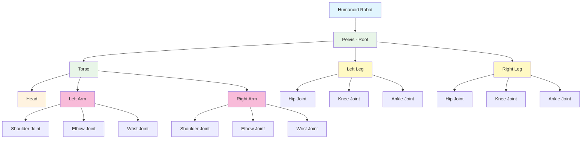

# Photorealistic Simulation and Humanoid Robot Assets in Isaac Sim

## Overview

This chapter explores the creation and utilization of photorealistic humanoid robot simulations in NVIDIA Isaac Sim. We'll cover how to import and configure humanoid robot assets, set up realistic environments, and leverage Isaac Sim's advanced rendering capabilities for high-fidelity simulation. By the end of this chapter, you'll understand how to create compelling humanoid robot simulations that closely mirror real-world physics and appearance.

## Humanoid Robot Asset Overview

### Humanoid Robot Architecture



### Characteristics of Humanoid Robots in Simulation

Humanoid robots present unique challenges in simulation due to their complex kinematics and the need for realistic bipedal locomotion. Key characteristics include:

- **Bipedal Locomotion**: Two-legged walking with dynamic balance
- **Multi-Degree-of-Freedom Joints**: Complex joint configurations for human-like movement
- **Dynamic Balance**: Real-time center of mass adjustment
- **Articulated Body**: Multiple interconnected segments with realistic constraints

### Available Humanoid Assets

Isaac Sim supports various humanoid robot assets:

- **Open Source Models**: Popular models like ATRIAS, DURABLE, and NASA Valkyrie
- **Commercial Models**: Proprietary humanoid robots from various manufacturers
- **Custom Models**: User-created humanoid robots following USD standards
- **Reference Models**: NVIDIA-provided examples for development

## USD Scene Creation for Humanoid Robots

### Basic Humanoid USD Structure

```usd
#usda 1.0
(
    doc = "Humanoid Robot Example"
    metersPerUnit = 1.0
    upAxis = "Y"
)

def Xform "HumanoidRobot"
{
    # Pelvis (root body)
    def Xform "pelvis"
    {
        def Sphere "pelvis_geom"
        {
            radius = 0.1
            prepend apiSchemas = ["PhysicsRigidBodyAPI"]
        }

        # Left leg
        def Xform "left_hip"
        {
            def Capsule "left_thigh"
            {
                radius = 0.05
                height = 0.4
                prepend apiSchemas = ["PhysicsRigidBodyAPI"]
            }

            def Xform "left_knee"
            {
                def Capsule "left_shin"
                {
                    radius = 0.04
                    height = 0.4
                    prepend apiSchemas = ["PhysicsRigidBodyAPI"]
                }

                def Xform "left_ankle"
                {
                    def Box "left_foot"
                    {
                        size = (0.2, 0.1, 0.08)
                        prepend apiSchemas = ["PhysicsRigidBodyAPI"]
                    }
                }
            }
        }

        # Right leg (similar structure)
        def Xform "right_hip"
        {
            def Capsule "right_thigh"
            {
                radius = 0.05
                height = 0.4
                prepend apiSchemas = ["PhysicsRigidBodyAPI"]
            }

            def Xform "right_knee"
            {
                def Capsule "right_shin"
                {
                    radius = 0.04
                    height = 0.4
                    prepend apiSchemas = ["PhysicsRigidBodyAPI"]
                }

                def Xform "right_ankle"
                {
                    def Box "right_foot"
                    {
                        size = (0.2, 0.1, 0.08)
                        prepend apiSchemas = ["PhysicsRigidBodyAPI"]
                    }
                }
            }
        }

        # Torso
        def Xform "torso"
        {
            def Capsule "torso_geom"
            {
                radius = 0.12
                height = 0.5
                prepend apiSchemas = ["PhysicsRigidBodyAPI"]
            }

            # Head
            def Xform "neck"
            {
                def Sphere "head"
                {
                    radius = 0.1
                    prepend apiSchemas = ["PhysicsRigidBodyAPI"]
                }
            }

            # Left arm
            def Xform "left_shoulder"
            {
                def Capsule "left_upper_arm"
                {
                    radius = 0.04
                    height = 0.3
                    prepend apiSchemas = ["PhysicsRigidBodyAPI"]
                }

                def Xform "left_elbow"
                {
                    def Capsule "left_forearm"
                    {
                        radius = 0.03
                        height = 0.25
                        prepend apiSchemas = ["PhysicsRigidBodyAPI"]
                    }

                    def Sphere "left_hand"
                    {
                        radius = 0.05
                        prepend apiSchemas = ["PhysicsRigidBodyAPI"]
                    }
                }
            }

            # Right arm (similar structure)
            def Xform "right_shoulder"
            {
                def Capsule "right_upper_arm"
                {
                    radius = 0.04
                    height = 0.3
                    prepend apiSchemas = ["PhysicsRigidBodyAPI"]
                }

                def Xform "right_elbow"
                {
                    def Capsule "right_forearm"
                    {
                        radius = 0.03
                        height = 0.25
                        prepend apiSchemas = ["PhysicsRigidBodyAPI"]
                    }

                    def Sphere "right_hand"
                    {
                        radius = 0.05
                        prepend apiSchemas = ["PhysicsRigidBodyAPI"]
                    }
                }
            }
        }
    }
}
```

### Joint Definitions for Humanoid Locomotion

Humanoid robots require complex joint configurations to achieve realistic movement:

```usd
# Adding joint constraints to the humanoid model
def Xform "HumanoidRobot"
{
    # Hip joints (spherical joints for full range of motion)
    def SphericalJoint "left_hip_joint"
    {
        prepend targets = [</HumanoidRobot/pelvis>, </HumanoidRobot/pelvis/left_hip>]
    }

    def SphericalJoint "right_hip_joint"
    {
        prepend targets = [</HumanoidRobot/pelvis>, </HumanoidRobot/pelvis/right_hip>]
    }

    # Knee joints (revolute joints constrained to flexion/extension)
    def RevoluteJoint "left_knee_joint"
    {
        prepend targets = [</HumanoidRobot/pelvis/left_hip>, </HumanoidRobot/pelvis/left_hip/left_knee>]
        axis = "X"
        lowerLimit = -0.05
        upperLimit = 2.3
    }

    def RevoluteJoint "right_knee_joint"
    {
        prepend targets = [</HumanoidRobot/pelvis/right_hip>, </HumanoidRobot/pelvis/right_hip/right_knee>]
        axis = "X"
        lowerLimit = -0.05
        upperLimit = 2.3
    }

    # Ankle joints (cylindrical joints for balance)
    def CylindricalJoint "left_ankle_joint"
    {
        prepend targets = [</HumanoidRobot/pelvis/left_hip/left_knee>, </HumanoidRobot/pelvis/left_hip/left_knee/left_ankle>]
    }

    def CylindricalJoint "right_ankle_joint"
    {
        prepend targets = [</HumanoidRobot/pelvis/right_hip/right_knee>, </HumanoidRobot/pelvis/right_hip/right_knee/right_ankle>]
    }
}
```

## Loading Humanoid Assets in Isaac Sim

### Importing Humanoid Models

Isaac Sim supports various humanoid robot formats:

```python
# Loading a humanoid robot from USD file
from isaacsim import SimulationApp
from isaacsim.core import World
from isaacsim.core.utils.stage import add_reference_to_stage
from isaacsim.core.utils.nucleus import get_assets_root_path

# Initialize simulation
simulation_app = SimulationApp({"headless": False})

# Import Isaac Sim modules
import omni
from omni.isaac.core import World
from omni.isaac.core.utils.stage import add_reference_to_stage

# Create world
world = World(stage_units_in_meters=1.0)

# Add ground plane
world.scene.add_default_ground_plane()

# Load humanoid robot from USD file
# Option 1: Load from local file
add_reference_to_stage(
    usd_path="/path/to/humanoid_robot.usd",
    prim_path="/World/HumanoidRobot"
)

# Option 2: Load from Omniverse Nucleus
# add_reference_to_stage(
#     usd_path="omniverse://localhost/NVIDIA/Assets/Robots/Humanoid/humanoid.usd",
#     prim_path="/World/HumanoidRobot"
# )

# Initialize the world
world.reset()
```

### Configuring Physics Properties

Proper physics configuration is crucial for realistic humanoid simulation:

```python
# Configure physics properties for humanoid robot
from pxr import UsdPhysics, PhysicsSchemaTools
from omni.isaac.core.utils.prims import get_prim_at_path

def configure_humanoid_physics(robot_path):
    """Configure physics properties for humanoid robot"""
    robot_prim = get_prim_at_path(robot_path)

    # Set up rigid body properties for each body part
    body_parts = [
        "pelvis",
        "left_thigh", "left_shin", "left_foot",
        "right_thigh", "right_shin", "right_foot",
        "torso", "head",
        "left_upper_arm", "left_forearm", "left_hand",
        "right_upper_arm", "right_forearm", "right_hand"
    ]

    for part in body_parts:
        part_path = f"{robot_path}/{part}"
        part_prim = get_prim_at_path(part_path)

        # Set mass based on body part
        mass = get_body_part_mass(part)
        UsdPhysics.MassAPI.Apply(part_prim).CreateMassAttr().Set(mass)

        # Set density for realistic materials
        if "thigh" in part or "torso" in part:
            # More massive body parts
            density = 1000.0  # kg/m^3 (similar to human tissue)
        else:
            # Less massive parts
            density = 800.0

def get_body_part_mass(body_part):
    """Calculate appropriate mass for body part"""
    masses = {
        "pelvis": 10.0,
        "left_thigh": 8.0,
        "left_shin": 4.0,
        "left_foot": 1.0,
        "right_thigh": 8.0,
        "right_shin": 4.0,
        "right_foot": 1.0,
        "torso": 25.0,
        "head": 5.0,
        "left_upper_arm": 2.5,
        "left_forearm": 1.5,
        "left_hand": 0.5,
        "right_upper_arm": 2.5,
        "right_forearm": 1.5,
        "right_hand": 0.5
    }
    return masses.get(body_part, 1.0)
```

## Creating Photorealistic Environments

### Environment USD Structure

```usd
#usda 1.0
(
    doc = "Photorealistic Indoor Environment"
    metersPerUnit = 1.0
    upAxis = "Y"
)

def Xform "Environment"
{
    # Ground plane with realistic material
    def Xform "Floor"
    {
        def Cube "floor_geom"
        {
            size = 10.0
            prepend apiSchemas = ["PhysicsRigidBodyAPI"]

            # Material assignment
            rel material:binding = </Materials/FloorMaterial>
        }
    }

    # Walls
    def Xform "Walls"
    {
        def Cube "wall_front"
        {
            size = (10.0, 3.0, 0.2)
            xformOp:translate = (0.0, 1.5, -5.0)
            prepend apiSchemas = ["PhysicsRigidBodyAPI"]
            rel material:binding = </Materials/WallMaterial>
        }

        def Cube "wall_back"
        {
            size = (10.0, 3.0, 0.2)
            xformOp:translate = (0.0, 1.5, 5.0)
            prepend apiSchemas = ["PhysicsRigidBodyAPI"]
            rel material:binding = </Materials/WallMaterial>
        }

        def Cube "wall_left"
        {
            size = (0.2, 3.0, 10.0)
            xformOp:translate = (-5.0, 1.5, 0.0)
            prepend apiSchemas = ["PhysicsRigidBodyAPI"]
            rel material:binding = </Materials/WallMaterial>
        }

        def Cube "wall_right"
        {
            size = (0.2, 3.0, 10.0)
            xformOp:translate = (5.0, 1.5, 0.0)
            prepend apiSchemas = ["PhysicsRigidBodyAPI"]
            rel material:binding = </Materials/WallMaterial>
        }
    }

    # Furniture for realistic environment
    def Xform "Furniture"
    {
        def Xform "Table"
        {
            def Cube "table_top"
            {
                size = (1.5, 0.05, 0.8)
                xformOp:translate = (0.0, 0.75, 2.0)
                prepend apiSchemas = ["PhysicsRigidBodyAPI"]
                rel material:binding = </Materials/WoodMaterial>
            }

            def Xform "table_legs"
            {
                def Cylinder "leg1"
                {
                    radius = 0.05
                    height = 0.7
                    xformOp:translate = (0.65, 0.35, 2.35)
                    prepend apiSchemas = ["PhysicsRigidBodyAPI"]
                    rel material:binding = </Materials/WoodMaterial>
                }

                def Cylinder "leg2"
                {
                    radius = 0.05
                    height = 0.7
                    xformOp:translate = (-0.65, 0.35, 2.35)
                    prepend apiSchemas = ["PhysicsRigidBodyAPI"]
                    rel material:binding = </Materials/WoodMaterial>
                }

                def Cylinder "leg3"
                {
                    radius = 0.05
                    height = 0.7
                    xformOp:translate = (0.65, 0.35, 1.65)
                    prepend apiSchemas = ["PhysicsRigidBodyAPI"]
                    rel material:binding = </Materials/WoodMaterial>
                }

                def Cylinder "leg4"
                {
                    radius = 0.05
                    height = 0.7
                    xformOp:translate = (-0.65, 0.35, 1.65)
                    prepend apiSchemas = ["PhysicsRigidBodyAPI"]
                    rel material:binding = </Materials/WoodMaterial>
                }
            }
        }
    }

    # Lighting setup
    def Xform "Lighting"
    {
        def DistantLight "KeyLight"
        {
            color = (0.9, 0.9, 0.8)
            intensity = 1000.0
            xformOp:rotateXYZ = (-60, 45, 0)
        }

        def DomeLight "EnvironmentLight"
        {
            color = (0.2, 0.2, 0.25)
            intensity = 300.0
            texture:file = @/path/to/environment_map.hdr@
        }
    }
}
```

### Material Definitions for Photorealism

```usd
# Material definitions for photorealistic rendering
def Material "FloorMaterial"
{
    def Shader "PreviewSurface"
    {
        uniform token inputs:surface =
        {
            color3f inputs:diffuse_color = (0.8, 0.8, 0.8)
            float inputs:metallic = 0.0
            float inputs:roughness = 0.2
            float inputs:specular_color = (0.5, 0.5, 0.5)
        }
    }
}

def Material "WallMaterial"
{
    def Shader "PreviewSurface"
    {
        uniform token inputs:surface =
        {
            color3f inputs:diffuse_color = (0.9, 0.9, 0.9)
            float inputs:metallic = 0.0
            float inputs:roughness = 0.5
            float inputs:specular_color = (0.2, 0.2, 0.2)
        }
    }
}

def Material "WoodMaterial"
{
    def Shader "PreviewSurface"
    {
        uniform token inputs:surface =
        {
            color3f inputs:diffuse_color = (0.6, 0.4, 0.2)
            float inputs:metallic = 0.0
            float inputs:roughness = 0.3
            float inputs:specular_color = (0.3, 0.2, 0.1)
        }
    }
}
```

## Advanced Rendering Features

### RTX Rendering Configuration

Isaac Sim leverages NVIDIA RTX technology for photorealistic rendering:

```python
# Configure RTX rendering settings
import carb
from omni import kit

def configure_rtx_rendering():
    """Configure RTX rendering for photorealistic output"""

    # Enable path tracing for realistic lighting
    carb.settings.get_settings().set("/rtx/pathtracing/enabled", True)
    carb.settings.get_settings().set("/rtx/pathtracing/maxBounces", 8)
    carb.settings.get_settings().set("/rtx/pathtracing/maxSpecularAndTransmissionBounces", 4)

    # Enable denoising for faster convergence
    carb.settings.get_settings().set("/rtx/denoise/enable", True)
    carb.settings.get_settings().set("/rtx/denoise/enableTemporal", True)

    # Configure multi-resolution shading for performance
    carb.settings.get_settings().set("/app/multiResShading/enabled", True)
    carb.settings.get_settings().set("/app/multiResShading/level", 1)

    # Enable DLSS for performance boost
    carb.settings.get_settings().set("/app/dlss/enabled", True)

# Apply rendering configuration
configure_rtx_rendering()
```

### Sensor Simulation for Humanoid Perception

Humanoid robots require various sensors for perception:

```python
# Add sensors to humanoid robot for perception
from omni.isaac.sensor import Camera
from omni.isaac.core.utils.prims import get_prim_at_path

def add_humanoid_sensors(robot_path):
    """Add perception sensors to humanoid robot"""

    # Head-mounted RGB camera
    head_prim = get_prim_at_path(f"{robot_path}/head")
    rgb_camera = Camera(
        prim_path=f"{robot_path}/head/rgb_camera",
        name="humanoid_rgb_camera",
        position=(0.0, 0.05, 0.05),  # Slightly forward of head center
        frequency=30,  # 30 Hz
        resolution=(640, 480)
    )

    # Depth camera
    depth_camera = Camera(
        prim_path=f"{robot_path}/head/depth_camera",
        name="humanoid_depth_camera",
        position=(0.0, 0.05, 0.07),  # Slightly behind RGB camera
        frequency=30,
        resolution=(640, 480),
        sensor_period=0.033  # 30 Hz
    )

    # IMU sensor in torso
    torso_prim = get_prim_at_path(f"{robot_path}/torso")
    # IMU simulation would be configured here

    # LiDAR sensor (optional, mounted on head)
    # LiDAR simulation would be configured here

# Add sensors to robot after loading
# add_humanoid_sensors("/World/HumanoidRobot")
```

## Humanoid Locomotion Control

### Basic Walking Controller

```python
# Simple bipedal walking controller for humanoid robot
import numpy as np
from omni.isaac.core.utils.prims import get_prim_at_path
from pxr import Gf

class HumanoidWalker:
    def __init__(self, robot_prim_path):
        self.robot_path = robot_prim_path
        self.joint_names = [
            "left_hip_joint", "left_knee_joint", "left_ankle_joint",
            "right_hip_joint", "right_knee_joint", "right_ankle_joint"
        ]

        # Initialize joint controllers
        self.joint_controllers = {}
        for joint_name in self.joint_names:
            joint_path = f"{robot_prim_path}/{joint_name}"
            # Joint controller would be initialized here

    def step(self, world_time):
        """Execute one step of walking control"""
        # Calculate walking gait based on time
        phase = (world_time * 2.0) % (2 * np.pi)  # Walking frequency

        # Generate joint angles for walking motion
        left_hip_angle = 0.2 * np.sin(phase)
        right_hip_angle = 0.2 * np.sin(phase + np.pi)  # Opposite phase

        left_knee_angle = 0.3 * np.sin(phase * 2)  # Double frequency for knee
        right_knee_angle = 0.3 * np.sin(phase * 2 + np.pi)

        # Apply joint angles
        self.set_joint_positions({
            "left_hip_joint": left_hip_angle,
            "right_hip_joint": right_hip_angle,
            "left_knee_joint": left_knee_angle,
            "right_knee_joint": right_knee_angle
        })

    def set_joint_positions(self, joint_positions):
        """Set target positions for joints"""
        for joint_name, position in joint_positions.items():
            # Apply position to joint controller
            # This would interface with Isaac Sim's joint control API
            pass

# Example usage
# walker = HumanoidWalker("/World/HumanoidRobot")
```

## Performance Optimization for Humanoid Simulation

### Optimizing Physics Simulation

```python
# Physics optimization for humanoid robots
def optimize_humanoid_physics():
    """Optimize physics settings for humanoid simulation"""

    # Adjust solver settings for stability
    carb.settings.get_settings().set("/physics/solver/dt", 1.0/60.0)  # 60 Hz physics
    carb.settings.get_settings().set("/physics/solver/maxVelocity", 100.0)
    carb.settings.get_settings().set("/physics/solver/maxAngularVelocity", 50.0)

    # Configure collision settings
    carb.settings.get_settings().set("/physics/collision/collisionMargin", 0.001)

    # Enable continuous collision detection for fast-moving parts
    carb.settings.get_settings().set("/physics/collision/enableCCD", True)

    # Adjust joint solver iterations for better stability
    carb.settings.get_settings().set("/physics/solver/jointSolverIterationCount", 8)
```

### Visual Optimization

```python
# Visual optimization for better performance
def optimize_visuals():
    """Optimize visual settings for better performance"""

    # Reduce shadow quality if needed
    carb.settings.get_settings().set("/rtx/sceneDb/shadowMapSize", 1024)

    # Limit the number of lights affecting each object
    carb.settings.get_settings().set("/rtx/lightcache/maxLightsPerObject", 4)

    # Enable multi-resolution shading
    carb.settings.get_settings().set("/app/multiResShading/enabled", True)

    # Configure level of detail
    carb.settings.get_settings().set("/app/lod/enable", True)
    carb.settings.get_settings().set("/app/lod/distanceScale", 1.0)
```

## Code Examples

### Complete Humanoid Simulation Setup

```python
from isaacsim import SimulationApp

# Configure simulation app with rendering and physics settings
config = {
    "headless": False,
    "render": True,
    "width": 1280,
    "height": 720
}

simulation_app = SimulationApp(config)

# Import Isaac Sim modules
import omni
from omni.isaac.core import World
from omni.isaac.core.utils.stage import add_reference_to_stage
from omni.isaac.core.utils.nucleus import get_assets_root_path
from omni.isaac.core.utils.viewports import set_camera_view

# Create world with proper units
world = World(stage_units_in_meters=1.0)

# Add ground plane
world.scene.add_default_ground_plane()

# Set up camera view for humanoid simulation
set_camera_view(eye=(3, 3, 3), target=(0, 0, 0))

# Load humanoid robot
# In a real scenario, you would load from a USD file
# add_reference_to_stage(
#     usd_path="path/to/humanoid_robot.usd",
#     prim_path="/World/HumanoidRobot"
# )

# Create a simple humanoid robot programmatically
from omni.isaac.core.utils.prims import create_primitive
from pxr import Gf

# Create pelvis
create_primitive(
    prim_path="/World/HumanoidRobot/pelvis",
    primitive_props={"prim_type": "Sphere", "radius": 0.1}
)

# Create legs
create_primitive(
    prim_path="/World/HumanoidRobot/left_thigh",
    primitive_props={"prim_type": "Capsule", "radius": 0.05, "height": 0.4}
)

create_primitive(
    prim_path="/World/HumanoidRobot/right_thigh",
    primitive_props={"prim_type": "Capsule", "radius": 0.05, "height": 0.4}
)

# Create torso
create_primitive(
    prim_path="/World/HumanoidRobot/torso",
    primitive_props={"prim_type": "Capsule", "radius": 0.12, "height": 0.5}
)

# Create head
create_primitive(
    prim_path="/World/HumanoidRobot/head",
    primitive_props={"prim_type": "Sphere", "radius": 0.1}
)

# Reset the world to initialize all objects
world.reset()

# Simulation loop
for i in range(1000):
    # Step the world
    world.step(render=True)

    # Add simple movement (for demonstration)
    if i % 100 == 0:
        print(f"Simulation step: {i}")

# Clean up
simulation_app.close()
```

### Creating a Humanoid Environment

```python
# Create a complete humanoid simulation environment
from pxr import Usd, UsdGeom, Gf, Sdf
import omni
from omni.isaac.core import World
from omni.isaac.core.utils.stage import add_ground_plane
from omni.isaac.core.utils.prims import create_primitive

def create_humanoid_environment():
    """Create a complete environment for humanoid robot simulation"""

    # Get the current stage
    stage = omni.usd.get_context().get_stage()

    # Create environment root
    env_prim = UsdGeom.Xform.Define(stage, "/World/Environment")

    # Create floor
    floor_prim = UsdGeom.Cube.Define(stage, "/World/Environment/Floor")
    floor_prim.GetSizeAttr().Set(10.0)

    # Create walls
    wall_front = UsdGeom.Cube.Define(stage, "/World/Environment/WallFront")
    wall_front.GetSizeAttr().Set(Gf.Vec3f(10.0, 3.0, 0.2))
    wall_front.AddTranslateOp().Set(Gf.Vec3f(0.0, 1.5, -5.0))

    wall_back = UsdGeom.Cube.Define(stage, "/World/Environment/WallBack")
    wall_back.GetSizeAttr().Set(Gf.Vec3f(10.0, 3.0, 0.2))
    wall_back.AddTranslateOp().Set(Gf.Vec3f(0.0, 1.5, 5.0))

    # Create lighting
    light_prim = UsdGeom.DistantLight.Define(stage, "/World/Environment/KeyLight")
    light_prim.GetIntensityAttr().Set(1000.0)

    # Create dome light for ambient lighting
    dome_light = UsdGeom.DomeLight.Define(stage, "/World/Environment/DomeLight")
    dome_light.GetIntensityAttr().Set(300.0)

# Call the environment creation function
# create_humanoid_environment()
```

## Best Practices

### Asset Creation Guidelines

1. **Proper Scaling**: Ensure all assets are properly scaled in meters
2. **Realistic Mass Distribution**: Assign appropriate masses to body parts
3. **Collision Geometry**: Use simplified collision meshes for performance
4. **Material Properties**: Apply physically-based materials for realistic rendering

### Simulation Stability

1. **Joint Limits**: Set appropriate joint limits to prevent unrealistic poses
2. **Physics Parameters**: Tune damping and stiffness for stable locomotion
3. **Time Stepping**: Use appropriate physics time steps for stability
4. **Balance Control**: Implement proper balance control algorithms

## Summary

This chapter covered the creation and configuration of photorealistic humanoid robot simulations in Isaac Sim. We explored USD scene creation for humanoid robots, environment setup, advanced rendering features, and performance optimization techniques. With properly configured humanoid assets and environments, you can now create compelling simulations that closely mirror real-world physics and appearance.

In the next chapter, we'll dive into synthetic data generation for perception training, exploring how Isaac Sim can be used to generate labeled training data for machine learning models.