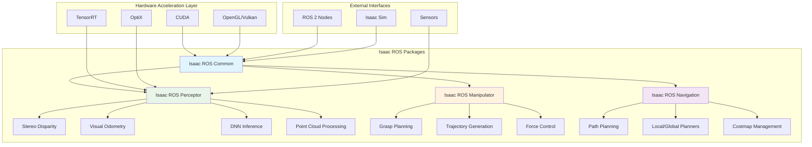

# Introduction to Isaac ROS: Hardware-Accelerated Packages

## Overview

Isaac ROS is NVIDIA's collection of hardware-accelerated perception and navigation packages designed specifically for robotics applications. These packages leverage the power of NVIDIA GPUs to accelerate computationally intensive tasks such as stereo vision, visual SLAM, and deep learning inference. This chapter provides an introduction to the Isaac ROS ecosystem, its core packages, and how to effectively utilize these tools in your robotics applications.

## Isaac ROS Architecture



### Hardware Acceleration Foundation

Isaac ROS packages are built on top of NVIDIA's GPU acceleration technologies, including:

- **CUDA**: For parallel computing on NVIDIA GPUs
- **TensorRT**: For optimized deep learning inference
- **OptiX**: For ray tracing and computer vision algorithms
- **OpenGL/Vulkan**: For graphics and compute operations

### Package Organization

Isaac ROS follows the ROS 2 package structure with specialized hardware acceleration:

```yaml
# Isaac ROS Package Structure
isaac_ros_common:
  - Common utilities and build configurations
  - Hardware interface abstractions
  - Performance monitoring tools

isaac_ros_perceptor:
  - Stereo disparity estimation
  - Visual odometry
  - DNN-based perception
  - Point cloud processing

isaac_ros_manipulator:
  - Manipulation algorithms
  - Grasp planning
  - Trajectory generation
  - Force control

isaac_ros_navigation:
  - Path planning
  - Local and global planners
  - Costmap management
  - Controller interfaces
```

## Core Isaac ROS Packages

### Isaac ROS Common

The `isaac_ros_common` package provides the foundation for all Isaac ROS packages:

```python
# Example Isaac ROS Common usage
import rclpy
from rclpy.node import Node
from isaac_ros_common.performance import PerformanceMetrics

class IsaacROSNode(Node):
    def __init__(self):
        super().__init__('isaac_ros_example_node')

        # Initialize performance monitoring
        self.performance_monitor = PerformanceMetrics(
            node_name=self.get_name(),
            gpu_monitoring=True,
            cpu_monitoring=True
        )

        # Setup GPU-accelerated processing
        self.setup_gpu_pipeline()

    def setup_gpu_pipeline(self):
        """Configure GPU-accelerated processing pipeline"""
        # Initialize CUDA context
        # Configure TensorRT engines
        # Set up memory pools
        pass
```

### Isaac ROS Perceptor

The `isaac_ros_perceptor` package contains perception algorithms:

#### Stereo Disparity

```python
# Isaac ROS Stereo Disparity Example
from isaac_ros_stereo_image_proc import StereoDisparityNode
import rclpy
from sensor_msgs.msg import Image

class StereoProcessor:
    def __init__(self):
        # Initialize stereo disparity node
        self.stereo_node = StereoDisparityNode(
            node_name='stereo_disparity',
            baseline=0.54,  # Baseline in meters
            focal_length=320.0,  # Focal length in pixels
            disparity_range=64  # Maximum disparity range
        )

        # Subscribe to stereo images
        self.left_sub = self.stereo_node.create_subscription(
            Image, '/camera/left/image_rect', self.left_callback, 10
        )
        self.right_sub = self.stereo_node.create_subscription(
            Image, '/camera/right/image_rect', self.right_callback, 10
        )

        # Publish disparity map
        self.disparity_pub = self.stereo_node.create_publisher(
            Image, '/disparity_map', 10
        )

    def left_callback(self, msg):
        # Process left image
        pass

    def right_callback(self, msg):
        # Process right image and compute disparity
        pass
```

#### Visual Odometry

```python
# Isaac ROS Visual Odometry Example
from isaac_ros_visual_slam import VisualSlamNode
from sensor_msgs.msg import Image, CameraInfo
from geometry_msgs.msg import PoseStamped

class VisualOdometryProcessor:
    def __init__(self):
        # Initialize visual SLAM node
        self.vslam_node = VisualSlamNode(
            node_name='visual_odometry',
            enable_occupancy_map=False,
            enable_imu_fusion=False
        )

        # Setup camera info subscribers
        self.left_cam_info_sub = self.vslam_node.create_subscription(
            CameraInfo, '/camera/left/camera_info', self.left_cam_info_callback, 10
        )

        # Setup image subscribers
        self.left_img_sub = self.vslam_node.create_subscription(
            Image, '/camera/left/image_rect', self.left_img_callback, 10
        )

        # Setup pose publisher
        self.pose_pub = self.vslam_node.create_publisher(
            PoseStamped, '/visual_odometry/pose', 10
        )

    def left_cam_info_callback(self, msg):
        # Process camera calibration
        pass

    def left_img_callback(self, msg):
        # Process image for visual odometry
        pass
```

### Isaac ROS Manipulator

The `isaac_ros_manipulator` package provides manipulation capabilities:

```python
# Isaac ROS Manipulation Example
from isaac_ros_manipulator import ManipulationPipeline
from geometry_msgs.msg import Pose
from std_msgs.msg import String

class ManipulationController:
    def __init__(self):
        # Initialize manipulation pipeline
        self.manipulator = ManipulationPipeline(
            robot_description='franka_panda',
            planning_scene='default_scene'
        )

        # Setup grasp planning
        self.grasp_planner = self.manipulator.create_grasp_planner()

        # Setup trajectory execution
        self.trajectory_executor = self.manipulator.create_trajectory_executor()

    def plan_grasp(self, object_pose):
        """Plan a grasp for the given object pose"""
        grasp_poses = self.grasp_planner.compute_grasps(object_pose)

        # Select best grasp
        best_grasp = self.select_best_grasp(grasp_poses)

        return best_grasp

    def execute_manipulation(self, grasp_pose, place_pose):
        """Execute manipulation task"""
        # Plan trajectory to grasp pose
        grasp_traj = self.manipulator.plan_to_pose(grasp_pose)

        # Execute grasp
        self.trajectory_executor.execute(grasp_traj)

        # Close gripper
        self.manipulator.close_gripper()

        # Plan trajectory to place pose
        place_traj = self.manipulator.plan_to_pose(place_pose)

        # Execute place
        self.trajectory_executor.execute(place_traj)

        # Open gripper
        self.manipulator.open_gripper()
```

### Isaac ROS Navigation

The `isaac_ros_navigation` package provides navigation capabilities:

```python
# Isaac ROS Navigation Example
from isaac_ros_nav2 import IsaacNavNode
from geometry_msgs.msg import PoseStamped
from nav_msgs.msg import Path

class IsaacNavigationController:
    def __init__(self):
        # Initialize navigation node
        self.nav_node = IsaacNavNode(
            node_name='isaac_navigation',
            costmap_resolution=0.05,  # 5cm resolution
            planner_frequency=5.0,   # 5 Hz planning
            controller_frequency=20.0 # 20 Hz control
        )

        # Setup goal subscriber
        self.goal_sub = self.nav_node.create_subscription(
            PoseStamped, '/move_base_simple/goal', self.goal_callback, 10
        )

        # Setup path publisher
        self.path_pub = self.nav_node.create_publisher(
            Path, '/plan', 10
        )

    def goal_callback(self, msg):
        """Handle navigation goal"""
        # Plan path to goal
        path = self.nav_node.plan_path(msg.pose)

        # Execute navigation
        self.nav_node.execute_path(path)
```

## GPU Acceleration Techniques

### CUDA Integration

Isaac ROS packages leverage CUDA for parallel processing:

```python
# CUDA-accelerated image processing example
import cupy as cp
import numpy as np
from sensor_msgs.msg import Image

class CudaImageProcessor:
    def __init__(self):
        # Initialize CUDA context
        self.cuda_device = cp.cuda.Device(0)
        self.cuda_device.use()

    def process_image_gpu(self, image_msg):
        """Process image using GPU acceleration"""
        # Convert ROS image to numpy array
        img_array = self.ros_image_to_numpy(image_msg)

        # Transfer to GPU
        gpu_img = cp.asarray(img_array)

        # Apply GPU-accelerated operations
        processed_gpu = self.gpu_filter_operation(gpu_img)

        # Transfer back to CPU
        result = cp.asnumpy(processed_gpu)

        return result

    def gpu_filter_operation(self, gpu_img):
        """Example GPU filter operation"""
        # Example: Apply Gaussian blur using CUDA
        kernel = cp.array([
            [1, 2, 1],
            [2, 4, 2],
            [1, 2, 1]
        ]) / 16.0

        # Perform convolution on GPU
        # (Simplified example)
        return cp.convolve2d(gpu_img, kernel, mode='same')
```

### TensorRT Integration

Deep learning models are optimized with TensorRT:

```python
# TensorRT-accelerated inference example
import tensorrt as trt
import pycuda.driver as cuda
import pycuda.autoinit
import numpy as np

class TensorRTInference:
    def __init__(self, engine_path):
        # Load TensorRT engine
        self.runtime = trt.Runtime(trt.Logger(trt.Logger.WARNING))

        with open(engine_path, 'rb') as f:
            self.engine = self.runtime.deserialize_cuda_engine(f.read())

        self.context = self.engine.create_execution_context()

        # Allocate buffers
        self.allocate_buffers()

    def allocate_buffers(self):
        """Allocate input/output buffers for TensorRT"""
        self.input_binding = None
        self.output_binding = None

        for binding in self.engine:
            if self.engine.get_tensor_mode(binding) == trt.TensorIOMode.INPUT:
                self.input_binding = self.engine.get_tensor_shape(binding)
            else:
                self.output_binding = self.engine.get_tensor_shape(binding)

    def infer(self, input_data):
        """Perform inference with TensorRT"""
        # Allocate GPU memory
        d_input = cuda.mem_alloc(input_data.nbytes)
        d_output = cuda.mem_alloc(self.output_binding[1] * 4)  # Assuming float32

        # Copy input to GPU
        cuda.memcpy_htod(d_input, input_data)

        # Execute inference
        self.context.execute_v2([int(d_input), int(d_output)])

        # Copy output from GPU
        output = np.empty(self.output_binding[1], dtype=np.float32)
        cuda.memcpy_dtoh(output, d_output)

        # Cleanup
        del d_input
        del d_output

        return output
```

## Isaac ROS Message Types

### Custom Message Definitions

Isaac ROS introduces specialized message types:

```python
# Isaac ROS message types
from isaac_ros_messages.msg import (
    IsaacPoseEstimate,
    IsaacPointCloud,
    IsaacDisparityImage,
    IsaacOpticalFlow
)

# Example usage of Isaac ROS messages
class IsaacMessageProcessor:
    def __init__(self):
        # Process Isaac-specific messages
        self.pose_sub = self.create_subscription(
            IsaacPoseEstimate, '/isaac/pose_estimate', self.pose_callback, 10
        )

        self.pointcloud_sub = self.create_subscription(
            IsaacPointCloud, '/isaac/pointcloud', self.pointcloud_callback, 10
        )

    def pose_callback(self, msg):
        """Handle Isaac pose estimate"""
        # Extract pose information
        position = msg.pose.position
        orientation = msg.pose.orientation

        # Process with Isaac-specific algorithms
        self.process_isaac_pose(msg)

    def pointcloud_callback(self, msg):
        """Handle Isaac point cloud"""
        # Process point cloud with GPU acceleration
        self.process_isaac_pointcloud(msg)
```

## Launch Files and Configuration

### Isaac ROS Launch Files

Isaac ROS packages include optimized launch configurations:

```xml
<!-- Isaac ROS launch file example -->
<launch>
  <!-- Stereo disparity node -->
  <node pkg="isaac_ros_stereo_image_proc"
        exec="isaac_ros_stereo_disparity"
        name="stereo_disparity">
    <param name="baseline" value="0.54"/>
    <param name="focal_length" value="320.0"/>
    <param name="disparity_range" value="64"/>
    <param name="enable_cuda" value="true"/>
  </node>

  <!-- Visual SLAM node -->
  <node pkg="isaac_ros_visual_slam"
        exec="isaac_ros_visual_slam_node"
        name="visual_slam">
    <param name="enable_occupancy_map" value="false"/>
    <param name="enable_imu_fusion" value="true"/>
    <param name="map_frame" value="map"/>
    <param name="odom_frame" value="odom"/>
  </node>

  <!-- DNN inference node -->
  <node pkg="isaac_ros_dnn_inference"
        exec="isaac_ros_dnn_inference"
        name="dnn_inference">
    <param name="engine_file_path" value="$(findpkg_share isaac_ros_dnn_inference)/models/yolov8.engine"/>
    <param name="input_tensor_name" value="images"/>
    <param name="output_tensor_name" value="output"/>
  </node>
</launch>
```

### Parameter Configuration

Isaac ROS packages offer extensive parameter tuning:

```yaml
# Isaac ROS parameter configuration
stereo_disparity:
  ros__parameters:
    baseline: 0.54
    focal_length: 320.0
    disparity_range: 64
    enable_cuda: true
    cuda_device_id: 0
    stereo_algorithm: "block_matching"
    block_size: 15
    min_disparity: 0
    uniqueness_ratio: 15
    speckle_window_size: 200
    speckle_range: 32

visual_slam:
  ros__parameters:
    enable_occupancy_map: false
    enable_imu_fusion: true
    map_frame: "map"
    odom_frame: "odom"
    base_frame: "base_link"
    max_num_features: 1000
    min_num_features: 500
    tracking_rate: 30.0
    mapping_rate: 1.0
    enable_localization: true
```

## Performance Optimization

### GPU Memory Management

Efficient GPU memory usage is crucial for Isaac ROS performance:

```python
# GPU memory management example
import pycuda.driver as cuda
import gc

class GPUMemoryManager:
    def __init__(self):
        # Initialize CUDA context
        cuda.init()
        self.device = cuda.Device(0)
        self.context = self.device.make_context()

        # Create memory pool
        self.memory_pool = {}

    def allocate_gpu_buffer(self, size, name):
        """Allocate GPU buffer with name tracking"""
        if name in self.memory_pool:
            return self.memory_pool[name]

        buffer = cuda.mem_alloc(size)
        self.memory_pool[name] = buffer
        return buffer

    def free_gpu_buffer(self, name):
        """Free GPU buffer by name"""
        if name in self.memory_pool:
            self.memory_pool[name].free()
            del self.memory_pool[name]

    def cleanup(self):
        """Clean up all GPU buffers"""
        for name, buffer in self.memory_pool.items():
            buffer.free()
        self.memory_pool.clear()
        self.context.pop()
```

### Pipeline Optimization

Optimize data flow between Isaac ROS nodes:

```python
# Isaac ROS pipeline optimization
from rclpy.qos import QoSProfile, QoSDurabilityPolicy, QoSHistoryPolicy

class OptimizedIsaacPipeline:
    def __init__(self):
        # Create optimized QoS profiles
        self.image_qos = QoSProfile(
            history=QoSHistoryPolicy.KEEP_LAST,
            depth=1,
            durability=QoSDurabilityPolicy.VOLATILE,
            # Reduced deadline for real-time processing
        )

        # Setup optimized pipeline
        self.setup_optimized_pipeline()

    def setup_optimized_pipeline(self):
        """Setup optimized processing pipeline"""
        # Subscribe with optimized QoS
        self.image_sub = self.create_subscription(
            Image,
            '/camera/image_raw',
            self.image_callback,
            self.image_qos
        )

        # Process with zero-copy where possible
        # Use intra-process communication when available
        # Minimize data serialization/deserialization
```

## Integration with Isaac Sim

### Simulation-Specific Features

Isaac ROS packages are designed to work seamlessly with Isaac Sim:

```python
# Isaac ROS - Isaac Sim integration
from isaac_ros_messages.msg import IsaacSimSensorData

class IsaacSimROSBridge:
    def __init__(self):
        # Subscribe to Isaac Sim sensor data
        self.sim_sensor_sub = self.create_subscription(
            IsaacSimSensorData,
            '/isaac_sim/sensor_data',
            self.sim_sensor_callback,
            10
        )

        # Publish commands to Isaac Sim
        self.sim_cmd_pub = self.create_publisher(
            Twist,
            '/isaac_sim/cmd_vel',
            10
        )

    def sim_sensor_callback(self, msg):
        """Process sensor data from Isaac Sim"""
        # Apply Isaac ROS perception algorithms
        # Process simulated sensor data
        processed_data = self.process_sim_sensor_data(msg)

        # Publish results
        self.publish_perception_results(processed_data)

    def process_sim_sensor_data(self, sim_data):
        """Process Isaac Sim sensor data with Isaac ROS"""
        # Convert simulation data to ROS format
        # Apply GPU-accelerated perception
        # Return processed results
        pass
```

## Code Examples

### Complete Isaac ROS Perception Pipeline

```python
#!/usr/bin/env python3
"""
Complete Isaac ROS Perception Pipeline Example
Demonstrates integration of multiple Isaac ROS packages
"""

import rclpy
from rclpy.node import Node
from sensor_msgs.msg import Image, CameraInfo
from geometry_msgs.msg import PoseStamped
from cv_bridge import CvBridge
import numpy as np
import cv2

class IsaacPerceptionPipeline(Node):
    def __init__(self):
        super().__init__('isaac_perception_pipeline')

        # Initialize CV bridge
        self.cv_bridge = CvBridge()

        # Initialize Isaac ROS components
        self.initialize_isaac_components()

        # Setup subscribers
        self.left_image_sub = self.create_subscription(
            Image, '/camera/left/image_rect', self.left_image_callback, 10
        )
        self.right_image_sub = self.create_subscription(
            Image, '/camera/right/image_rect', self.right_image_callback, 10
        )
        self.left_cam_info_sub = self.create_subscription(
            CameraInfo, '/camera/left/camera_info', self.left_cam_info_callback, 10
        )
        self.right_cam_info_sub = self.create_subscription(
            CameraInfo, '/camera/right/camera_info', self.right_cam_info_callback, 10
        )

        # Setup publishers
        self.disparity_pub = self.create_publisher(
            Image, '/disparity_map', 10
        )
        self.pose_pub = self.create_publisher(
            PoseStamped, '/visual_odometry/pose', 10
        )

        # Storage for stereo images
        self.left_image = None
        self.right_image = None
        self.left_cam_info = None
        self.right_cam_info = None

        # Processing rate
        self.process_rate = self.create_rate(30)  # 30 Hz

        self.get_logger().info('Isaac Perception Pipeline initialized')

    def initialize_isaac_components(self):
        """Initialize Isaac ROS components"""
        # Initialize stereo processing
        self.stereo_processor = self.create_stereo_processor()

        # Initialize visual odometry
        self.visual_odom = self.create_visual_odometry()

        # Initialize DNN inference (if needed)
        # self.dnn_inference = self.create_dnn_inference()

    def create_stereo_processor(self):
        """Create stereo processing component"""
        # This would initialize Isaac ROS stereo processing
        # For simulation purposes, we'll return a placeholder
        return {
            'baseline': 0.54,  # meters
            'focal_length': 320.0,  # pixels
            'disparity_range': 64
        }

    def create_visual_odometry(self):
        """Create visual odometry component"""
        # This would initialize Isaac ROS visual odometry
        return {
            'pose': np.eye(4),  # 4x4 transformation matrix
            'frame_count': 0
        }

    def left_image_callback(self, msg):
        """Handle left camera image"""
        try:
            self.left_image = self.cv_bridge.imgmsg_to_cv2(msg, desired_encoding='passthrough')
        except Exception as e:
            self.get_logger().error(f'Error converting left image: {e}')

    def right_image_callback(self, msg):
        """Handle right camera image"""
        try:
            self.right_image = self.cv_bridge.imgmsg_to_cv2(msg, desired_encoding='passthrough')
        except Exception as e:
            self.get_logger().error(f'Error converting right image: {e}')

    def left_cam_info_callback(self, msg):
        """Handle left camera info"""
        self.left_cam_info = msg

    def right_cam_info_callback(self, msg):
        """Handle right camera info"""
        self.right_cam_info = msg

    def process_stereo_data(self):
        """Process stereo images to generate disparity map"""
        if self.left_image is None or self.right_image is None:
            return None

        # Use OpenCV for demonstration (Isaac ROS uses optimized CUDA implementation)
        stereo = cv2.StereoBM_create(numDisparities=64, blockSize=15)
        disparity = stereo.compute(self.left_image, self.right_image)

        # Convert to ROS message
        disparity_msg = self.cv_bridge.cv2_to_imgmsg(disparity, encoding='mono16')
        disparity_msg.header = self.left_image.header

        return disparity_msg

    def process_visual_odometry(self):
        """Process visual odometry"""
        if self.left_image is None:
            return None

        # Placeholder for visual odometry processing
        # Isaac ROS would use GPU-accelerated algorithms
        pose_msg = PoseStamped()
        pose_msg.header.stamp = self.get_clock().now().to_msg()
        pose_msg.header.frame_id = 'odom'

        # Placeholder pose (in real implementation, this would come from visual odometry)
        pose_msg.pose.position.x = 0.0
        pose_msg.pose.position.y = 0.0
        pose_msg.pose.position.z = 0.0
        pose_msg.pose.orientation.w = 1.0

        return pose_msg

    def timer_callback(self):
        """Main processing loop"""
        # Process stereo data
        disparity_msg = self.process_stereo_data()
        if disparity_msg is not None:
            self.disparity_pub.publish(disparity_msg)

        # Process visual odometry
        pose_msg = self.process_visual_odometry()
        if pose_msg is not None:
            self.pose_pub.publish(pose_msg)

    def run(self):
        """Run the perception pipeline"""
        while rclpy.ok():
            self.timer_callback()
            self.process_rate.sleep()

def main(args=None):
    rclpy.init(args=args)

    perception_pipeline = IsaacPerceptionPipeline()

    try:
        perception_pipeline.run()
    except KeyboardInterrupt:
        perception_pipeline.get_logger().info('Pipeline interrupted by user')
    finally:
        perception_pipeline.destroy_node()
        rclpy.shutdown()

if __name__ == '__main__':
    main()
```

## Performance Monitoring and Debugging

### Isaac ROS Performance Tools

Isaac ROS includes tools for performance monitoring:

```python
# Isaac ROS performance monitoring
from isaac_ros_common.performance import PerformanceMonitor
import psutil
import GPUtil

class IsaacPerformanceMonitor:
    def __init__(self, node_name):
        self.node_name = node_name
        self.monitor = PerformanceMonitor(node_name)

        # Initialize GPU monitoring
        self.gpu_monitoring = True

        # Initialize CPU monitoring
        self.cpu_monitoring = True

        # Performance statistics
        self.stats = {
            'cpu_usage': [],
            'gpu_usage': [],
            'memory_usage': [],
            'processing_time': []
        }

    def start_monitoring(self):
        """Start performance monitoring"""
        self.monitor.start()

    def stop_monitoring(self):
        """Stop performance monitoring"""
        self.monitor.stop()
        self.print_performance_summary()

    def record_performance(self, processing_time):
        """Record performance metrics"""
        # Record processing time
        self.stats['processing_time'].append(processing_time)

        # Record CPU usage
        cpu_percent = psutil.cpu_percent()
        self.stats['cpu_usage'].append(cpu_percent)

        # Record GPU usage
        if self.gpu_monitoring:
            gpus = GPUtil.getGPUs()
            if gpus:
                gpu_percent = gpus[0].load * 100
                self.stats['gpu_usage'].append(gpu_percent)

        # Record memory usage
        memory_percent = psutil.virtual_memory().percent
        self.stats['memory_usage'].append(memory_percent)

    def print_performance_summary(self):
        """Print performance summary"""
        if not self.stats['processing_time']:
            return

        avg_time = sum(self.stats['processing_time']) / len(self.stats['processing_time'])
        avg_cpu = sum(self.stats['cpu_usage']) / len(self.stats['cpu_usage'])

        print(f"Performance Summary for {self.node_name}:")
        print(f"  Average Processing Time: {avg_time:.4f}s ({1/avg_time:.2f} Hz)")
        print(f"  Average CPU Usage: {avg_cpu:.2f}%")
        if self.stats['gpu_usage']:
            avg_gpu = sum(self.stats['gpu_usage']) / len(self.stats['gpu_usage'])
            print(f"  Average GPU Usage: {avg_gpu:.2f}%")
```

## Best Practices

### Efficient GPU Utilization

1. **Batch Processing**: Process multiple inputs simultaneously when possible
2. **Memory Pooling**: Reuse GPU memory allocations to avoid overhead
3. **Asynchronous Execution**: Use CUDA streams for overlapping operations
4. **TensorRT Optimization**: Optimize neural networks with TensorRT

### Pipeline Design

1. **Modular Architecture**: Design nodes to be reusable and configurable
2. **QoS Configuration**: Use appropriate QoS settings for real-time performance
3. **Threading**: Utilize multi-threading for I/O and processing separation
4. **Resource Management**: Properly manage GPU and CPU resources

## Summary

Isaac ROS provides a comprehensive suite of hardware-accelerated packages for robotics perception and navigation. By leveraging NVIDIA's GPU acceleration technologies, Isaac ROS enables real-time processing of computationally intensive algorithms that would be challenging on CPU alone. The packages are designed to integrate seamlessly with ROS 2 and Isaac Sim, providing a complete development pipeline from simulation to deployment.

In the next chapter, we'll explore Visual SLAM and advanced perception with Isaac ROS, diving into implementation examples of VSLAM algorithms that leverage GPU acceleration for real-time performance.