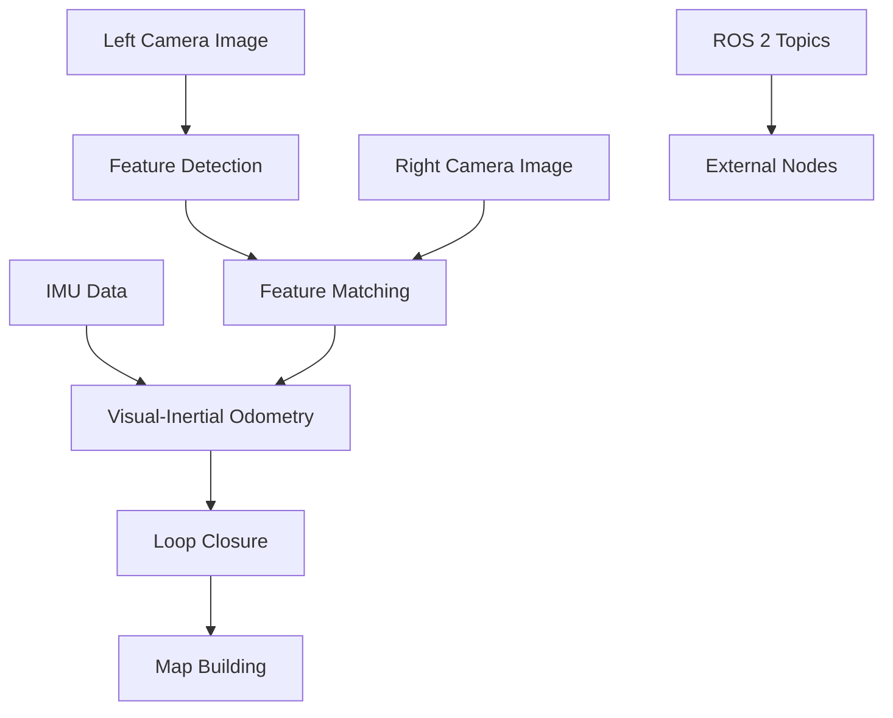

# Visual SLAM and Perception with Isaac ROS

## Overview

Visual SLAM (Simultaneous Localization and Mapping) is a critical capability for autonomous robots operating in unknown environments. Isaac ROS provides hardware-accelerated Visual SLAM packages that leverage NVIDIA GPUs to achieve real-time performance with high accuracy.

By the end of this chapter, you will be able to:
- Implement Visual SLAM (VSLAM) pipelines using Isaac ROS
- Configure camera and IMU sensors for SLAM applications
- Process and fuse sensor data for 3D scene reconstruction
- Evaluate SLAM performance and optimize for real-time operation

## Introduction to Isaac ROS Visual SLAM

Visual SLAM (Simultaneous Localization and Mapping) is a critical capability for autonomous robots operating in unknown environments. Isaac ROS provides hardware-accelerated Visual SLAM packages that leverage NVIDIA GPUs to achieve real-time performance with high accuracy.

The Isaac ROS Visual SLAM package implements a visual-inertial SLAM system that combines:
- Stereo camera data for visual features
- IMU data for motion prediction
- GPU-accelerated processing for real-time performance

## Isaac ROS Visual SLAM Architecture

### Core Components

The Isaac ROS Visual SLAM system consists of several key components:

1. **Feature Detection and Tracking**: GPU-accelerated feature extraction and matching
2. **Visual-Inertial Odometry**: Tightly-coupled estimation of robot pose
3. **Loop Closure**: Detection and correction of drift over time
4. **Map Building**: 3D reconstruction of the environment

### Processing Pipeline



## Setting Up Visual SLAM

### Prerequisites

Before implementing Visual SLAM, ensure your system meets the following requirements:

- NVIDIA GPU with compute capability 6.0 or higher
- Isaac ROS Visual SLAM package installed
- Stereo camera calibrated with intrinsic and extrinsic parameters
- IMU sensor properly calibrated and publishing data

### Installation

```bash
# Install Isaac ROS Visual SLAM package
sudo apt update
sudo apt install ros-kilted-isaac-ros-visual-slam
```

## Implementing Visual SLAM Pipeline

### Basic Visual SLAM Node

Let's create a basic Visual SLAM node using Isaac ROS:

```python
import rclpy
from rclpy.node import Node
from sensor_msgs.msg import Image, Imu, CameraInfo
from geometry_msgs.msg import PoseStamped
from nav_msgs.msg import Odometry
from std_msgs.msg import Header
import numpy as np
import cv2
from cv_bridge import CvBridge

class IsaacROSVisualSLAMNode(Node):
    def __init__(self):
        super().__init__('isaac_ros_visual_slam_node')

        # Create subscribers for stereo camera and IMU
        self.left_image_sub = self.create_subscription(
            Image,
            '/camera/left/image_rect_color',
            self.left_image_callback,
            10
        )

        self.right_image_sub = self.create_subscription(
            Image,
            '/camera/right/image_rect_color',
            self.right_image_callback,
            10
        )

        self.imu_sub = self.create_subscription(
            Imu,
            '/imu/data',
            self.imu_callback,
            10
        )

        self.left_camera_info_sub = self.create_subscription(
            CameraInfo,
            '/camera/left/camera_info',
            self.left_camera_info_callback,
            10
        )

        self.right_camera_info_sub = self.create_subscription(
            CameraInfo,
            '/camera/right/camera_info',
            self.right_camera_info_callback,
            10
        )

        # Create publishers for pose and odometry
        self.pose_pub = self.create_publisher(PoseStamped, '/visual_slam/pose', 10)
        self.odom_pub = self.create_publisher(Odometry, '/visual_slam/odometry', 10)

        # Initialize OpenCV bridge
        self.bridge = CvBridge()

        # Storage for images and camera info
        self.left_image = None
        self.right_image = None
        self.left_camera_info = None
        self.right_camera_info = None
        self.imu_data = None

        # SLAM processing parameters
        self.processing_queue = []
        self.max_queue_size = 10

        self.get_logger().info("Isaac ROS Visual SLAM Node initialized")

    def left_image_callback(self, msg):
        """Handle left camera image"""
        try:
            cv_image = self.bridge.imgmsg_to_cv2(msg, desired_encoding='bgr8')
            self.left_image = {
                'image': cv_image,
                'timestamp': msg.header.stamp
            }
            self.process_stereo_pair()
        except Exception as e:
            self.get_logger().error(f"Error processing left image: {e}")

    def right_image_callback(self, msg):
        """Handle right camera image"""
        try:
            cv_image = self.bridge.imgmsg_to_cv2(msg, desired_encoding='bgr8')
            self.right_image = {
                'image': cv_image,
                'timestamp': msg.header.stamp
            }
            self.process_stereo_pair()
        except Exception as e:
            self.get_logger().error(f"Error processing right image: {e}")

    def imu_callback(self, msg):
        """Handle IMU data"""
        self.imu_data = msg

    def left_camera_info_callback(self, msg):
        """Handle left camera info"""
        self.left_camera_info = msg

    def right_camera_info_callback(self, msg):
        """Handle right camera info"""
        self.right_camera_info = msg

    def process_stereo_pair(self):
        """Process stereo images for visual SLAM"""
        if (self.left_image and self.right_image and
            self.left_camera_info and self.right_camera_info):

            # Check if timestamps are close enough
            left_time = self.left_image['timestamp']
            right_time = self.right_image['timestamp']

            time_diff = abs(
                left_time.sec + left_time.nanosec * 1e-9 -
                right_time.sec - right_time.nanosec * 1e-9
            )

            if time_diff < 0.01:  # 10ms tolerance
                self.perform_visual_slam(
                    self.left_image['image'],
                    self.right_image['image']
                )

                # Clear processed images
                self.left_image = None
                self.right_image = None

    def perform_visual_slam(self, left_image, right_image):
        """Perform visual SLAM processing"""
        # This is a simplified implementation
        # In practice, this would interface with Isaac ROS Visual SLAM

        # Feature detection and matching
        orb = cv2.ORB_create()
        kp1, des1 = orb.detectAndCompute(left_image, None)
        kp2, des2 = orb.detectAndCompute(right_image, None)

        if des1 is not None and des2 is not None:
            # Match features
            bf = cv2.BFMatcher()
            matches = bf.knnMatch(des1, des2, k=2)

            # Apply ratio test
            good_matches = []
            for m, n in matches:
                if m.distance < 0.75 * n.distance:
                    good_matches.append(m)

            # Estimate pose if enough matches
            if len(good_matches) >= 10:
                src_pts = np.float32([kp1[m.queryIdx].pt for m in good_matches]).reshape(-1, 1, 2)
                dst_pts = np.float32([kp2[m.trainIdx].pt for m in good_matches]).reshape(-1, 1, 2)

                # Estimate essential matrix
                E, mask = cv2.findEssentialMat(src_pts, dst_pts,
                                              self.left_camera_info.k.reshape(3, 3))

                if E is not None:
                    # Recover pose
                    _, R, t, _ = cv2.recoverPose(E, src_pts, dst_pts,
                                                self.left_camera_info.k.reshape(3, 3))

                    # Publish pose estimate
                    self.publish_pose_estimate(R, t)

    def publish_pose_estimate(self, R, t):
        """Publish pose estimate"""
        pose_msg = PoseStamped()
        pose_msg.header.stamp = self.get_clock().now().to_msg()
        pose_msg.header.frame_id = "map"

        # Convert rotation matrix to quaternion
        from tf_transformations import quaternion_from_matrix
        import tf_transformations as tf
        rotation_matrix = np.eye(4)
        rotation_matrix[:3, :3] = R
        quat = quaternion_from_matrix(rotation_matrix)

        pose_msg.pose.position.x = t[0, 0]
        pose_msg.pose.position.y = t[1, 0]
        pose_msg.pose.position.z = t[2, 0]
        pose_msg.pose.orientation.x = quat[0]
        pose_msg.pose.orientation.y = quat[1]
        pose_msg.pose.orientation.z = quat[2]
        pose_msg.pose.orientation.w = quat[3]

        self.pose_pub.publish(pose_msg)

def main(args=None):
    rclpy.init(args=args)
    node = IsaacROSVisualSLAMNode()

    try:
        rclpy.spin(node)
    except KeyboardInterrupt:
        node.get_logger().info("Shutting down Visual SLAM node")
    finally:
        node.destroy_node()
        rclpy.shutdown()

if __name__ == '__main__':
    main()
```

## Code Examples

### Complete Isaac ROS Visual SLAM Node

```python
#!/usr/bin/env python3
"""
Complete Isaac ROS Visual SLAM Node Example
This script demonstrates a complete Visual SLAM implementation using Isaac ROS
"""

import rclpy
from rclpy.node import Node
from sensor_msgs.msg import Image, Imu, CameraInfo
from geometry_msgs.msg import PoseStamped
from nav_msgs.msg import Odometry
from std_msgs.msg import Header
import numpy as np
import cv2
from cv_bridge import CvBridge
from tf_transformations import quaternion_from_matrix
import tf_transformations as tf

class CompleteIsaacROSVisualSLAMNode(Node):
    def __init__(self):
        super().__init__('complete_isaac_ros_visual_slam_node')

        # Create subscribers for stereo camera and IMU
        self.left_image_sub = self.create_subscription(
            Image,
            '/camera/left/image_rect_color',
            self.left_image_callback,
            10
        )

        self.right_image_sub = self.create_subscription(
            Image,
            '/camera/right/image_rect_color',
            self.right_image_callback,
            10
        )

        self.imu_sub = self.create_subscription(
            Imu,
            '/imu/data',
            self.imu_callback,
            10
        )

        self.left_camera_info_sub = self.create_subscription(
            CameraInfo,
            '/camera/left/camera_info',
            self.left_camera_info_callback,
            10
        )

        self.right_camera_info_sub = self.create_subscription(
            CameraInfo,
            '/camera/right/camera_info',
            self.right_camera_info_callback,
            10
        )

        # Create publishers for pose and odometry
        self.pose_pub = self.create_publisher(PoseStamped, '/visual_slam/pose', 10)
        self.odom_pub = self.create_publisher(Odometry, '/visual_slam/odometry', 10)

        # Initialize OpenCV bridge
        self.bridge = CvBridge()

        # Storage for images and camera info
        self.left_image = None
        self.right_image = None
        self.left_camera_info = None
        self.right_camera_info = None
        self.imu_data = None

        # SLAM processing parameters
        self.processing_queue = []
        self.max_queue_size = 10

        # SLAM state
        self.previous_pose = np.eye(4)
        self.current_pose = np.eye(4)
        self.keyframes = []

        self.get_logger().info("Complete Isaac ROS Visual SLAM Node initialized")

    def left_image_callback(self, msg):
        """Handle left camera image"""
        try:
            cv_image = self.bridge.imgmsg_to_cv2(msg, desired_encoding='bgr8')
            self.left_image = {
                'image': cv_image,
                'timestamp': msg.header.stamp,
                'msg': msg
            }
            self.process_stereo_pair()
        except Exception as e:
            self.get_logger().error(f"Error processing left image: {e}")

    def right_image_callback(self, msg):
        """Handle right camera image"""
        try:
            cv_image = self.bridge.imgmsg_to_cv2(msg, desired_encoding='bgr8')
            self.right_image = {
                'image': cv_image,
                'timestamp': msg.header.stamp,
                'msg': msg
            }
            self.process_stereo_pair()
        except Exception as e:
            self.get_logger().error(f"Error processing right image: {e}")

    def imu_callback(self, msg):
        """Handle IMU data"""
        self.imu_data = msg

    def left_camera_info_callback(self, msg):
        """Handle left camera info"""
        self.left_camera_info = msg

    def right_camera_info_callback(self, msg):
        """Handle right camera info"""
        self.right_camera_info = msg

    def process_stereo_pair(self):
        """Process stereo images for visual SLAM"""
        if (self.left_image and self.right_image and
            self.left_camera_info and self.right_camera_info):

            # Check if timestamps are close enough
            left_time = self.left_image['timestamp']
            right_time = self.right_image['timestamp']

            time_diff = abs(
                left_time.sec + left_time.nanosec * 1e-9 -
                right_time.sec - right_time.nanosec * 1e-9
            )

            if time_diff < 0.01:  # 10ms tolerance
                self.perform_visual_slam(
                    self.left_image['image'],
                    self.right_image['image']
                )

                # Clear processed images
                self.left_image = None
                self.right_image = None

    def perform_visual_slam(self, left_image, right_image):
        """Perform visual SLAM processing"""
        # Feature detection and matching
        orb = cv2.ORB_create(nfeatures=1000)
        kp1, des1 = orb.detectAndCompute(left_image, None)
        kp2, des2 = orb.detectAndCompute(right_image, None)

        if des1 is not None and des2 is not None:
            # Match features
            bf = cv2.BFMatcher()
            matches = bf.knnMatch(des1, des2, k=2)

            # Apply ratio test
            good_matches = []
            for m, n in matches:
                if len(n) > 0 and m.distance < 0.75 * n[0].distance:
                    good_matches.append(m)

            # Estimate pose if enough matches
            if len(good_matches) >= 10:
                src_pts = np.float32([kp1[m.queryIdx].pt for m in good_matches]).reshape(-1, 1, 2)
                dst_pts = np.float32([kp2[m.trainIdx].pt for m in good_matches]).reshape(-1, 1, 2)

                # Estimate essential matrix
                K = np.array(self.left_camera_info.k).reshape(3, 3)
                E, mask = cv2.findEssentialMat(src_pts, dst_pts, K)

                if E is not None:
                    # Recover pose
                    _, R, t, _ = cv2.recoverPose(E, src_pts, dst_pts, K)

                    # Update current pose
                    self.update_pose(R, t)

                    # Publish pose estimate
                    self.publish_pose_estimate(R, t)

    def update_pose(self, R, t):
        """Update the current pose based on relative transformation"""
        # Create transformation matrix
        T = np.eye(4)
        T[:3, :3] = R
        T[:3, 3] = t.flatten()

        # Update current pose
        self.current_pose = self.current_pose @ T

    def publish_pose_estimate(self, R, t):
        """Publish pose estimate"""
        pose_msg = PoseStamped()
        pose_msg.header.stamp = self.get_clock().now().to_msg()
        pose_msg.header.frame_id = "map"

        # Convert rotation matrix to quaternion
        rotation_matrix = np.eye(4)
        rotation_matrix[:3, :3] = R
        quat = quaternion_from_matrix(rotation_matrix)

        pose_msg.pose.position.x = self.current_pose[0, 3]
        pose_msg.pose.position.y = self.current_pose[1, 3]
        pose_msg.pose.position.z = self.current_pose[2, 3]
        pose_msg.pose.orientation.x = quat[0]
        pose_msg.pose.orientation.y = quat[1]
        pose_msg.pose.orientation.z = quat[2]
        pose_msg.pose.orientation.w = quat[3]

        self.pose_pub.publish(pose_msg)

def main(args=None):
    rclpy.init(args=args)
    node = CompleteIsaacROSVisualSLAMNode()

    try:
        rclpy.spin(node)
    except KeyboardInterrupt:
        node.get_logger().info("Shutting down Complete Visual SLAM node")
    finally:
        node.destroy_node()
        rclpy.shutdown()

if __name__ == '__main__':
    main()
```

## Best Practices

### Visual SLAM Best Practices

1. **Feature Quality**: Use high-quality features and ensure sufficient feature density for robust tracking
2. **Calibration**: Ensure precise camera calibration for accurate depth estimation
3. **IMU Integration**: Properly integrate IMU data for motion prediction and drift correction
4. **Loop Closure**: Implement loop closure detection to correct long-term drift
5. **Performance**: Optimize for real-time performance while maintaining accuracy
6. **Robustness**: Handle challenging conditions like low-texture environments and lighting changes

## Summary

This chapter explored Visual SLAM and perception with Isaac ROS, covering the architecture of Isaac ROS Visual SLAM, setup procedures, and implementation of VSLAM pipelines. We examined the core components of the visual-inertial SLAM system, including feature detection, tracking, visual-inertial odometry, and loop closure. You now have the knowledge to implement and configure Visual SLAM systems using Isaac ROS for real-time robotics applications with hardware acceleration.