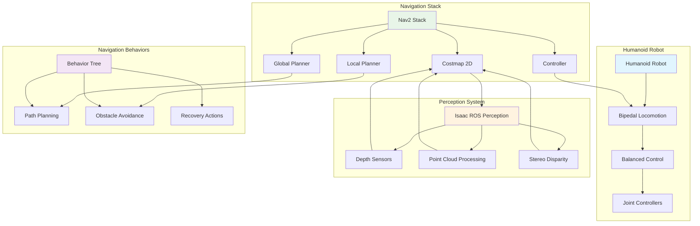
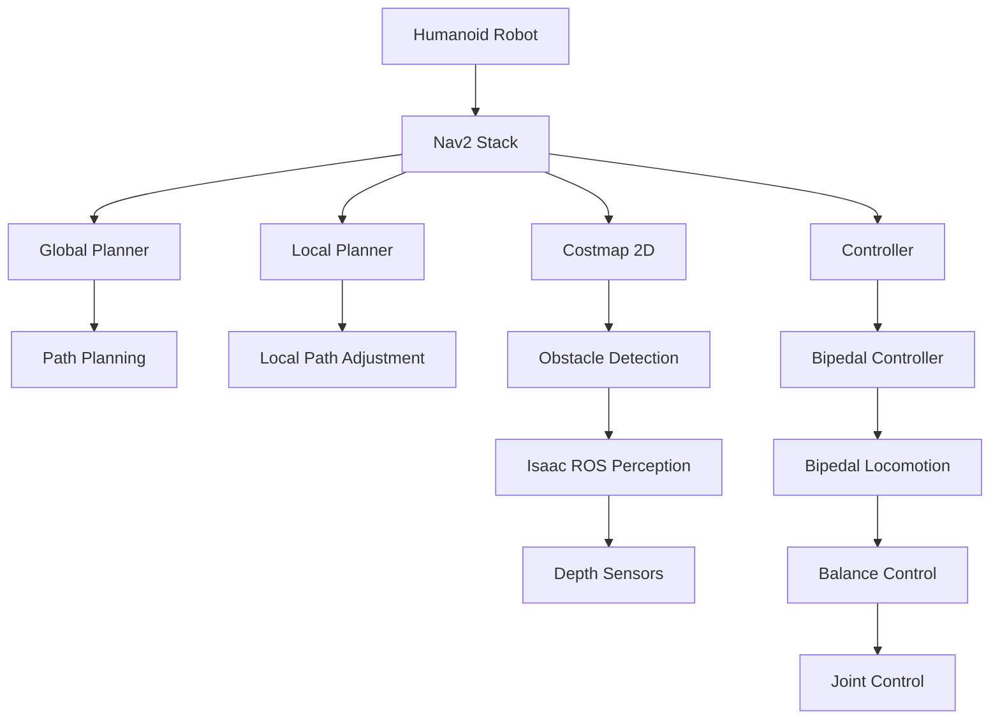

# Nav2 Configuration for Bipedal Humanoid Navigation

## Overview

Navigation in humanoid robots presents unique challenges compared to wheeled robots due to the complex dynamics of bipedal locomotion. The Navigation2 (Nav2) stack provides a comprehensive framework for path planning and navigation, but requires specialized configuration for bipedal robots. This chapter explores how to configure Nav2 for humanoid robot navigation, addressing the specific requirements of bipedal locomotion, balance constraints, and dynamic stability.

## Bipedal Navigation Challenges

### Humanoid Navigation System Architecture



### Unique Characteristics of Humanoid Navigation

Humanoid robots differ significantly from traditional mobile robots in navigation:

- **Dynamic Balance**: Must maintain balance while moving, unlike wheeled robots
- **Foot Placement**: Requires precise foot placement for stable walking
- **ZMP Constraints**: Zero Moment Point must be maintained for stability
- **Limited Turning Radius**: Bipedal robots have different turning capabilities
- **Terrain Adaptation**: Need to adapt gait patterns to different terrains

### Nav2 Architecture for Humanoids



## Nav2 Core Components for Humanoid Navigation

### Global Planner Configuration

The global planner in Nav2 needs to account for humanoid-specific constraints:

```yaml
# Global Planner Configuration for Humanoid Robots
global_planner:
  ros__parameters:
    # Use a planner that can handle humanoid kinematics
    plugin: "nav2_navfn_planner/NavfnPlanner"

    # Planner-specific parameters
    tolerance: 0.5  # Tolerance for goal acceptance (larger for humanoid stability)
    use_astar: false
    allow_unknown: true

    # Humanoid-specific constraints
    min_distance_from_obstacles: 0.8  # Maintain extra clearance for balance
    max_step_height: 0.15  # Maximum step height for humanoid
    max_slope: 0.3  # Maximum traversable slope (in radians)
```

### Local Planner Configuration

The local planner needs to generate trajectories compatible with bipedal locomotion:

```yaml
# Local Planner Configuration for Humanoid Robots
local_planner:
  ros__parameters:
    # Use a controller compatible with humanoid dynamics
    plugin: "nav2_mppi_controller/MPPIController"

    # Controller-specific parameters
    frequency: 10.0  # Lower frequency for humanoid stability
    time_steps: 50
    model_dt: 0.1
    batch_size: 2000

    # Humanoid-specific constraints
    cmd_vel_limits:
      x: [0.0, 0.3, 0.1]  # [min, max, tolerance] for forward speed
      y: [-0.1, 0.1, 0.05]  # Lateral movement constraints
      theta: [-0.5, 0.5, 0.1]  # Angular velocity constraints

    # Cost parameters for humanoid navigation
    goal_dist_gain: 1.0
    path_dist_gain: 2.0
    occ_cost_gain: 2.5
    obstacle_cost_gain: 3.0
    reference_speed_gain: 0.5
```

### Costmap Configuration for Humanoids

Humanoid robots require specialized costmaps that consider balance and gait constraints:

```yaml
# Costmap Configuration for Humanoid Navigation
global_costmap:
  global_costmap:
    ros__parameters:
      update_frequency: 5.0
      publish_frequency: 2.0
      width: 20
      height: 20
      resolution: 0.05  # Fine resolution for precise foot placement
      origin_x: -10.0
      origin_y: -10.0

      # Robot footprint for humanoid (larger than wheeled robots)
      footprint: [[-0.3, -0.2], [-0.3, 0.2], [0.3, 0.2], [0.3, -0.2]]
      footprint_padding: 0.1  # Extra padding for balance margin

      plugins: ["obstacle_layer", "voxel_layer", "inflation_layer"]

      obstacle_layer:
        plugin: "nav2_costmap_2d::ObstacleLayer"
        enabled: True
        observation_sources: scan
        scan:
          topic: /laser_scan
          max_obstacle_height: 2.0
          clearing: True
          marking: True
          data_type: "LaserScan"
          raytrace_max_range: 10.0
          raytrace_min_range: 0.0
          obstacle_max_range: 5.0
          obstacle_min_range: 0.0

      voxel_layer:
        plugin: "nav2_costmap_2d::VoxelLayer"
        enabled: True
        publish_voxel_map: True
        origin_z: 0.0
        z_voxels: 16
        z_resolution: 0.2
        max_obstacle_height: 2.0
        mark_threshold: 0
        observation_sources: pointcloud

      inflation_layer:
        plugin: "nav2_costmap_2d::InflationLayer"
        enabled: True
        cost_scaling_factor: 3.0  # Higher for humanoid safety
        inflation_radius: 1.0    # Larger inflation for stability
        inflate_unknown: false
        inflate_around_unknown: false

  local_costmap:
    ros__parameters:
      update_frequency: 10.0
      publish_frequency: 5.0
      width: 6
      height: 6
      resolution: 0.05
      origin_x: -3.0
      origin_y: -3.0

      # Robot footprint for local planning
      footprint: [[-0.2, -0.15], [-0.2, 0.15], [0.2, 0.15], [0.2, -0.15]]
      footprint_padding: 0.05

      plugins: ["obstacle_layer", "voxel_layer", "inflation_layer"]

      obstacle_layer:
        plugin: "nav2_costmap_2d::ObstacleLayer"
        enabled: True
        observation_sources: scan
        scan:
          topic: /laser_scan
          max_obstacle_height: 2.0
          clearing: True
          marking: True
          data_type: "LaserScan"
          raytrace_max_range: 5.0
          raytrace_min_range: 0.0
          obstacle_max_range: 3.0
          obstacle_min_range: 0.0

      inflation_layer:
        plugin: "nav2_costmap_2d::InflationLayer"
        enabled: True
        cost_scaling_factor: 5.0  # Even higher for local safety
        inflation_radius: 0.8
```

## Bipedal Locomotion Controller

### Humanoid-Specific Controller Interface

The controller needs to interface with the humanoid's bipedal locomotion system:

```python
# Bipedal controller for Nav2 integration
import rclpy
from rclpy.node import Node
from geometry_msgs.msg import Twist, PoseStamped
from nav_msgs.msg import Path
from sensor_msgs.msg import JointState
import numpy as np

class BipedalController(Node):
    def __init__(self):
        super().__init__('bipedal_controller')

        # Publishers and subscribers
        self.cmd_vel_pub = self.create_publisher(Twist, '/cmd_vel', 10)
        self.joint_cmd_pub = self.create_publisher(JointState, '/joint_commands', 10)
        self.path_sub = self.create_subscription(Path, '/plan', self.path_callback, 10)

        # Bipedal locomotion interface
        self.locomotion_interface = BipedalLocomotionInterface()

        # Navigation parameters
        self.linear_vel_limit = 0.3  # m/s
        self.angular_vel_limit = 0.5  # rad/s
        self.min_turning_radius = 0.5  # m

        # Balance control
        self.balance_controller = BalanceController()

        self.get_logger().info('Bipedal Controller initialized')

    def path_callback(self, path_msg):
        """Process navigation path and generate bipedal commands"""
        if len(path_msg.poses) < 2:
            return

        # Convert path to bipedal-compatible commands
        bipedal_commands = self.convert_path_to_bipedal_commands(path_msg)

        # Execute bipedal locomotion
        self.execute_bipedal_locomotion(bipedal_commands)

    def convert_path_to_bipedal_commands(self, path_msg):
        """Convert Nav2 path to bipedal locomotion commands"""
        commands = []

        for i in range(len(path_msg.poses) - 1):
            current_pose = path_msg.poses[i].pose
            next_pose = path_msg.poses[i + 1].pose

            # Calculate direction and distance
            dx = next_pose.position.x - current_pose.position.x
            dy = next_pose.position.y - current_pose.position.y
            distance = np.sqrt(dx*dx + dy*dy)
            angle = np.arctan2(dy, dx)

            # Generate bipedal step command
            step_cmd = self.generate_bipedal_step(dx, dy, distance, angle)
            commands.append(step_cmd)

        return commands

    def generate_bipedal_step(self, dx, dy, distance, angle):
        """Generate a single bipedal step command"""
        # Calculate step parameters based on humanoid kinematics
        step_length = min(distance, 0.3)  # Max step length for stability
        step_direction = angle

        # Generate foot placement
        left_foot_pose = self.calculate_foot_placement('left', step_direction)
        right_foot_pose = self.calculate_foot_placement('right', step_direction)

        # Generate balance commands
        balance_cmd = self.balance_controller.calculate_balance_command(
            left_foot_pose, right_foot_pose
        )

        return {
            'step_length': step_length,
            'direction': step_direction,
            'left_foot': left_foot_pose,
            'right_foot': right_foot_pose,
            'balance_cmd': balance_cmd
        }

    def execute_bipedal_locomotion(self, commands):
        """Execute bipedal locomotion commands"""
        for cmd in commands:
            # Execute single step
            self.execute_single_step(cmd)

            # Wait for step completion
            self.wait_for_step_completion()

            # Update balance
            self.balance_controller.update_balance(cmd['balance_cmd'])

    def execute_single_step(self, step_cmd):
        """Execute a single bipedal step"""
        # This would interface with the actual humanoid robot
        # For simulation, we'll send joint commands
        joint_state = JointState()
        joint_state.name = ['left_hip_joint', 'right_hip_joint',
                           'left_knee_joint', 'right_knee_joint',
                           'left_ankle_joint', 'right_ankle_joint']
        joint_state.position = [step_cmd['left_foot'].position.x,
                               step_cmd['right_foot'].position.x,
                               step_cmd['left_foot'].position.y,
                               step_cmd['right_foot'].position.y,
                               step_cmd['left_foot'].position.z,
                               step_cmd['right_foot'].position.z]

        self.joint_cmd_pub.publish(joint_state)

    def wait_for_step_completion(self):
        """Wait for step execution to complete"""
        # Implementation would check for step completion
        # This is a placeholder
        pass
```

### Balance Control System

```python
# Balance control for humanoid navigation
import numpy as np

class BalanceController:
    def __init__(self):
        # ZMP (Zero Moment Point) parameters
        self.zmp_reference = np.array([0.0, 0.0])
        self.com_height = 0.8  # Center of mass height
        self.gravity = 9.81

        # PID controllers for balance
        self.roll_pid = PIDController(kp=2.0, ki=0.1, kd=0.05)
        self.pitch_pid = PIDController(kp=2.0, ki=0.1, kd=0.05)
        self.yaw_pid = PIDController(kp=1.5, ki=0.05, kd=0.02)

        # Support polygon for bipedal stability
        self.support_polygon = self.calculate_support_polygon()

    def calculate_balance_command(self, left_foot_pose, right_foot_pose):
        """Calculate balance command based on foot positions"""
        # Calculate support polygon
        self.update_support_polygon(left_foot_pose, right_foot_pose)

        # Calculate current ZMP
        current_zmp = self.calculate_current_zmp()

        # Calculate balance correction
        zmp_error = self.zmp_reference - current_zmp
        balance_cmd = self.calculate_balance_correction(zmp_error)

        return balance_cmd

    def calculate_current_zmp(self):
        """Calculate current Zero Moment Point"""
        # This would interface with IMU and force sensors
        # For simulation, we'll use a simplified model
        return np.array([0.0, 0.0])

    def update_support_polygon(self, left_foot, right_foot):
        """Update support polygon based on foot positions"""
        # Calculate support polygon vertices
        self.support_polygon = [
            (left_foot.position.x, left_foot.position.y),
            (right_foot.position.x, right_foot.position.y)
        ]

        # Add margin for stability
        self.support_polygon = self.expand_polygon(self.support_polygon, margin=0.05)

    def expand_polygon(self, polygon, margin):
        """Expand polygon by margin for stability"""
        # Simplified expansion
        expanded = []
        for point in polygon:
            # Add margin in all directions
            expanded.append((point[0] + margin, point[1] + margin))
            expanded.append((point[0] - margin, point[1] - margin))
        return expanded

    def calculate_balance_correction(self, zmp_error):
        """Calculate balance correction from ZMP error"""
        # Use PID controllers to calculate correction
        roll_correction = self.roll_pid.update(zmp_error[0])
        pitch_correction = self.pitch_pid.update(zmp_error[1])
        yaw_correction = self.yaw_pid.update(0.0)  # Yaw from other sources

        return {
            'roll': roll_correction,
            'pitch': pitch_correction,
            'yaw': yaw_correction
        }

class PIDController:
    def __init__(self, kp, ki, kd):
        self.kp = kp
        self.ki = ki
        self.kd = kd
        self.prev_error = 0.0
        self.integral = 0.0

    def update(self, error):
        """Update PID controller"""
        self.integral += error
        derivative = error - self.prev_error
        output = (self.kp * error) + (self.ki * self.integral) + (self.kd * derivative)
        self.prev_error = error
        return output
```

## Isaac ROS Integration for Navigation

### Perception Integration

Humanoid navigation relies heavily on perception data from Isaac ROS:

```python
# Isaac ROS perception integration for navigation
from sensor_msgs.msg import LaserScan, PointCloud2
from nav_msgs.msg import OccupancyGrid
from geometry_msgs.msg import PoseStamped
import numpy as np

class IsaacPerceptionNavigator:
    def __init__(self):
        # Isaac ROS perception subscribers
        self.depth_sub = self.create_subscription(
            Image, '/depth_camera/depth/image_rect_raw',
            self.depth_callback, 10
        )
        self.pointcloud_sub = self.create_subscription(
            PointCloud2, '/pointcloud', self.pointcloud_callback, 10
        )
        self.stereo_disparity_sub = self.create_subscription(
            Image, '/disparity_map', self.disparity_callback, 10
        )

        # Navigation publishers
        self.costmap_pub = self.create_publisher(
            OccupancyGrid, '/isaac_costmap', 10
        )

        # Isaac ROS perception interface
        self.perception_interface = IsaacPerceptionInterface()

    def depth_callback(self, msg):
        """Process depth camera data for navigation"""
        # Convert depth image to point cloud
        point_cloud = self.depth_to_pointcloud(msg)

        # Generate occupancy grid from depth data
        occupancy_grid = self.pointcloud_to_occupancy(point_cloud)

        # Publish to navigation stack
        self.costmap_pub.publish(occupancy_grid)

    def pointcloud_callback(self, msg):
        """Process point cloud data for obstacle detection"""
        # Process point cloud for navigation obstacles
        obstacles = self.detect_obstacles_from_pointcloud(msg)

        # Update navigation costmap
        self.update_navigation_costmap(obstacles)

    def disparity_callback(self, msg):
        """Process stereo disparity data for depth estimation"""
        # Convert disparity to depth
        depth_map = self.disparity_to_depth(msg)

        # Generate elevation map for humanoid navigation
        elevation_map = self.generate_elevation_map(depth_map)

        # Check for traversable terrain
        traversability = self.evaluate_traversability(elevation_map)

        # Update navigation plan based on terrain
        self.update_navigation_plan(traversability)

    def detect_obstacles_from_pointcloud(self, pointcloud_msg):
        """Detect obstacles from point cloud data"""
        # Extract obstacle points from point cloud
        obstacle_points = self.extract_obstacle_points(pointcloud_msg)

        # Cluster obstacles
        obstacle_clusters = self.cluster_obstacles(obstacle_points)

        # Filter based on humanoid traversability
        humanoid_obstacles = self.filter_humanoid_obstacles(obstacle_clusters)

        return humanoid_obstacles

    def generate_elevation_map(self, depth_map):
        """Generate elevation map from depth data"""
        # Create elevation map for terrain analysis
        elevation_map = np.zeros_like(depth_map)

        # Process depth data to identify traversable terrain
        for i in range(depth_map.shape[0]):
            for j in range(depth_map.shape[1]):
                if depth_map[i, j] > 0:
                    elevation_map[i, j] = depth_map[i, j]

        return elevation_map

    def evaluate_traversability(self, elevation_map):
        """Evaluate terrain traversability for humanoid"""
        traversability_map = np.ones_like(elevation_map)

        # Check for slopes exceeding humanoid capability
        gradients = np.gradient(elevation_map)
        slope_map = np.sqrt(gradients[0]**2 + gradients[1]**2)

        # Mark areas with excessive slope as non-traversable
        traversability_map[slope_map > 0.3] = 0  # 0.3 rad = ~17 degrees

        # Check for step height
        step_height = np.abs(np.diff(elevation_map, axis=0))
        traversability_map[:-1, :][step_height > 0.15] = 0  # 15cm max step

        return traversability_map
```

## Navigation Behavior Trees

### Custom Behavior Trees for Humanoid Navigation

Nav2 uses behavior trees for navigation task management, which need to be customized for humanoid robots:

```xml
<!-- Humanoid Navigation Behavior Tree -->
<root main_tree_to_execute="MainTree">
    <BehaviorTree ID="MainTree">
        <PipelineSequence name="NavigateWithRecovery">
            <RateController hz="10">
                <ReactiveSequence>
                    <!-- Check if goal is valid -->
                    <GoalUpdated/>

                    <!-- Compute global path -->
                    <ComputePathToPose goal="{goal}" path="{path}" planner_id="humanoid_global_planner"/>

                    <!-- Follow the path with humanoid-specific controller -->
                    <FollowPath path="{path}" controller_id="bipedal_controller"/>
                </ReactiveSequence>
            </RateController>
        </PipelineSequence>
    </BehaviorTree>

    <BehaviorTree ID="RecoveryNodeSequence">
        <ReactiveFallback name="RecoveryFallback">
            <!-- Try to clear local costmap -->
            <ClearEntirelyLocalCostmap service_name="local_costmap/clear_entirely_local_costmap"/>

            <!-- Try to clear global costmap -->
            <ClearEntirelyGlobalCostmap service_name="global_costmap/clear_entirely_global_costmap"/>

            <!-- Try to rotate in place (with balance) -->
            <BackUp backup_dist="0.3" backup_speed="0.1"/>

            <!-- Try to wait and reassess -->
            <Wait wait_duration="2.0"/>
        </ReactiveFallback>
    </BehaviorTree>
</root>
```

### Humanoid-Specific Action Nodes

```python
# Custom action nodes for humanoid navigation
from rclpy.action import ActionServer, CancelResponse, GoalResponse
from rclpy.callback_groups import ReentrantCallbackGroup
from nav2_msgs.action import NavigateToPose
import threading

class HumanoidNavigateToPose:
    def __init__(self, node):
        self.node = node
        self._action_server = ActionServer(
            node,
            NavigateToPose,
            'navigate_to_pose',
            self.execute_callback,
            goal_callback=self.goal_callback,
            cancel_callback=self.cancel_callback,
            callback_group=ReentrantCallbackGroup()
        )

        # Humanoid-specific navigation interface
        self.bipedal_navigator = BipedalNavigator(node)

    def goal_callback(self, goal_request):
        """Handle navigation goal request"""
        # Validate goal for humanoid navigation
        if self.is_goal_valid_for_humanoid(goal_request.pose):
            return GoalResponse.ACCEPT
        else:
            return GoalResponse.REJECT

    def cancel_callback(self, goal_handle):
        """Handle navigation cancellation"""
        return CancelResponse.ACCEPT

    def execute_callback(self, goal_handle):
        """Execute navigation goal"""
        self.node.get_logger().info('Executing navigation goal')

        # Initialize humanoid-specific navigation
        self.bipedal_navigator.initialize_navigation(goal_handle)

        # Execute navigation with progress feedback
        result = self.bipedal_navigator.execute_navigation_with_feedback()

        # Return result
        goal_handle.succeed()
        return result

    def is_goal_valid_for_humanoid(self, pose):
        """Check if goal is valid for humanoid navigation"""
        # Check if goal is on traversable terrain
        terrain_valid = self.check_terrain_traversability(pose)

        # Check if goal is within humanoid capabilities
        distance_valid = self.check_distance_capability(pose)

        # Check if path is safe for humanoid
        path_safe = self.check_path_safety(pose)

        return terrain_valid and distance_valid and path_safe

    def check_terrain_traversability(self, pose):
        """Check if terrain is traversable by humanoid"""
        # Implementation would check elevation, slope, obstacles
        return True

    def check_distance_capability(self, pose):
        """Check if distance is within humanoid capabilities"""
        # Implementation would check distance against humanoid limits
        return True

    def check_path_safety(self, pose):
        """Check if path is safe for humanoid navigation"""
        # Implementation would check path for safety constraints
        return True
```

## Simulation and Testing

### Isaac Sim Integration for Navigation Testing

```python
# Isaac Sim integration for navigation testing
from isaacsim import SimulationApp
from omni.isaac.core import World
from omni.isaac.core.utils.stage import add_reference_to_stage
from omni.isaac.core.utils.nucleus import get_assets_root_path
from omni.isaac.sensor import Camera
import numpy as np

class IsaacSimNavigationTest:
    def __init__(self):
        # Initialize Isaac Sim
        self.simulation_app = SimulationApp({"headless": False})
        self.world = World(stage_units_in_meters=1.0)

        # Add ground plane
        self.world.scene.add_default_ground_plane()

        # Load humanoid robot
        assets_root_path = get_assets_root_path()
        if assets_root_path is None:
            self.simulation_app.close()
            raise Exception("Could not find Isaac Sim assets. Ensure Isaac Sim is properly installed.")

        # Add humanoid robot to simulation
        add_reference_to_stage(
            usd_path=f"{assets_root_path}/Isaac/Robots/Humanoid/humanoid.usd",
            prim_path="/World/HumanoidRobot"
        )

        # Add obstacles for navigation testing
        self.add_navigation_obstacles()

        # Initialize ROS 2 bridge
        self.setup_ros_bridge()

        self.world.reset()

    def add_navigation_obstacles(self):
        """Add obstacles for navigation testing"""
        # Add various obstacles to test navigation
        from omni.isaac.core.utils.prims import create_primitive

        # Create obstacles
        create_primitive(
            prim_path="/World/Obstacle1",
            primitive_props={
                "prim_type": "Cylinder",
                "radius": 0.3,
                "height": 1.0,
                "position": (2.0, 0.0, 0.5)
            }
        )

        create_primitive(
            prim_path="/World/Obstacle2",
            primitive_props={
                "prim_type": "Box",
                "size": 0.5,
                "position": (-1.5, 1.5, 0.25)
            }
        )

        # Create ramps for testing traversability
        create_primitive(
            prim_path="/World/Ramp1",
            primitive_props={
                "prim_type": "Cone",
                "radius": 1.0,
                "height": 0.3,
                "position": (3.0, -2.0, 0.15),
                "orientation": (0.0, 0.383, 0.0, 0.924)  # 45 degree tilt
            }
        )

    def setup_ros_bridge(self):
        """Setup ROS 2 bridge for navigation"""
        # Enable ROS bridge extension
        import omni
        ext_manager = omni.kit.app.get_app().get_extension_manager()
        ext_manager.set_extension_enabled("omni.isaac.ros_bridge", True)

    def run_navigation_test(self):
        """Run navigation test in Isaac Sim"""
        # Set up goal for navigation
        goal_x, goal_y = 5.0, 5.0

        # Publish navigation goal
        import rclpy
        from geometry_msgs.msg import PoseStamped
        from std_msgs.msg import Header

        rclpy.init()
        nav_goal_publisher = rclpy.create_node('isaac_sim_nav_test')
        goal_pub = nav_goal_publisher.create_publisher(
            PoseStamped, '/goal_pose', 10
        )

        # Create and publish goal
        goal_msg = PoseStamped()
        goal_msg.header = Header()
        goal_msg.header.frame_id = 'map'
        goal_msg.header.stamp = nav_goal_publisher.get_clock().now().to_msg()
        goal_msg.pose.position.x = goal_x
        goal_msg.pose.position.y = goal_y
        goal_msg.pose.position.z = 0.0
        goal_msg.pose.orientation.w = 1.0

        # Publish goal and run simulation
        goal_pub.publish(goal_msg)

        # Run simulation for navigation
        for i in range(5000):  # Run for 5000 steps
            self.world.step(render=True)

            # Check if navigation completed
            if self.check_navigation_completion():
                print(f"Navigation completed at step {i}")
                break

        # Cleanup
        nav_goal_publisher.destroy_node()
        rclpy.shutdown()

    def check_navigation_completion(self):
        """Check if navigation task is completed"""
        # Implementation would check if humanoid reached goal
        # This is a placeholder
        return False

    def close(self):
        """Close Isaac Sim"""
        self.simulation_app.close()
```

## Performance Optimization

### Humanoid Navigation Performance Tuning

```python
# Performance optimization for humanoid navigation
class HumanoidNavPerformanceOptimizer:
    def __init__(self):
        self.planning_frequency = 1.0  # Hz
        self.control_frequency = 10.0  # Hz
        self.sensor_frequency = 30.0   # Hz

        # Adaptive parameters based on complexity
        self.adaptive_params = {
            'max_planning_time': 5.0,
            'min_control_interval': 0.1,
            'sensor_processing_rate': 0.3  # Process every 3rd sensor reading
        }

    def optimize_planning_frequency(self, environment_complexity):
        """Adjust planning frequency based on environment"""
        if environment_complexity > 0.7:  # High complexity
            self.planning_frequency = 0.5  # Lower frequency for complex planning
        elif environment_complexity < 0.3:  # Low complexity
            self.planning_frequency = 2.0  # Higher frequency for simple planning
        else:
            self.planning_frequency = 1.0  # Default frequency

    def optimize_control_frequency(self, motion_stability):
        """Adjust control frequency based on motion stability"""
        if motion_stability < 0.5:  # Unstable motion
            self.control_frequency = 15.0  # Higher control for stability
        else:
            self.control_frequency = 10.0  # Default control frequency

    def optimize_sensor_processing(self, sensor_load):
        """Optimize sensor processing based on load"""
        if sensor_load > 0.8:  # High sensor load
            self.adaptive_params['sensor_processing_rate'] = 0.5  # Process every 2nd reading
        elif sensor_load < 0.3:  # Low sensor load
            self.adaptive_params['sensor_processing_rate'] = 1.0  # Process all readings
        else:
            self.adaptive_params['sensor_processing_rate'] = 0.3  # Default rate
```

## Code Examples

### Complete Humanoid Navigation Launch File

```xml
<!-- Complete humanoid navigation launch file -->
<launch>
  <!-- Arguments -->
  <arg name="map" default="turtlebot3_world.yaml"/>
  <arg name="open_rviz" default="true"/>
  <arg name="use_sim_time" default="true"/>

  <!-- Map server -->
  <node pkg="nav2_map_server" exec="map_server" name="map_server">
    <param name="yaml_filename" value="$(var map)"/>
    <param name="topic" value="map"/>
    <param name="frame_id" value="map"/>
    <param name="use_sim_time" value="$(var use_sim_time)"/>
  </node>

  <!-- Local and global costmaps -->
  <group>
    <node pkg="nav2_costmap_2d" exec="nav2_costmap_2d" name="local_costmap" output="screen">
      <param from="$(findpkg_share nav2_bringup)/params/nav2_params_humanoid.yaml" namespace="local_costmap"/>
      <param name="use_sim_time" value="$(var use_sim_time)"/>
    </node>

    <node pkg="nav2_costmap_2d" exec="nav2_costmap_2d" name="global_costmap" output="screen">
      <param from="$(findpkg_share nav2_bringup)/params/nav2_params_humanoid.yaml" namespace="global_costmap"/>
      <param name="use_sim_time" value="$(var use_sim_time)"/>
    </node>
  </group>

  <!-- Global planner -->
  <node pkg="nav2_navfn_planner" exec="navfn_planner" name="navfn_planner" output="screen">
    <param from="$(findpkg_share nav2_bringup)/params/nav2_params_humanoid.yaml" namespace="navfn_planner"/>
    <param name="use_sim_time" value="$(var use_sim_time)"/>
  </node>

  <!-- Local planner/Controller -->
  <node pkg="nav2_mppi_controller" exec="mppi_controller" name="mppi_controller" output="screen">
    <param from="$(findpkg_share nav2_bringup)/params/nav2_params_humanoid.yaml" namespace="mppi_controller"/>
    <param name="use_sim_time" value="$(var use_sim_time)"/>
  </node>

  <!-- Behavior tree navigator -->
  <node pkg="nav2_bt_navigator" exec="bt_navigator" name="bt_navigator" output="screen">
    <param from="$(findpkg_share nav2_bringup)/params/nav2_params_humanoid.yaml" namespace="bt_navigator"/>
    <param name="use_sim_time" value="$(var use_sim_time)"/>
    <param name="bt_loop_duration" value="10"/>
    <param name="default_server_timeout" value="20"/>
    <remap from="cmd_vel" to="diff_drive_controller/cmd_vel_unstamped"/>
  </node>

  <!-- Lifecycle manager -->
  <node pkg="nav2_lifecycle_manager" exec="lifecycle_manager" name="lifecycle_manager" output="screen">
    <param name="use_sim_time" value="$(var use_sim_time)"/>
    <param name="autostart" value="true"/>
    <param name="node_names" value="[map_server, local_costmap, global_costmap, navfn_planner, mppi_controller, bt_navigator, velocity_smoother]"/>
  </node>

  <!-- Velocity smoother -->
  <node pkg="nav2_velocity_smoother" exec="velocity_smoother" name="velocity_smoother" output="screen">
    <param from="$(findpkg_share nav2_bringup)/params/nav2_params_humanoid.yaml" namespace="velocity_smoother"/>
    <remap from="cmd_vel" to="diff_drive_controller/cmd_vel_unstamped"/>
    <remap from="smoothed_cmd_vel" to="cmd_vel_out"/>
  </node>

  <!-- ISAAC ROS Perception Integration -->
  <node pkg="isaac_ros_stereo_image_proc" exec="isaac_ros_stereo_disparity" name="stereo_disparity">
    <param name="baseline" value="0.54"/>
    <param name="focal_length" value="320.0"/>
    <param name="disparity_range" value="64"/>
    <param name="enable_cuda" value="true"/>
  </node>

  <!-- Visual SLAM for localization -->
  <node pkg="isaac_ros_visual_slam" exec="isaac_ros_visual_slam_node" name="visual_slam">
    <param name="enable_occupancy_map" value="false"/>
    <param name="enable_imu_fusion" value="true"/>
    <param name="map_frame" value="map"/>
    <param name="odom_frame" value="odom"/>
  </node>

  <!-- Rviz -->
  <group if="$(var open_rviz)">
    <node pkg="rviz2" exec="rviz2" name="rviz2" args="-d $(findpkg_share nav2_bringup)/rviz/nav2_namespaced_view.rviz" output="screen">
      <param name="use_sim_time" value="$(var use_sim_time)"/>
    </node>
  </group>
</launch>
```

### Humanoid Navigation Parameter File

```yaml
# Nav2 parameters for humanoid navigation
amcl:
  ros__parameters:
    use_sim_time: True
    alpha1: 0.2
    alpha2: 0.2
    alpha3: 0.2
    alpha4: 0.2
    alpha5: 0.2
    base_frame_id: "base_footprint"
    beam_skip_distance: 0.5
    beam_skip_error_threshold: 0.9
    beam_skip_threshold: 0.3
    do_beamskip: false
    global_frame_id: "map"
    lambda_short: 0.1
    laser_likelihood_max_dist: 2.0
    laser_max_range: 10.0
    laser_min_range: -1.0
    laser_model_type: "likelihood_field"
    max_beams: 60
    max_particles: 2000
    min_particles: 500
    odom_frame_id: "odom"
    pf_err: 0.05
    pf_z: 0.99
    recovery_alpha_fast: 0.0
    recovery_alpha_slow: 0.0
    resample_interval: 1
    robot_model_type: "nav2_amcl::DifferentialMotionModel"
    save_pose_rate: 0.5
    sigma_hit: 0.2
    tf_broadcast: true
    transform_tolerance: 1.0
    update_min_a: 0.2
    update_min_d: 0.25
    z_hit: 0.5
    z_max: 0.05
    z_rand: 0.5
    z_short: 0.05
    scan_topic: scan

bt_navigator:
  ros__parameters:
    use_sim_time: True
    global_frame: map
    robot_base_frame: base_link
    odom_topic: /odom
    default_bt_xml_filename: "package://nav2_bt_navigator/bt_xml_v0/humanoid_navigate_w_replanning_and_recovery.xml"
    plugin_lib_names:
    - nav2_compute_path_to_pose_action_bt_node
    - nav2_compute_path_through_poses_action_bt_node
    - nav2_follow_path_action_bt_node
    - nav2_back_up_action_bt_node
    - nav2_spin_action_bt_node
    - nav2_wait_action_bt_node
    - nav2_clear_costmap_service_bt_node
    - nav2_is_stuck_condition_bt_node
    - nav2_goal_reached_condition_bt_node
    - nav2_goal_updated_condition_bt_node
    - nav2_initial_pose_received_condition_bt_node
    - nav2_reinitialize_global_localization_service_bt_node
    - nav2_rate_controller_bt_node
    - nav2_distance_controller_bt_node
    - nav2_speed_controller_bt_node
    - nav2_truncate_path_action_bt_node
    - nav2_truncate_path_local_action_bt_node
    - nav2_goal_updater_node_bt_node
    - nav2_recovery_node_bt_node
    - nav2_pipeline_sequence_bt_node
    - nav2_round_robin_node_bt_node
    - nav2_transform_available_condition_bt_node
    - nav2_time_expired_condition_bt_node
    - nav2_path_expiring_timer_condition
    - nav2_distance_traveled_condition_bt_node
    - nav2_single_trigger_bt_node
    - nav2_is_battery_low_condition_bt_node
    - nav2_navigate_through_poses_action_bt_node
    - nav2_navigate_to_pose_action_bt_node
    - nav2_remove_passed_goals_action_bt_node
    - nav2_planner_selector_bt_node
    - nav2_controller_selector_bt_node
    - nav2_goal_checker_selector_bt_node
    - nav2_controller_cancel_bt_node
    - nav2_path_longer_on_approach_bt_node
    - nav2_wait_cancel_bt_node
    - nav2_spin_cancel_bt_node
    - nav2_back_up_cancel_bt_node
    - nav2_assisted_teleop_cancel_bt_node
    - nav2_follow_path_cancel_bt_node
    - nav2_is_localizer_working_bt_node
    - nav2_is_map_valid_bt_node

controller_server:
  ros__parameters:
    use_sim_time: True
    controller_frequency: 10.0
    min_x_velocity_threshold: 0.001
    min_y_velocity_threshold: 0.5
    min_theta_velocity_threshold: 0.001
    failure_tolerance: 0.3
    progress_checker_plugin: "progress_checker"
    goal_checker_plugins: ["general_goal_checker"]
    controller_plugins: ["FollowPath"]

    # Humanoid-specific controller
    FollowPath:
      plugin: "nav2_mppi_controller::MPPIController"
      time_steps: 50
      model_dt: 0.1
      batch_size: 2000
      vx_std: 0.2
      vy_std: 0.1
      wz_std: 0.3
      x_reg: 0.0
      y_reg: 0.0
      theta_reg: 0.0
      v_reg: 0.05
      omega_reg: 0.05
      vx_max: 0.3
      vx_min: -0.1
      vy_max: 0.1
      vy_min: -0.1
      wz_max: 0.5
      wz_min: -0.5
      sim_period: 0.1
      cmd_vel_timeout: 0.5
      velocity_samples: 20
      omega_samples: 20
      use_apf: false
      max_robot_pose_search_dist: 1.0
      max_robot_pose_search_angle: 1.57
      transform_tolerance: 0.1
      xy_goal_tolerance: 0.25  # Larger for humanoid stability
      yaw_goal_tolerance: 0.2
      stateful: true
      goal_checker:
        plugin: "nav2_controller::SimpleGoalChecker"
        xy_goal_tolerance: 0.25
        yaw_goal_tolerance: 0.2
        stateful: true

local_costmap:
  local_costmap:
    ros__parameters:
      update_frequency: 10.0
      publish_frequency: 5.0
      global_frame: odom
      robot_base_frame: base_link
      use_sim_time: True
      rolling_window: true
      width: 6
      height: 6
      resolution: 0.05
      robot_radius: 0.3  # Larger for humanoid
      plugins: ["voxel_layer", "inflation_layer"]
      inflation_layer:
        plugin: "nav2_costmap_2d::InflationLayer"
        cost_scaling_factor: 5.0
        inflation_radius: 0.8
      voxel_layer:
        plugin: "nav2_costmap_2d::VoxelLayer"
        enabled: True
        publish_voxel_map: True
        origin_z: 0.0
        z_resolution: 0.2
        z_voxels: 16
        max_obstacle_height: 2.0
        mark_threshold: 0
        observation_sources: scan
        scan:
          topic: /scan
          max_obstacle_height: 2.0
          clearing: True
          marking: True
          data_type: "LaserScan"
          raytrace_max_range: 5.0
          raytrace_min_range: 0.0
          obstacle_max_range: 3.0
          obstacle_min_range: 0.0
      always_send_full_costmap: True

global_costmap:
  global_costmap:
    ros__parameters:
      update_frequency: 5.0
      publish_frequency: 2.0
      global_frame: map
      robot_base_frame: base_link
      use_sim_time: True
      robot_radius: 0.3  # Larger for humanoid
      resolution: 0.05
      track_unknown_space: true
      plugins: ["static_layer", "obstacle_layer", "voxel_layer", "inflation_layer"]
      obstacle_layer:
        plugin: "nav2_costmap_2d::ObstacleLayer"
        enabled: True
        observation_sources: scan
        scan:
          topic: /scan
          max_obstacle_height: 2.0
          clearing: True
          marking: True
          data_type: "LaserScan"
          raytrace_max_range: 10.0
          raytrace_min_range: 0.0
          obstacle_max_range: 5.0
          obstacle_min_range: 0.0
      voxel_layer:
        plugin: "nav2_costmap_2d::VoxelLayer"
        enabled: True
        publish_voxel_map: True
        origin_z: 0.0
        z_resolution: 0.2
        z_voxels: 16
        max_obstacle_height: 2.0
        mark_threshold: 0
      static_layer:
        plugin: "nav2_costmap_2d::StaticLayer"
        map_subscribe_transient_local: True
      inflation_layer:
        plugin: "nav2_costmap_2d::InflationLayer"
        cost_scaling_factor: 3.0
        inflation_radius: 1.0
      always_send_full_costmap: True

planner_server:
  ros__parameters:
    expected_planner_frequency: 1.0
    use_sim_time: True
    planner_plugins: ["GridBased"]
    GridBased:
      plugin: "nav2_navfn_planner/NavfnPlanner"
      tolerance: 0.5  # Larger for humanoid
      use_astar: false
      allow_unknown: true

smoother_server:
  ros__parameters:
    use_sim_time: True
    smoother_plugins: ["simple_smoother"]
    simple_smoother:
      plugin: "nav2_smoother::SimpleSmoother"
      tolerance: 1.0e-10
      max_its: 1000
      do_refinement: True

behavior_server:
  ros__parameters:
    costmap_topic: local_costmap/costmap_raw
    footprint_topic: local_costmap/published_footprint
    cycle_frequency: 10.0
    behavior_plugins: ["spin", "backup", "wait"]
    spin:
      plugin: "nav2_behaviors/Spin"
      spin_dist: 1.57  # 90 degrees for humanoid
    backup:
      plugin: "nav2_behaviors/BackUp"
      backup_dist: 0.3
      backup_speed: 0.05
    wait:
      plugin: "nav2_behaviors/Wait"
      wait_duration: 2s
```

## Best Practices

### Humanoid Navigation Best Practices

1. **Balance-First Approach**: Always prioritize balance over speed
2. **Conservative Planning**: Use larger safety margins than wheeled robots
3. **Adaptive Parameters**: Adjust parameters based on terrain and environment
4. **Sensor Fusion**: Combine multiple sensors for robust navigation
5. **Recovery Behaviors**: Implement specialized recovery behaviors for humanoid robots

### Performance Considerations

1. **Planning Frequency**: Lower than wheeled robots due to stability requirements
2. **Control Frequency**: Higher for balance maintenance
3. **Safety Margins**: Larger than wheeled robots to account for balance uncertainty
4. **Terrain Analysis**: Include elevation and slope analysis in path planning

## Summary

This chapter covered the configuration of Nav2 for bipedal humanoid navigation, addressing the unique challenges of humanoid locomotion. We explored specialized configurations for global and local planners, costmap settings, balance control systems, and integration with Isaac ROS perception packages. Humanoid navigation requires careful consideration of balance, stability, and gait constraints that differ significantly from traditional mobile robots.

In the next chapter, we'll discuss best practices for simulation optimization and performance tuning in Isaac Sim environments.