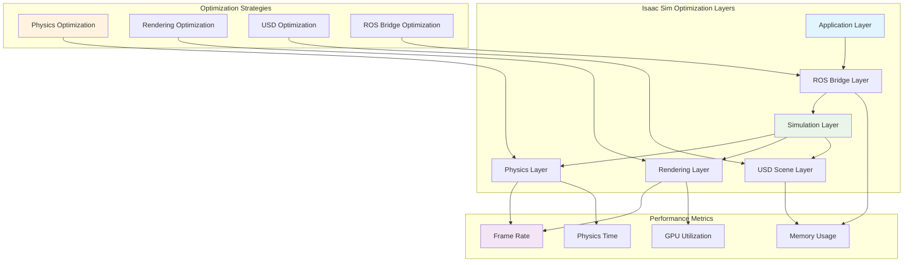
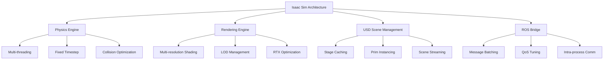

# Best Practices: Sim-to-Sim Transfer and Performance Optimization

## Overview

This final chapter of Module 3 focuses on best practices for optimizing simulation performance and achieving effective sim-to-sim transfer in NVIDIA Isaac Sim environments. We'll explore techniques for maximizing simulation efficiency, ensuring realistic physics behavior, and creating simulation scenarios that effectively transfer learning to other simulation environments. This chapter consolidates the knowledge gained throughout the module and provides practical guidance for advanced Isaac Sim usage.

## Performance Optimization Fundamentals



### Simulation Architecture Optimization

Isaac Sim's performance can be optimized at multiple architectural levels:



### Physics Optimization Strategies

The physics engine is often the primary performance bottleneck in humanoid simulation:

```python
# Physics optimization for Isaac Sim
from omni import kit
import carb

def optimize_physics_settings():
    """Optimize physics settings for humanoid simulation performance"""

    # Set appropriate fixed timestep for stability
    carb.settings.get_settings().set("/physics/solver/dt", 1.0/240.0)  # 240 Hz for detailed humanoid physics

    # Adjust solver parameters for performance vs. accuracy balance
    carb.settings.get_settings().set("/physics/solver/positionIterationCount", 4)  # Reduce for performance
    carb.settings.get_settings().set("/physics/solver/velocityIterationCount", 2)  # Reduce for performance

    # Enable continuous collision detection for fast-moving humanoid parts
    carb.settings.get_settings().set("/physics/collision/enableCCD", True)

    # Optimize collision margin for performance
    carb.settings.get_settings().set("/physics/collision/collisionMargin", 0.001)

    # Enable multithreading for physics
    carb.settings.get_settings().set("/physics/multithread", True)
    carb.settings.get_settings().set("/physics/workerThreadCount", 4)  # Adjust based on CPU cores

def optimize_humanoid_rigidity(robot_prim_path):
    """Optimize humanoid robot for physics performance"""

    # Use simplified collision geometries for performance
    # Replace complex meshes with simpler primitives where possible

    # Set appropriate mass properties
    # Ensure mass distribution is realistic but not overly complex

    # Use joint limits to prevent excessive computation
    # Properly constrain joint ranges for humanoid kinematics
    pass

# Apply optimizations
optimize_physics_settings()
```

### Rendering Optimization

Rendering optimization is crucial for maintaining interactive frame rates:

```python
# Rendering optimization for Isaac Sim
def optimize_rendering_settings():
    """Optimize rendering settings for performance"""

    # Enable multi-resolution shading for performance
    carb.settings.get_settings().set("/app/multiResShading/enabled", True)
    carb.settings.get_settings().set("/app/multiResShading/level", 1)  # Level 1 for balance

    # Configure level of detail (LOD)
    carb.settings.get_settings().set("/app/lod/enable", True)
    carb.settings.get_settings().set("/app/lod/distanceScale", 1.0)

    # Optimize RTX settings for performance
    carb.settings.get_settings().set("/rtx/indirectdiffuse/enable", False)  # Disable for performance
    carb.settings.get_settings().set("/rtx/reflections/enable", False)      # Disable for performance
    carb.settings.get_settings().set("/rtx/pathtracing/enabled", False)     # Use simpler renderer

    # Enable DLSS if available
    carb.settings.get_settings().set("/app/dlss/enabled", True)

    # Configure shadow settings
    carb.settings.get_settings().set("/rtx/sceneDb/shadowMapSize", 1024)  # Lower resolution for performance

    # Limit the number of lights affecting each object
    carb.settings.get_settings().set("/rtx/lightcache/maxLightsPerObject", 4)

def optimize_scene_complexity():
    """Optimize scene complexity for performance"""

    # Use instancing for repeated objects
    # Reduce polygon count where possible
    # Use simpler materials for performance
    # Limit dynamic object count
    pass
```

## USD Scene Optimization

### Efficient USD Composition

Efficient USD scene composition is essential for performance:

```usd
#usda 1.0
(
    doc = "Optimized Humanoid Scene"
    metersPerUnit = 1.0
    upAxis = "Y"
)

# Use references for complex assets
def Xform "HumanoidRobot"
{
    # Reference the robot asset instead of defining inline
    add references = @./assets/optimized_humanoid.usd@

    # Use xform to position and orient
    xformOp:translate = (0.0, 1.0, 0.0)
    xformOp:rotateXYZ = (0.0, 0.0, 0.0)
}

# Use instancing for repeated objects
def Scope "Environment"
{
    # Define a template once
    def Xform "ObstacleTemplate" (payload = @./assets/obstacle.usd@)
    {
        # This template can be instanced multiple times
    }

    # Instance the template multiple times
    def Xform "Obstacle001" (instanceable = True)
    {
        add instanceableMaster = </Environment/ObstacleTemplate>
        xformOp:translate = (2.0, 0.0, 2.0)
    }

    def Xform "Obstacle002" (instanceable = True)
    {
        add instanceableMaster = </Environment/ObstacleTemplate>
        xformOp:translate = (-2.0, 0.0, -2.0)
    }
}

# Use material binding efficiently
def Material "SharedMaterial"
{
    def Shader "PreviewSurface"
    {
        uniform token inputs:surface =
        {
            color3f inputs:diffuse_color = (0.8, 0.8, 0.8)
            float inputs:metallic = 0.0
            float inputs:roughness = 0.2
        }
    }
}

# Bind materials to multiple objects
over "HumanoidRobot/torso_geom"
{
    rel material:binding = </SharedMaterial>
}

over "HumanoidRobot/head"
{
    rel material:binding = </SharedMaterial>
}
```

### Scene Streaming and Caching

```python
# Scene streaming and caching optimization
from omni.isaac.core.utils.stage import get_current_stage
from pxr import UsdGeom, Sdf, UsdUtils
import omni.kit.asset_converter as asset_converter

def optimize_scene_streaming():
    """Optimize scene for streaming and caching"""

    stage = get_current_stage()

    # Create level-of-detail schemas
    create_lod_schemas(stage)

    # Set up streaming for large scenes
    setup_scene_streaming(stage)

    # Configure caching for repeated elements
    configure_asset_caching(stage)

def create_lod_schemas(stage):
    """Create level-of-detail schemas for objects"""

    # Define different levels of detail for humanoid robot
    humanoid_prim = stage.GetPrimAtPath("/World/HumanoidRobot")

    if humanoid_prim.IsValid():
        # Add LOD variant set
        variant_set = humanoid_prim.GetVariantSet("LOD")
        variant_set.SetVariantSelection("High")  # Default to high detail

        # Define variants
        variant_set.AddVariant("High")
        variant_set.AddVariant("Medium")
        variant_set.AddVariant("Low")

def setup_scene_streaming(stage):
    """Setup scene streaming for large environments"""

    # Define streaming layers for different parts of the scene
    # This allows loading only visible parts of large scenes
    pass

def configure_asset_caching(stage):
    """Configure asset caching for performance"""

    # Enable USD stage caching
    # Configure asset converter for optimized assets
    pass
```

## Sim-to-Sim Transfer Techniques

### Domain Randomization

Domain randomization helps improve sim-to-sim transfer by increasing robustness:

```python
# Domain randomization for sim-to-sim transfer
import numpy as np
import random

class DomainRandomizer:
    def __init__(self):
        self.randomization_params = {
            'lighting': {
                'intensity_range': (0.5, 2.0),
                'color_temperature_range': (5000, 8000),
                'position_jitter': 0.1
            },
            'materials': {
                'roughness_range': (0.1, 0.9),
                'metallic_range': (0.0, 0.2),
                'albedo_jitter': 0.1
            },
            'dynamics': {
                'mass_multiplier_range': (0.8, 1.2),
                'friction_range': (0.1, 0.9),
                'restitution_range': (0.0, 0.3)
            },
            'sensors': {
                'noise_std_range': (0.001, 0.01),
                'bias_range': (-0.01, 0.01),
                'delay_range': (0.0, 0.05)
            }
        }

    def randomize_lighting(self):
        """Randomize lighting conditions"""
        intensity = random.uniform(
            self.randomization_params['lighting']['intensity_range'][0],
            self.randomization_params['lighting']['intensity_range'][1]
        )

        color_temp = random.uniform(
            self.randomization_params['lighting']['color_temperature_range'][0],
            self.randomization_params['lighting']['color_temperature_range'][1]
        )

        position_jitter = np.random.normal(0,
            self.randomization_params['lighting']['position_jitter'], 3)

        return {
            'intensity': intensity,
            'color_temperature': color_temp,
            'position_jitter': position_jitter
        }

    def randomize_materials(self):
        """Randomize material properties"""
        roughness = random.uniform(
            self.randomization_params['materials']['roughness_range'][0],
            self.randomization_params['materials']['roughness_range'][1]
        )

        metallic = random.uniform(
            self.randomization_params['materials']['metallic_range'][0],
            self.randomization_params['materials']['metallic_range'][1]
        )

        albedo_jitter = np.random.normal(0,
            self.randomization_params['materials']['albedo_jitter'], 3)

        return {
            'roughness': roughness,
            'metallic': metallic,
            'albedo_jitter': albedo_jitter
        }

    def randomize_dynamics(self):
        """Randomize dynamic properties"""
        mass_multiplier = random.uniform(
            self.randomization_params['dynamics']['mass_multiplier_range'][0],
            self.randomization_params['dynamics']['mass_multiplier_range'][1]
        )

        friction = random.uniform(
            self.randomization_params['dynamics']['friction_range'][0],
            self.randomization_params['dynamics']['friction_range'][1]
        )

        restitution = random.uniform(
            self.randomization_params['dynamics']['restitution_range'][0],
            self.randomization_params['dynamics']['restitution_range'][1]
        )

        return {
            'mass_multiplier': mass_multiplier,
            'friction': friction,
            'restitution': restitution
        }

    def randomize_sensors(self):
        """Randomize sensor properties"""
        noise_std = random.uniform(
            self.randomization_params['sensors']['noise_std_range'][0],
            self.randomization_params['sensors']['noise_std_range'][1]
        )

        bias = random.uniform(
            self.randomization_params['sensors']['bias_range'][0],
            self.randomization_params['sensors']['bias_range'][1]
        )

        delay = random.uniform(
            self.randomization_params['sensors']['delay_range'][0],
            self.randomization_params['sensors']['delay_range'][1]
        )

        return {
            'noise_std': noise_std,
            'bias': bias,
            'delay': delay
        }

# Usage in simulation
domain_randomizer = DomainRandomizer()

def apply_randomization():
    """Apply domain randomization to simulation"""
    lighting_params = domain_randomizer.randomize_lighting()
    material_params = domain_randomizer.randomize_materials()
    dynamics_params = domain_randomizer.randomize_dynamics()
    sensor_params = domain_randomizer.randomize_sensors()

    # Apply parameters to simulation
    update_lighting(lighting_params)
    update_materials(material_params)
    update_dynamics(dynamics_params)
    update_sensors(sensor_params)

def update_lighting(params):
    """Update lighting based on randomization parameters"""
    # Implementation would update Isaac Sim lighting
    pass

def update_materials(params):
    """Update materials based on randomization parameters"""
    # Implementation would update Isaac Sim materials
    pass

def update_dynamics(params):
    """Update dynamics based on randomization parameters"""
    # Implementation would update physics properties
    pass

def update_sensors(params):
    """Update sensors based on randomization parameters"""
    # Implementation would update sensor models
    pass
```

### System Identification and Parameter Tuning

```python
# System identification for sim-to-sim transfer
import numpy as np
from scipy.optimize import minimize
from scipy import signal

class SystemIdentifier:
    def __init__(self):
        self.sim_parameters = {
            'mass': 75.0,  # kg
            'inertia': np.eye(3) * 10.0,  # kg*m^2
            'friction_coeff': 0.3,
            'restitution': 0.1,
            'damping': 0.1
        }

        self.target_parameters = {}  # Parameters from target sim or real robot
        self.parameter_bounds = {
            'mass': (50.0, 100.0),
            'friction_coeff': (0.1, 0.8),
            'restitution': (0.0, 0.5),
            'damping': (0.01, 0.5)
        }

    def identify_system(self, excitation_signal, response_data):
        """Identify system parameters from excitation and response"""

        # Define objective function to minimize
        def objective(params):
            # Simulate with current parameters
            simulated_response = self.simulate_with_params(params, excitation_signal)

            # Calculate error with actual response
            error = np.mean((simulated_response - response_data)**2)
            return error

        # Optimize parameters
        initial_params = list(self.sim_parameters.values())
        result = minimize(objective, initial_params, method='BFGS')

        # Update parameters
        self.update_parameters(result.x)
        return result

    def simulate_with_params(self, params, excitation):
        """Simulate system with given parameters"""
        # This would interface with Isaac Sim physics
        # For demonstration, using a simple dynamic model
        mass, friction_coeff, restitution, damping = params

        # Simulate response to excitation
        # This is a simplified example
        response = signal.lfilter([1.0], [mass, damping, friction_coeff], excitation)
        return response

    def update_parameters(self, optimized_params):
        """Update simulation parameters with optimized values"""
        param_names = list(self.sim_parameters.keys())
        for i, name in enumerate(param_names):
            if i < len(optimized_params):
                self.sim_parameters[name] = max(
                    self.parameter_bounds[name][0],
                    min(self.parameter_bounds[name][1], optimized_params[i])
                )

    def match_behavior(self, target_behavior_data):
        """Match simulation behavior to target"""
        # Generate excitation signal
        excitation = self.generate_excitation_signal()

        # Identify current system
        current_response = self.get_current_response(excitation)

        # Optimize to match target
        optimization_result = self.identify_system(excitation, target_behavior_data)

        return optimization_result

    def generate_excitation_signal(self):
        """Generate excitation signal for system identification"""
        # Generate random or chirp signal for identification
        t = np.linspace(0, 10, 1000)  # 10 seconds at 100 Hz
        excitation = np.random.normal(0, 1, len(t))  # Random signal
        return excitation

    def get_current_response(self, excitation):
        """Get current simulation response to excitation"""
        # This would run Isaac Sim simulation with excitation
        # For now, return a placeholder
        return np.zeros(len(excitation))
```

## GPU Acceleration Optimization

### CUDA Memory Management

Efficient GPU memory management is crucial for Isaac ROS performance:

```python
# GPU memory optimization for Isaac ROS
import pycuda.driver as cuda
import pycuda.autoinit
import numpy as np
from pycuda.tools import PageLockedMemoryPool, ManagedMemoryPool

class GPUMemoryOptimizer:
    def __init__(self):
        # Initialize CUDA context
        cuda.init()
        self.device = cuda.Device(0)
        self.context = self.device.make_context()

        # Create memory pools for different data types
        self.pools = {
            'input': PageLockedMemoryPool(),
            'output': PageLockedMemoryPool(),
            'workspace': PageLockedMemoryPool()
        }

        # Track memory usage
        self.memory_usage = {'allocated': 0, 'peak': 0}

    def allocate_gpu_buffer(self, size, buffer_type='input'):
        """Allocate GPU buffer with memory pooling"""
        if buffer_type in self.pools:
            # Use memory pool if available
            host_mem = self.pools[buffer_type].allocate(size)
            device_mem = cuda.mem_alloc(size)

            self.memory_usage['allocated'] += size
            if self.memory_usage['allocated'] > self.memory_usage['peak']:
                self.memory_usage['peak'] = self.memory_usage['allocated']

            return host_mem, device_mem
        else:
            # Fallback to regular allocation
            host_mem = cuda.pagelocked_empty(size, dtype=np.uint8)
            device_mem = cuda.mem_alloc(size)
            return host_mem, device_mem

    def free_gpu_buffer(self, host_mem, device_mem, buffer_type='input'):
        """Free GPU buffer and return to pool"""
        if buffer_type in self.pools:
            # Return to memory pool
            self.pools[buffer_type].free(host_mem)
        else:
            # Regular deallocation
            del host_mem

        device_mem.free()
        self.memory_usage['allocated'] -= len(host_mem)

    def cleanup(self):
        """Clean up all GPU resources"""
        for pool in self.pools.values():
            pool.free_held()
        self.context.pop()

class TensorRTOptimizer:
    def __init__(self):
        import tensorrt as trt

        self.logger = trt.Logger(trt.Logger.WARNING)
        self.runtime = trt.Runtime(self.logger)

        # Optimization settings
        self.optimization_level = 3  # Maximum optimization
        self.workspace_size = 1 << 30  # 1GB workspace

    def build_optimized_engine(self, onnx_model_path, engine_path):
        """Build optimized TensorRT engine"""
        import tensorrt as trt

        # Create builder
        builder = trt.Builder(self.logger)
        config = builder.create_builder_config()
        config.max_workspace_size = self.workspace_size
        config.set_flag(trt.BuilderFlag.FP16)  # Enable FP16 if supported

        # Create network
        network = builder.create_network(
            1 << int(trt.NetworkDefinitionCreationFlag.EXPLICIT_BATCH)
        )

        # Parse ONNX model
        parser = trt.OnnxParser(network, self.logger)
        with open(onnx_model_path, 'rb') as model_file:
            if not parser.parse(model_file.read()):
                for error in range(parser.num_errors):
                    print(parser.get_error(error))
                return None

        # Build engine
        serialized_engine = builder.build_serialized_network(network, config)

        # Save engine
        with open(engine_path, 'wb') as engine_file:
            engine_file.write(serialized_engine)

        return serialized_engine
```

### Isaac ROS Pipeline Optimization

```python
# Isaac ROS pipeline optimization
from rclpy.qos import QoSProfile, QoSHistoryPolicy, QoSReliabilityPolicy
from sensor_msgs.msg import Image
import threading
import queue

class OptimizedIsaacROSPipeline:
    def __init__(self, node):
        self.node = node

        # Create optimized QoS profiles
        self.optimized_qos = QoSProfile(
            history=QoSHistoryPolicy.KEEP_LAST,
            depth=1,  # Minimal depth for performance
            reliability=QoSReliabilityPolicy.BEST_EFFORT,  # For real-time performance
            # durability=rclpy.qos.QoSDurabilityPolicy.VOLATILE,
        )

        # Create processing queues
        self.processing_queue = queue.Queue(maxsize=2)  # Limit queue size

        # Create processing thread
        self.processing_thread = threading.Thread(target=self.processing_loop)
        self.processing_thread.daemon = True
        self.processing_thread.start()

        # Subscribe to sensor data
        self.image_sub = self.node.create_subscription(
            Image,
            '/camera/image_raw',
            self.optimized_image_callback,
            self.optimized_qos
        )

        # Publisher for processed data
        self.result_pub = self.node.create_publisher(
            Image,  # or custom message type
            '/processed_result',
            self.optimized_qos
        )

    def optimized_image_callback(self, msg):
        """Optimized image callback with queue management"""
        try:
            # Non-blocking put to prevent blocking the main thread
            self.processing_queue.put_nowait(msg)
        except queue.Full:
            # Queue is full, drop frame to maintain real-time performance
            self.node.get_logger().warn('Processing queue full, dropping frame')

    def processing_loop(self):
        """Background processing loop"""
        while rclpy.ok():
            try:
                # Get message from queue with timeout
                msg = self.processing_queue.get(timeout=0.1)

                # Process message (GPU-accelerated)
                result = self.process_message_gpu(msg)

                # Publish result
                self.result_pub.publish(result)

                # Mark task as done
                self.processing_queue.task_done()

            except queue.Empty:
                # Continue loop if queue is empty
                continue
            except Exception as e:
                self.node.get_logger().error(f'Processing error: {e}')

    def process_message_gpu(self, msg):
        """Process message using GPU acceleration"""
        # This would use Isaac ROS GPU-accelerated processing
        # For example, stereo disparity, visual SLAM, etc.
        pass
```

## Isaac Sim Extensions for Optimization

### Custom Optimization Extensions

```python
# Custom Isaac Sim extension for performance optimization
import omni.ext
import omni
from omni.isaac.core import World
import carb
import asyncio

class PerformanceOptimizationExtension(omni.ext.IExt):
    def on_startup(self, ext_id):
        print("[performance_optimization_extension] Performance Optimization Extension Startup")

        # Store extension ID
        self._ext_id = ext_id

        # Initialize optimization settings
        self._initialize_optimizations()

        # Create menu entry
        self._window = omni.ui.Workspace.get_window("Script Editor")

        # Start performance monitoring
        self._performance_monitor = PerformanceMonitor()
        self._performance_monitor.start_monitoring()

    def on_shutdown(self):
        print("[performance_optimization_extension] Performance Optimization Extension Shutdown")

        # Stop performance monitoring
        if hasattr(self, '_performance_monitor'):
            self._performance_monitor.stop_monitoring()

    def _initialize_optimizations(self):
        """Initialize performance optimizations"""
        # Physics optimizations
        carb.settings.get_settings().set("/physics/solver/dt", 1.0/120.0)
        carb.settings.get_settings().set("/physics/multithread", True)

        # Rendering optimizations
        carb.settings.get_settings().set("/app/multiResShading/enabled", True)
        carb.settings.get_settings().set("/rtx/lightcache/maxLightsPerObject", 4)

        # USD optimizations
        carb.settings.get_settings().set("/app/stage/asyncLoad", True)
        carb.settings.get_settings().set("/app/stage/asyncLoadDelay", 0.01)

class PerformanceMonitor:
    def __init__(self):
        self.is_monitoring = False
        self.metrics = {
            'frame_time': [],
            'physics_time': [],
            'render_time': [],
            'gpu_usage': [],
            'cpu_usage': []
        }
        self.monitoring_task = None

    def start_monitoring(self):
        """Start performance monitoring"""
        self.is_monitoring = True
        self.monitoring_task = asyncio.ensure_future(self._monitor_loop())

    def stop_monitoring(self):
        """Stop performance monitoring"""
        self.is_monitoring = False
        if self.monitoring_task:
            self.monitoring_task.cancel()

    async def _monitor_loop(self):
        """Performance monitoring loop"""
        while self.is_monitoring:
            # Collect performance metrics
            frame_time = carb.app.get_framework().get_last_frame_time()
            physics_time = carb.settings.get_settings().get("/physics/solver/lastSolveTime")
            render_time = carb.settings.get_settings().get("/renderer/lastFrameGpuTime")

            # Store metrics
            self.metrics['frame_time'].append(frame_time)
            self.metrics['physics_time'].append(physics_time)
            self.metrics['render_time'].append(render_time)

            # Limit history to prevent memory growth
            max_history = 1000
            for key in self.metrics:
                if len(self.metrics[key]) > max_history:
                    self.metrics[key] = self.metrics[key][-max_history:]

            # Wait for next frame
            await asyncio.sleep(0.1)  # Monitor every 100ms

    def get_performance_summary(self):
        """Get performance summary"""
        if not self.metrics['frame_time']:
            return "No metrics collected"

        avg_frame_time = sum(self.metrics['frame_time']) / len(self.metrics['frame_time'])
        avg_fps = 1.0 / avg_frame_time if avg_frame_time > 0 else 0

        summary = f"""
Performance Summary:
  Average FPS: {avg_fps:.2f}
  Average Frame Time: {avg_frame_time*1000:.2f}ms
  Physics Time: {self.metrics['physics_time'][-1]*1000:.2f}ms (last)
  Render Time: {self.metrics['render_time'][-1]*1000:.2f}ms (last)
        """

        return summary
```

## Simulation Quality Assurance

### Validation and Verification

```python
# Simulation validation and verification
import numpy as np
from scipy import stats
import matplotlib.pyplot as plt

class SimulationValidator:
    def __init__(self):
        self.validation_metrics = {}
        self.baseline_data = {}
        self.tolerance = 0.05  # 5% tolerance

    def validate_physics_behavior(self, sim_data, real_data, metric_name):
        """Validate physics behavior against real data"""
        # Calculate statistical similarity
        ks_statistic, p_value = stats.ks_2samp(sim_data, real_data)

        # Calculate mean and variance similarity
        sim_mean, sim_var = np.mean(sim_data), np.var(sim_data)
        real_mean, real_var = np.mean(real_data), np.var(real_data)

        mean_diff = abs(sim_mean - real_mean) / max(abs(real_mean), 1e-6)
        var_diff = abs(sim_var - real_var) / max(abs(real_var), 1e-6)

        # Store validation results
        self.validation_metrics[metric_name] = {
            'ks_statistic': ks_statistic,
            'p_value': p_value,
            'mean_diff': mean_diff,
            'var_diff': var_diff,
            'passed': (mean_diff < self.tolerance) and (var_diff < self.tolerance)
        }

        return self.validation_metrics[metric_name]

    def validate_sensor_models(self, sim_sensor_data, real_sensor_data):
        """Validate sensor models"""
        # Check for bias, noise, and delay characteristics
        bias = np.mean(sim_sensor_data - real_sensor_data)
        noise_std = np.std(sim_sensor_data - real_sensor_data)

        # Validate over time windows
        window_size = min(len(sim_sensor_data), 100)
        correlations = []

        for i in range(0, len(sim_sensor_data) - window_size, window_size):
            sim_window = sim_sensor_data[i:i+window_size]
            real_window = real_sensor_data[i:i+window_size]
            corr = np.corrcoef(sim_window, real_window)[0, 1]
            correlations.append(corr)

        avg_correlation = np.mean(correlations)

        return {
            'bias': bias,
            'noise_std': noise_std,
            'avg_correlation': avg_correlation,
            'passed': avg_correlation > 0.8  # High correlation threshold
        }

    def validate_control_response(self, sim_control_data, real_control_data):
        """Validate control system response"""
        # Compare step response characteristics
        sim_step_response = self.extract_step_response(sim_control_data)
        real_step_response = self.extract_step_response(real_control_data)

        # Calculate response similarity
        response_similarity = np.corrcoef(
            sim_step_response, real_step_response
        )[0, 1]

        return {
            'response_similarity': response_similarity,
            'passed': response_similarity > 0.85
        }

    def extract_step_response(self, control_data):
        """Extract step response from control data"""
        # Implementation would extract step response characteristics
        # such as rise time, settling time, overshoot, etc.
        return control_data  # Placeholder

    def generate_validation_report(self):
        """Generate comprehensive validation report"""
        report = "Simulation Validation Report\n"
        report += "=" * 30 + "\n\n"

        for metric_name, results in self.validation_metrics.items():
            report += f"{metric_name}:\n"
            report += f"  KS Statistic: {results['ks_statistic']:.4f}\n"
            report += f"  P-Value: {results['p_value']:.4f}\n"
            report += f"  Mean Difference: {results['mean_diff']:.4f}\n"
            report += f"  Variance Difference: {results['var_diff']:.4f}\n"
            report += f"  Passed: {results['passed']}\n\n"

        return report

# Usage example
validator = SimulationValidator()

# Validate different aspects of simulation
# physics_validation = validator.validate_physics_behavior(sim_positions, real_positions, "position_tracking")
# sensor_validation = validator.validate_sensor_models(sim_imu_data, real_imu_data)
# control_validation = validator.validate_control_response(sim_control, real_control)

# Generate report
# validation_report = validator.generate_validation_report()
# print(validation_report)
```

## Advanced Debugging Techniques

### Simulation Debugging Tools

```python
# Advanced simulation debugging
import omni
from pxr import Gf, UsdGeom, Tf
import carb

class SimulationDebugger:
    def __init__(self):
        self.debug_visualizations = []
        self.log_level = carb.logging.INFO
        self.frame_counter = 0

    def enable_physics_debug_draw(self):
        """Enable physics debug visualization"""
        carb.settings.get_settings().set("/physics/debugDraw/enable", True)
        carb.settings.get_settings().set("/physics/debugDraw/axes", True)
        carb.settings.get_settings().set("/physics/debugDraw/bodyMasses", True)
        carb.settings.get_settings().set("/physics/debugDraw/bodyAxes", True)
        carb.settings.get_settings().set("/physics/debugDraw/jointFrames", True)
        carb.settings.get_settings().set("/physics/debugDraw/jointLimits", True)
        carb.settings.get_settings().set("/physics/debugDraw/collisionShapes", True)

    def disable_physics_debug_draw(self):
        """Disable physics debug visualization"""
        carb.settings.get_settings().set("/physics/debugDraw/enable", False)

    def visualize_force_vectors(self, prim_path, force_vector, scale=1.0):
        """Visualize force vectors in the scene"""
        # Create debug visualization for forces
        stage = omni.usd.get_context().get_stage()
        prim = stage.GetPrimAtPath(prim_path)

        if prim.IsValid():
            # Add force visualization (simplified approach)
            print(f"Visualizing force {force_vector} at {prim_path}")

    def log_simulation_state(self):
        """Log comprehensive simulation state"""
        # Log physics state
        physics_dt = carb.settings.get_settings().get("/physics/solver/dt")
        last_solve_time = carb.settings.get_settings().get("/physics/solver/lastSolveTime")

        # Log rendering state
        last_frame_time = carb.app.get_framework().get_last_frame_time()
        gpu_time = carb.settings.get_settings().get("/renderer/lastFrameGpuTime")

        # Log simulation objects
        stage = omni.usd.get_context().get_stage()
        prim_count = len([p for p in stage.Traverse()])

        log_msg = f"""
Simulation State (Frame {self.frame_counter}):
  Physics DT: {physics_dt}s
  Last Solve Time: {last_solve_time*1000:.2f}ms
  Last Frame Time: {last_frame_time*1000:.2f}ms
  GPU Time: {gpu_time*1000:.2f}ms
  Prims in Stage: {prim_count}
        """

        carb.log_info(log_msg)
        self.frame_counter += 1

    def profile_simulation_performance(self, num_frames=100):
        """Profile simulation performance over multiple frames"""
        import time

        frame_times = []
        physics_times = []

        for i in range(num_frames):
            start_time = time.time()

            # Step simulation
            # world.step(render=True)  # This would be called elsewhere

            frame_time = time.time() - start_time
            frame_times.append(frame_time)

            # Get physics time
            physics_time = carb.settings.get_settings().get("/physics/solver/lastSolveTime")
            physics_times.append(physics_time)

        avg_frame_time = sum(frame_times) / len(frame_times)
        avg_physics_time = sum(physics_times) / len(physics_times)
        avg_fps = 1.0 / avg_frame_time if avg_frame_time > 0 else 0

        profile_report = f"""
Performance Profile ({num_frames} frames):
  Average FPS: {avg_fps:.2f}
  Average Frame Time: {avg_frame_time*1000:.2f}ms
  Average Physics Time: {avg_physics_time*1000:.2f}ms
  Physics Time %: {(avg_physics_time/avg_frame_time)*100:.2f}%
        """

        return profile_report
```

## Code Examples

### Complete Optimization Configuration

```yaml
# Complete Isaac Sim optimization configuration
physics_optimization:
  solver:
    dt: 0.008333  # 1/120s for good balance
    positionIterationCount: 4
    velocityIterationCount: 2
    maxVelocity: 100.0
    maxAngularVelocity: 50.0
  collision:
    collisionMargin: 0.001
    enableCCD: true  # Enable for humanoid joints
  threading:
    multithread: true
    workerThreadCount: 4

rendering_optimization:
  multiResShading:
    enabled: true
    level: 1
  lod:
    enable: true
    distanceScale: 1.0
  rtx:
    pathtracing:
      enabled: false
    denoise:
      enable: true
      enableTemporal: true
    sceneDb:
      shadowMapSize: 1024
    lightcache:
      maxLightsPerObject: 4
  app:
    dlss:
      enabled: true
    mpr:
      enabled: true

usd_optimization:
  stage:
    asyncLoad: true
    asyncLoadDelay: 0.01
  cache:
    enable: true
    sizeLimit: 1073741824  # 1GB

ros_bridge_optimization:
  qos:
    sensor_data:
      history: "keep_last"
      depth: 1
      reliability: "best_effort"
    commands:
      history: "keep_last"
      depth: 10
      reliability: "reliable"
  threading:
    enable_multithreading: true
    intra_process_comms: true
```

### Performance Monitoring Node

```python
#!/usr/bin/env python3
"""
Performance monitoring node for Isaac ROS
Monitors and reports system performance metrics
"""

import rclpy
from rclpy.node import Node
from std_msgs.msg import Float32
from sensor_msgs.msg import Image
from isaac_ros_messages.msg import IsaacPerformanceMetrics
import psutil
import GPUtil
import time
import threading
from collections import deque

class PerformanceMonitorNode(Node):
    def __init__(self):
        super().__init__('performance_monitor')

        # Initialize metrics storage
        self.metrics_history_size = 100
        self.cpu_usage_history = deque(maxlen=self.metrics_history_size)
        self.gpu_usage_history = deque(maxlen=self.metrics_history_size)
        self.memory_usage_history = deque(maxlen=self.metrics_history_size)
        self.fps_history = deque(maxlen=self.metrics_history_size)

        # Publishers
        self.cpu_pub = self.create_publisher(Float32, '/system/cpu_usage', 10)
        self.gpu_pub = self.create_publisher(Float32, '/system/gpu_usage', 10)
        self.memory_pub = self.create_publisher(Float32, '/system/memory_usage', 10)
        self.fps_pub = self.create_publisher(Float32, '/system/fps', 10)
        self.metrics_pub = self.create_publisher(
            IsaacPerformanceMetrics, '/system/performance_metrics', 10
        )

        # Subscribers to monitor processing rate
        self.image_sub = self.create_subscription(
            Image, '/camera/image_raw', self.image_callback, 1
        )

        # Timer for periodic monitoring
        self.monitor_timer = self.create_timer(1.0, self.monitor_callback)

        # Track image processing
        self.image_count = 0
        self.last_image_time = time.time()

        # Monitoring thread
        self.monitoring_thread = threading.Thread(target=self.background_monitoring)
        self.monitoring_thread.daemon = True
        self.monitoring_thread.start()

        self.get_logger().info('Performance Monitor Node initialized')

    def image_callback(self, msg):
        """Track image processing rate"""
        self.image_count += 1

    def monitor_callback(self):
        """Periodic monitoring callback"""
        current_time = time.time()

        # Calculate FPS
        time_diff = current_time - self.last_image_time
        if time_diff > 0:
            fps = self.image_count / time_diff
            self.fps_history.append(fps)
            self.image_count = 0
            self.last_image_time = current_time
        else:
            fps = 0.0

        # Get system metrics
        cpu_percent = psutil.cpu_percent()
        memory_percent = psutil.virtual_memory().percent

        # Get GPU metrics
        gpus = GPUtil.getGPUs()
        gpu_percent = gpus[0].load * 100 if gpus else 0.0

        # Store in history
        self.cpu_usage_history.append(cpu_percent)
        self.gpu_usage_history.append(gpu_percent)
        self.memory_usage_history.append(memory_percent)
        self.fps_history.append(fps)

        # Publish metrics
        cpu_msg = Float32()
        cpu_msg.data = float(cpu_percent)
        self.cpu_pub.publish(cpu_msg)

        gpu_msg = Float32()
        gpu_msg.data = float(gpu_percent)
        self.gpu_pub.publish(gpu_msg)

        memory_msg = Float32()
        memory_msg.data = float(memory_percent)
        self.memory_pub.publish(memory_msg)

        fps_msg = Float32()
        fps_msg.data = float(fps)
        self.fps_pub.publish(fps_msg)

        # Publish comprehensive metrics
        metrics_msg = IsaacPerformanceMetrics()
        metrics_msg.header.stamp = self.get_clock().now().to_msg()
        metrics_msg.cpu_usage = float(cpu_percent)
        metrics_msg.gpu_usage = float(gpu_percent)
        metrics_msg.memory_usage = float(memory_percent)
        metrics_msg.fps = float(fps)
        metrics_msg.processing_rate = float(fps)  # Assuming 1:1 with FPS for this example

        self.metrics_pub.publish(metrics_msg)

    def background_monitoring(self):
        """Background monitoring thread"""
        while rclpy.ok():
            time.sleep(0.1)  # Light sleep to avoid busy waiting

    def get_performance_summary(self):
        """Get summary of performance metrics"""
        if not self.cpu_usage_history:
            return "No metrics available"

        avg_cpu = sum(self.cpu_usage_history) / len(self.cpu_usage_history)
        avg_gpu = sum(self.gpu_usage_history) / len(self.gpu_usage_history)
        avg_memory = sum(self.memory_usage_history) / len(self.memory_usage_history)
        avg_fps = sum(self.fps_history) / len(self.fps_history) if self.fps_history else 0.0

        summary = f"""
Performance Summary:
  CPU Usage: {avg_cpu:.2f}%
  GPU Usage: {avg_gpu:.2f}%
  Memory Usage: {avg_memory:.2f}%
  FPS: {avg_fps:.2f}
        """

        return summary

def main(args=None):
    rclpy.init(args=args)

    performance_monitor = PerformanceMonitorNode()

    try:
        # Print periodic summary
        while rclpy.ok():
            rclpy.spin_once(performance_monitor, timeout_sec=1.0)

            # Print summary every 10 seconds
            if performance_monitor.get_clock().now().nanoseconds // 1_000_000_000 % 10 == 0:
                summary = performance_monitor.get_performance_summary()
                performance_monitor.get_logger().info(summary)

    except KeyboardInterrupt:
        performance_monitor.get_logger().info('Performance monitor interrupted')
    finally:
        performance_monitor.destroy_node()
        rclpy.shutdown()

if __name__ == '__main__':
    main()
```

## Best Practices Summary

### Performance Optimization Checklist

1. **Physics Settings**:
   - Use appropriate fixed timestep (1/120s to 1/240s)
   - Balance solver iterations for accuracy vs. performance
   - Enable multithreading for physics

2. **Rendering Optimization**:
   - Use multi-resolution shading
   - Configure appropriate LOD settings
   - Optimize RTX settings for use case

3. **USD Scene Optimization**:
   - Use instancing for repeated objects
   - Implement level-of-detail schemas
   - Use references instead of inline definitions

4. **GPU Acceleration**:
   - Optimize CUDA memory management
   - Build optimized TensorRT engines
   - Use memory pools for allocation

5. **ROS Integration**:
   - Use appropriate QoS settings
   - Optimize message sizes and frequency
   - Use intra-process communication where possible

### Sim-to-Sim Transfer Guidelines

1. **Domain Randomization**: Apply systematic randomization of simulation parameters
2. **System Identification**: Match dynamic parameters between simulations
3. **Validation**: Continuously validate simulation behavior against targets
4. **Parameter Tuning**: Adjust parameters based on validation results
5. **Quality Assurance**: Implement comprehensive testing procedures

## Summary

This chapter has covered essential best practices for simulation optimization and sim-to-sim transfer in NVIDIA Isaac Sim environments. We've explored performance optimization at multiple levels - physics, rendering, USD composition, and GPU acceleration - providing practical techniques to maximize simulation efficiency.

The sim-to-sim transfer techniques discussed, including domain randomization and system identification, enable the creation of simulation environments that effectively transfer learning and behavior to other simulation platforms. These techniques are crucial for developing robust robotic systems that can operate across different simulation environments and eventually transition to real-world deployment.

Throughout this module, we've built a comprehensive understanding of the NVIDIA Isaac ecosystem, from basic setup to advanced optimization techniques. The knowledge gained here provides a solid foundation for developing sophisticated robotic applications using Isaac Sim and Isaac ROS.

This concludes Module 3: The AI-Robot Brain (NVIDIA Isaac™). You now have the tools and knowledge to create high-fidelity, optimized simulations for humanoid robots with hardware-accelerated perception and navigation capabilities.