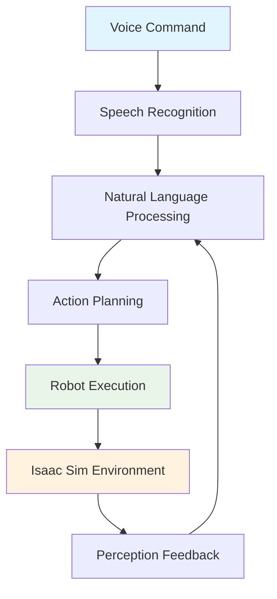

# Introduction to Vision-Language-Action (VLA) Robotics

## Overview

Vision-Language-Action (VLA) represents a paradigm shift in robotics, where visual perception, natural language understanding, and robotic action are tightly integrated into a unified system. This approach enables robots to understand and respond to human commands expressed in natural language, perceive their environment visually, and execute complex tasks with minimal human intervention.

In this module, we'll explore how to build VLA systems that can process voice commands, interpret them using large language models (LLMs), and execute corresponding actions in simulation using NVIDIA Isaac Sim. By the end of this module, you'll have a complete pipeline that transforms voice commands like "Pick up the red cube" into actual robot actions in a simulated environment.

## Understanding VLA Architecture

The VLA architecture consists of three interconnected components that work together to create an intelligent robotic system:



### Key Components of VLA Systems

1. **Speech Recognition Layer**: Converts voice commands to text using OpenAI Whisper or similar technology
2. **Natural Language Understanding**: Interprets text commands using LLMs to extract intent and parameters
3. **Action Planning**: Translates high-level commands into low-level robot actions
4. **Execution Engine**: Executes planned actions in the simulation environment
5. **Perception System**: Provides environmental feedback to close the loop

## Prerequisites for VLA Development

Before diving into VLA implementation, ensure you have the following prerequisites:

- Module 1-3 knowledge: Robotic Nervous System, Digital Twin, and AI-Robot Brain concepts
- ROS 2 Kilted Kaiju installed and configured
- NVIDIA Isaac Sim 5.0 with Isaac ROS 3.2 packages
- Access to OpenAI API or local LLM alternatives (Ollama, etc.)
- Audio input capabilities for speech recognition
- NVIDIA GPU with CUDA support for accelerated processing

## VLA in Humanoid Robotics

Humanoid robots present unique challenges and opportunities in VLA systems:

- **Complex Kinematics**: Humanoid robots have multiple degrees of freedom requiring sophisticated motion planning
- **Bipedal Locomotion**: Walking requires dynamic balance and careful footstep planning
- **Natural Interaction**: Humanoid form factor enables more intuitive human-robot interaction
- **Embodied Cognition**: Physical presence allows for grounded language understanding

## Setting Up Your Development Environment

### Required Software Stack

```bash
# Verify Isaac Sim installation
cd ~/.nvidia-omniverse/kit/cache/tkg/isaac-sim-5.0.0/
python -c "import omni; print('Isaac Sim installation verified')"

# Check Isaac ROS packages
apt list --installed | grep isaac-ros

# Verify ROS 2 environment
source /opt/ros/kilted/setup.bash
ros2 topic list | grep isaac
```

### API Configuration

```python
# Configure OpenAI API access
import openai

# Set your API key (use environment variables in production)
openai.api_key = "YOUR_API_KEY_HERE"

# Test API connectivity
try:
    response = openai.ChatCompletion.create(
        model="gpt-4o",
        messages=[{"role": "user", "content": "Test"}]
    )
    print("OpenAI API connection successful")
except Exception as e:
    print(f"API connection failed: {e}")
```

## The Complete VLA Pipeline

Our VLA implementation will follow this complete pipeline:

1. **Voice Input**: Capture voice commands from the user
2. **Speech-to-Text**: Convert speech to text using Whisper
3. **Language Understanding**: Process text with LLM to extract intent
4. **Action Planning**: Generate sequence of robot actions
5. **Simulation Execution**: Execute actions in Isaac Sim
6. **Perception Feedback**: Sense environment and adjust behavior
7. **Response Generation**: Provide feedback to the user

## Chapter Learning Objectives

By the end of this chapter, you will be able to:
- Understand the fundamental concepts of Vision-Language-Action systems
- Set up the required software stack for VLA development
- Explain the architecture of VLA systems and their components
- Configure API access for speech recognition and language processing
- Prepare your development environment for VLA implementation

## Summary

This chapter introduced the Vision-Language-Action paradigm and its application to humanoid robotics. We covered the key components of VLA systems, the prerequisites for development, and outlined the complete pipeline we'll implement throughout this module.

In the following chapters, we'll explore each component in detail:
- [Chapter 2: Voice-to-Text with Whisper](./02-voice-to-text-whisper.md) covers setting up speech recognition
- [Chapter 3: Natural Language with LLMs](./03-natural-language-with-llms.md) explores language understanding
- [Chapter 4: Cognitive Planning for ROS Actions](./04-cognitive-planning-ros-actions.md) implements action planning
- [Chapter 5: Integrating Perception with VLA](./05-integrating-perception-vla.md) covers perception integration
- [Chapter 6: Path Planning from Language Goals](./06-path-planning-language-goals.md) addresses navigation
- [Chapter 7: Manipulation with Language Commands](./07-manipulation-language-commands.md) covers manipulation
- [Chapter 8: Capstone Autonomous Humanoid Project](./08-capstone-autonomous-humanoid.md) brings everything together

Each chapter builds upon the previous ones to create a complete VLA system.