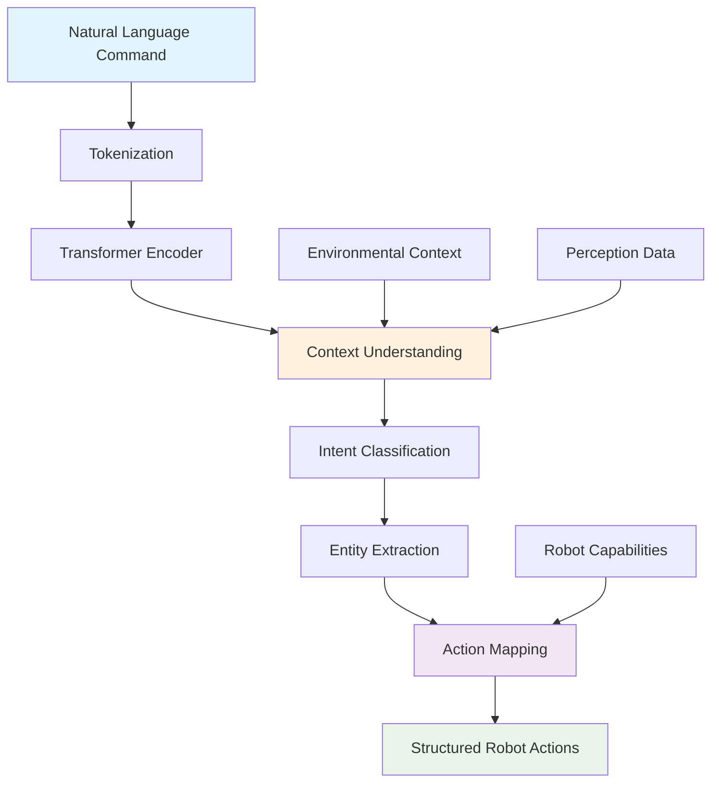

# Understanding Natural Language Commands with LLMs

## Overview

This chapter explores the integration of Large Language Models (LLMs) for understanding and interpreting natural language commands in robotics applications. We'll cover how to use LLMs like OpenAI GPT-4o or open-source alternatives to translate human language into structured robot actions that can be executed in Isaac Sim. The focus is on creating a robust language understanding pipeline that bridges human intent and robotic execution.

## Understanding Language Models in Robotics

Large Language Models have revolutionized how robots can understand and respond to human commands. Unlike traditional rule-based systems, LLMs can:

- **Parse complex natural language**: Understand nuanced commands beyond simple keywords
- **Handle ambiguity**: Infer intent from imprecise or contextual commands
- **Generalize to new commands**: Interpret novel combinations of known concepts
- **Provide context awareness**: Consider environmental context when interpreting commands

### LLM Architecture for Robotics

The robotics-specific LLM pipeline includes several key components:



## Setting Up LLM Integration

### OpenAI GPT-4o Integration

For production robotics applications, OpenAI's GPT-4o provides excellent performance for language understanding tasks:

```bash
# Install OpenAI Python package
pip3 install openai
```

```python
import openai
import json
import asyncio
from typing import Dict, List, Optional
from dataclasses import dataclass

@dataclass
class RobotCommand:
    """Represents a structured robot command"""
    action_type: str  # navigation, manipulation, perception, etc.
    parameters: Dict[str, any]
    target_object: Optional[str] = None
    target_location: Optional[Dict[str, float]] = None
    priority: int = 1

class LLMRobotInterface:
    def __init__(self, api_key: str, model: str = "gpt-4o"):
        """
        Initialize LLM interface for robot command interpretation
        """
        openai.api_key = api_key
        self.model = model

        # Robot capabilities and environment context
        self.robot_capabilities = {
            "navigation": {
                "max_speed": 0.5,
                "turn_rate": 0.5,
                "min_distance": 0.1
            },
            "manipulation": {
                "reachable_area": {"x": [-1.0, 1.0], "y": [-1.0, 1.0], "z": [0.1, 1.5]},
                "grasp_types": ["power", "precision"],
                "max_payload": 2.0
            },
            "perception": {
                "camera_range": 5.0,
                "detection_classes": ["cube", "sphere", "cylinder", "person", "chair", "table"]
            }
        }

        # Known environment objects and locations
        self.environment_context = {
            "objects": {
                "red_cube": {"position": {"x": 1.0, "y": 0.0, "z": 0.2}, "type": "graspable"},
                "blue_sphere": {"position": {"x": -0.5, "y": 0.5, "z": 0.2}, "type": "graspable"},
                "table": {"position": {"x": 0.0, "y": 0.0, "z": 0.0}, "type": "support"}
            },
            "locations": {
                "home_position": {"x": 0.0, "y": 0.0, "z": 0.0},
                "charging_station": {"x": -2.0, "y": 0.0, "z": 0.0},
                "workstation": {"x": 1.5, "y": 1.0, "z": 0.0}
            }
        }

    def interpret_command(self, command: str, environment_context: Optional[dict] = None) -> Optional[RobotCommand]:
        """
        Interpret natural language command using LLM
        """
        # Prepare context for the LLM
        context = environment_context or self.environment_context

        prompt = f"""
        You are a robot command interpreter. Convert the following natural language command
        into a structured robot action that can be executed in a simulation environment.

        Robot Capabilities:
        {json.dumps(self.robot_capabilities, indent=2)}

        Environment Context:
        {json.dumps(context, indent=2)}

        Command: "{command}"

        Respond in JSON format with the following structure:
        {{
            "action_type": "navigation|manipulation|perception|communication",
            "parameters": {{"key": "value"}},
            "target_object": "object_name_if_any",
            "target_location": {{"x": float, "y": float, "z": float}},
            "confidence": 0.0-1.0
        }}

        If the command is unclear or impossible, respond with:
        {{
            "action_type": "none",
            "parameters": {{"error": "description"}},
            "target_object": null,
            "target_location": null,
            "confidence": 0.0
        }}
        """

        try:
            response = openai.ChatCompletion.create(
                model=self.model,
                messages=[
                    {"role": "system", "content": "You are a precise robot command interpreter. Always respond in valid JSON format."},
                    {"role": "user", "content": prompt}
                ],
                temperature=0.1,  # Low temperature for consistent responses
                max_tokens=500,
                response_format={"type": "json_object"}
            )

            # Parse the response
            response_content = response.choices[0].message.content

            # Extract JSON from response (in case it includes additional text)
            import re
            json_match = re.search(r'\{.*\}', response_content, re.DOTALL)
            if json_match:
                parsed_response = json.loads(json_match.group())

                # Validate confidence score
                confidence = min(1.0, max(0.0, parsed_response.get("confidence", 0.0)))

                if confidence > 0.5:  # Only return if confidence is above threshold
                    return RobotCommand(
                        action_type=parsed_response["action_type"],
                        parameters=parsed_response["parameters"],
                        target_object=parsed_response.get("target_object"),
                        target_location=parsed_response.get("target_location"),
                        priority=1
                    )
                else:
                    print(f"Low confidence interpretation: {confidence}")
                    return None
            else:
                print(f"No JSON found in response: {response_content}")
                return None

        except Exception as e:
            print(f"Error interpreting command: {e}")
            return None

    def batch_interpret_commands(self, commands: List[str]) -> List[Optional[RobotCommand]]:
        """
        Interpret multiple commands efficiently using batching
        """
        results = []
        for cmd in commands:
            result = self.interpret_command(cmd)
            results.append(result)
        return results

    def validate_action_feasibility(self, command: RobotCommand) -> bool:
        """
        Validate if the interpreted action is feasible given robot capabilities
        """
        if command.action_type == "navigation":
            if command.target_location:
                # Check if target is within reachable range
                target = command.target_location
                if target["z"] < 0:  # Cannot go underground
                    return False

        elif command.action_type == "manipulation":
            if command.target_object:
                # Check if object exists and is graspable
                if command.target_object in self.environment_context["objects"]:
                    obj_info = self.environment_context["objects"][command.target_object]
                    if obj_info["type"] != "graspable":
                        return False

                    # Check if object is within reach
                    obj_pos = obj_info["position"]
                    # Simple reachability check (in a real system, use inverse kinematics)
                    if obj_pos["z"] > self.robot_capabilities["manipulation"]["reachable_area"]["z"][1]:
                        return False

        return True
```

### Open-Source Alternative: Ollama Integration

For applications requiring local processing, Ollama provides excellent performance:

```bash
# Install Ollama
curl -fsSL https://ollama.ai/install.sh | sh

# Pull a suitable model
ollama pull llama3:70b
```

```python
import requests
import json
from typing import Dict, Any

class OllamaRobotInterface:
    def __init__(self, model: str = "llama3:70b", ollama_url: str = "http://localhost:11434"):
        """
        Initialize Ollama interface for robot command interpretation
        """
        self.model = model
        self.ollama_url = ollama_url.rstrip('/')

        # Test connection
        try:
            response = requests.get(f"{self.ollama_url}/api/tags")
            if response.status_code == 200:
                print(f"Ollama connection successful. Available models: {[m['name'] for m in response.json()['models']]}")
            else:
                print(f"Warning: Ollama connection failed: {response.status_code}")
        except Exception as e:
            print(f"Warning: Could not connect to Ollama: {e}")

    def interpret_command(self, command: str, environment_context: Optional[dict] = None) -> Optional[RobotCommand]:
        """
        Interpret command using local Ollama model
        """
        context = environment_context or self.environment_context

        prompt = f"""
        You are a robot command interpreter. Convert the following natural language command
        into a structured robot action that can be executed in a simulation environment.

        Robot Capabilities:
        {json.dumps(self.robot_capabilities, indent=2)}

        Environment Context:
        {json.dumps(context, indent=2)}

        Command: "{command}"

        Respond in JSON format with the following structure:
        {{
            "action_type": "navigation|manipulation|perception|communication",
            "parameters": {{"key": "value"}},
            "target_object": "object_name_if_any",
            "target_location": {{"x": float, "y": float, "z": float}},
            "confidence": 0.0-1.0
        }}
        """

        try:
            response = requests.post(
                f"{self.ollama_url}/api/generate",
                json={
                    "model": self.model,
                    "prompt": prompt,
                    "stream": False,
                    "options": {
                        "temperature": 0.1,
                        "num_ctx": 4096
                    }
                }
            )

            if response.status_code == 200:
                result = response.json()
                response_text = result.get("response", "")

                # Extract JSON from response
                import re
                json_match = re.search(r'\{.*\}', response_text, re.DOTALL)
                if json_match:
                    parsed_response = json.loads(json_match.group())

                    confidence = min(1.0, max(0.0, parsed_response.get("confidence", 0.0)))

                    if confidence > 0.3:  # Lower threshold for local models
                        return RobotCommand(
                            action_type=parsed_response["action_type"],
                            parameters=parsed_response["parameters"],
                            target_object=parsed_response.get("target_object"),
                            target_location=parsed_response.get("target_location"),
                            priority=1
                        )

            return None

        except Exception as e:
            print(f"Error with Ollama interpretation: {e}")
            return None
```

## Advanced Language Understanding Techniques

### Intent Classification and Entity Extraction

For more robust command interpretation, we can use a two-stage approach:

```python
class AdvancedLLMInterpreter:
    def __init__(self, llm_interface):
        self.llm_interface = llm_interface

        # Define command patterns and templates
        self.intent_templates = {
            "navigation": [
                "go to {location}",
                "move to {location}",
                "navigate to {location}",
                "walk to {location}",
                "travel to {location}"
            ],
            "manipulation": [
                "pick up {object}",
                "grasp {object}",
                "take {object}",
                "get {object}",
                "lift {object}",
                "place {object} on {target}",
                "put {object} on {target}"
            ],
            "perception": [
                "look at {object}",
                "find {object}",
                "locate {object}",
                "detect {object}",
                "what is in front of me",
                "describe the scene"
            ],
            "communication": [
                "say {message}",
                "speak {message}",
                "tell me {information}",
                "report {information}"
            ]
        }

    def classify_intent_and_extract_entities(self, command: str) -> Dict[str, any]:
        """
        Classify intent and extract entities from command
        """
        # First, use LLM to get initial classification
        prompt = f"""
        Classify the intent of this robot command and extract entities:

        Command: "{command}"

        Possible intents: navigation, manipulation, perception, communication

        Respond in JSON format:
        {{
            "intent": "intent_type",
            "entities": {{"entity_name": "entity_value", ...}},
            "confidence": 0.0-1.0
        }}
        """

        try:
            # Use the base LLM interface to get intent classification
            response = openai.ChatCompletion.create(
                model=self.llm_interface.model,
                messages=[
                    {"role": "system", "content": "You are a precise intent classifier and entity extractor."},
                    {"role": "user", "content": prompt}
                ],
                response_format={"type": "json_object"}
            )

            result = json.loads(response.choices[0].message.content)
            return result

        except Exception as e:
            print(f"Error in intent classification: {e}")
            return {"intent": "unknown", "entities": {}, "confidence": 0.0}

    def generate_robot_action(self, command: str, intent_data: dict) -> Optional[RobotCommand]:
        """
        Generate robot action based on classified intent and entities
        """
        intent = intent_data["intent"]
        entities = intent_data["entities"]
        confidence = intent_data["confidence"]

        if confidence < 0.5:
            return None

        if intent == "navigation":
            # Extract target location
            target_location_name = entities.get("location")
            if target_location_name and target_location_name in self.environment_context["locations"]:
                location = self.environment_context["locations"][target_location_name]
                return RobotCommand(
                    action_type="navigation",
                    parameters={"speed": 0.3},
                    target_location=location
                )

        elif intent == "manipulation":
            # Extract target object and action
            target_object = entities.get("object")
            if target_object and target_object in self.environment_context["objects"]:
                obj_info = self.environment_context["objects"][target_object]
                return RobotCommand(
                    action_type="manipulation",
                    parameters={"action": "grasp", "approach_distance": 0.1},
                    target_object=target_object,
                    target_location=obj_info["position"]
                )

        # Fallback to direct LLM interpretation if pattern matching fails
        return self.llm_interface.interpret_command(command)
```

## ROS 2 Integration for LLM Processing

### Creating a ROS 2 Service for Command Interpretation

```python
import rclpy
from rclpy.node import Node
from std_msgs.msg import String
from geometry_msgs.msg import Point
from sensor_msgs.msg import JointState
from builtin_interfaces.msg import Duration
from rosbridge_msgs.msg import Message

class LLMCommandInterpreterNode(Node):
    def __init__(self):
        super().__init__('llm_command_interpreter_node')

        # Initialize LLM interface
        import os
        api_key = os.getenv('OPENAI_API_KEY', '')
        if not api_key:
            self.get_logger().warn("OPENAI_API_KEY not set, using mock responses")
            self.llm_interface = MockLLMInterface()
        else:
            self.llm_interface = LLMRobotInterface(api_key)

        # Subscribe to voice commands
        self.voice_cmd_sub = self.create_subscription(
            String,
            '/voice_commands',
            self.voice_command_callback,
            10
        )

        # Subscribe to environmental context
        self.context_sub = self.create_subscription(
            Message,  # This would be a custom message type in practice
            '/environment_context',
            self.context_callback,
            10
        )

        # Publish interpreted robot commands
        self.robot_cmd_pub = self.create_publisher(
            String,  # This would be a custom robot command message in practice
            '/robot_commands',
            10
        )

        # Publish for human feedback
        self.feedback_pub = self.create_publisher(
            String,
            '/robot_feedback',
            10
        )

        self.current_environment_context = {}

        self.get_logger().info("LLM Command Interpreter Node initialized")

    def voice_command_callback(self, msg):
        """
        Process incoming voice command
        """
        command_text = msg.data

        self.get_logger().info(f"Received voice command: {command_text}")

        # Interpret the command using LLM
        robot_cmd = self.llm_interface.interpret_command(
            command_text,
            self.current_environment_context
        )

        if robot_cmd:
            # Validate action feasibility
            if self.llm_interface.validate_action_feasibility(robot_cmd):
                # Publish the interpreted command
                cmd_msg = String()
                cmd_msg.data = json.dumps({
                    "action_type": robot_cmd.action_type,
                    "parameters": robot_cmd.parameters,
                    "target_object": robot_cmd.target_object,
                    "target_location": robot_cmd.target_location
                })

                self.robot_cmd_pub.publish(cmd_msg)
                self.get_logger().info(f"Published robot command: {robot_cmd.action_type}")

                # Provide feedback to user
                feedback_msg = String()
                feedback_msg.data = f"Executing: {command_text}"
                self.feedback_pub.publish(feedback_msg)
            else:
                self.get_logger().warn(f"Command not feasible: {command_text}")
                feedback_msg = String()
                feedback_msg.data = f"Cannot execute: {command_text} - not feasible in current context"
                self.feedback_pub.publish(feedback_msg)
        else:
            self.get_logger().warn(f"Could not interpret command: {command_text}")
            feedback_msg = String()
            feedback_msg.data = f"Sorry, I didn't understand: {command_text}"
            self.feedback_pub.publish(feedback_msg)

    def context_callback(self, msg):
        """
        Update environmental context
        """
        try:
            # In practice, this would be a custom message type
            context_data = json.loads(msg.data)
            self.current_environment_context.update(context_data)
            self.get_logger().info("Updated environmental context")
        except Exception as e:
            self.get_logger().error(f"Error parsing context: {e}")

def main(args=None):
    rclpy.init(args=args)

    node = LLMCommandInterpreterNode()

    try:
        rclpy.spin(node)
    except KeyboardInterrupt:
        node.get_logger().info("Shutting down LLM Command Interpreter Node")
    finally:
        node.destroy_node()
        rclpy.shutdown()

# Mock interface for testing without API access
class MockLLMInterface:
    def __init__(self):
        self.robot_capabilities = {
            "navigation": {"max_speed": 0.5, "turn_rate": 0.5},
            "manipulation": {"reachable_area": {"x": [-1.0, 1.0], "y": [-1.0, 1.0], "z": [0.1, 1.5]}}
        }
        self.environment_context = {
            "objects": {
                "red_cube": {"position": {"x": 1.0, "y": 0.0, "z": 0.2}, "type": "graspable"},
                "blue_sphere": {"position": {"x": -0.5, "y": 0.5, "z": 0.2}, "type": "graspable"}
            },
            "locations": {
                "home_position": {"x": 0.0, "y": 0.0, "z": 0.0},
                "workstation": {"x": 1.5, "y": 1.0, "z": 0.0}
            }
        }

    def interpret_command(self, command: str, environment_context: Optional[dict] = None) -> Optional[RobotCommand]:
        """
        Mock interpretation for testing purposes
        """
        import re

        # Simple pattern matching for demo purposes
        command_lower = command.lower()

        if "go to" in command_lower or "move to" in command_lower:
            # Extract location
            location_match = re.search(r'(home|workstation)', command_lower)
            if location_match:
                location_name = location_match.group(1)
                if location_name in self.environment_context["locations"]:
                    location = self.environment_context["locations"][location_name]
                    return RobotCommand(
                        action_type="navigation",
                        parameters={"speed": 0.3},
                        target_location=location
                    )

        elif "pick up" in command_lower or "grasp" in command_lower or "take" in command_lower:
            # Extract object
            obj_match = re.search(r'(red cube|blue sphere)', command_lower)
            if obj_match:
                obj_name = obj_match.group(1).replace(" ", "_")
                if obj_name in self.environment_context["objects"]:
                    obj_info = self.environment_context["objects"][obj_name]
                    return RobotCommand(
                        action_type="manipulation",
                        parameters={"action": "grasp", "approach_distance": 0.1},
                        target_object=obj_name,
                        target_location=obj_info["position"]
                    )

        return None

    def validate_action_feasibility(self, command: RobotCommand) -> bool:
        """
        Mock validation
        """
        return True
```

## Performance Optimization

### Caching and Batching

```python
import functools
import time
from typing import Tuple

class OptimizedLLMInterface:
    def __init__(self, base_interface, cache_size: int = 100):
        self.base_interface = base_interface
        self.cache_size = cache_size
        self.command_cache = {}
        self.cache_access_count = 0
        self.cache_hit_count = 0

        # Rate limiting to respect API quotas
        self.last_request_time = 0
        self.min_request_interval = 0.1  # 100ms minimum between requests

    def interpret_command_cached(self, command: str, environment_context: Optional[dict] = None) -> Optional[RobotCommand]:
        """
        Interpret command with caching to improve performance
        """
        # Create cache key
        cache_key = (command.lower().strip(), str(sorted(environment_context.items())) if environment_context else "")

        # Check cache first
        if cache_key in self.command_cache:
            self.cache_hit_count += 1
            self.cache_access_count += 1
            return self.command_cache[cache_key]

        # Respect rate limiting
        current_time = time.time()
        time_since_last = current_time - self.last_request_time
        if time_since_last < self.min_request_interval:
            time.sleep(self.min_request_interval - time_since_last)

        # Call base interface
        result = self.base_interface.interpret_command(command, environment_context)

        # Update cache
        if len(self.command_cache) >= self.cache_size:
            # Remove oldest entries (simple FIFO)
            oldest_key = next(iter(self.command_cache))
            del self.command_cache[oldest_key]

        self.command_cache[cache_key] = result
        self.last_request_time = time.time()
        self.cache_access_count += 1

        return result

    def get_cache_stats(self) -> Dict[str, float]:
        """
        Get cache performance statistics
        """
        hit_rate = self.cache_hit_count / self.cache_access_count if self.cache_access_count > 0 else 0
        return {
            "hit_rate": hit_rate,
            "total_accesses": self.cache_access_count,
            "hits": self.cache_hit_count,
            "misses": self.cache_access_count - self.cache_hit_count,
            "cache_size": len(self.command_cache)
        }
```

## Error Handling and Fallback Strategies

```python
class RobustLLMInterface:
    def __init__(self, primary_interface, fallback_interface=None):
        self.primary_interface = primary_interface
        self.fallback_interface = fallback_interface or MockLLMInterface()
        self.fallback_threshold = 3  # Number of consecutive failures before switching
        self.failure_count = 0
        self.use_fallback = False

    def interpret_command_robust(self, command: str, environment_context: Optional[dict] = None) -> Optional[RobotCommand]:
        """
        Interpret command with robust error handling and fallback
        """
        if self.use_fallback:
            try:
                result = self.fallback_interface.interpret_command(command, environment_context)
                if result:
                    # Periodically try to switch back to primary
                    if self.should_try_primary():
                        primary_result = self.try_primary_interface(command, environment_context)
                        if primary_result:
                            self.use_fallback = False
                            self.failure_count = 0
                            return primary_result
                return result
            except Exception as e:
                print(f"Fallback interface failed: {e}")
                return None
        else:
            try:
                result = self.primary_interface.interpret_command(command, environment_context)
                if result:
                    self.failure_count = 0  # Reset on success
                    return result
                else:
                    self.failure_count += 1
                    if self.failure_count >= self.fallback_threshold:
                        self.get_logger().warn("Switching to fallback interface due to consecutive failures")
                        self.use_fallback = True
                        return self.fallback_interface.interpret_command(command, environment_context)
            except Exception as e:
                self.failure_count += 1
                self.get_logger().error(f"Primary interface failed: {e}")
                if self.failure_count >= self.fallback_threshold:
                    self.get_logger().warn("Switching to fallback interface due to consecutive failures")
                    self.use_fallback = True
                    return self.fallback_interface.interpret_command(command, environment_context)

        return None

    def should_try_primary(self) -> bool:
        """
        Determine if we should try the primary interface again
        """
        import random
        return random.random() < 0.1  # 10% chance to try primary interface

    def try_primary_interface(self, command: str, environment_context: Optional[dict] = None) -> Optional[RobotCommand]:
        """
        Try primary interface without changing state
        """
        try:
            return self.primary_interface.interpret_command(command, environment_context)
        except:
            return None
```

## Integration with Isaac Sim

### Isaac Sim LLM Integration Node

```python
import rclpy
from rclpy.node import Node
from sensor_msgs.msg import Image, PointCloud2
from geometry_msgs.msg import PoseStamped
from std_msgs.msg import String
import numpy as np

class IsaacLLMIntegrationNode(Node):
    def __init__(self):
        super().__init__('isaac_llm_integration_node')

        # Initialize LLM interface
        api_key = self.get_parameter_or('openai_api_key', '')
        if api_key:
            self.llm_interface = LLMRobotInterface(api_key.value)
        else:
            self.get_logger().warn("API key not provided, using mock interface")
            self.llm_interface = MockLLMInterface()

        # Perception data subscribers
        self.camera_sub = self.create_subscription(
            Image,
            '/front_camera/image_raw',
            self.camera_callback,
            10
        )

        self.pointcloud_sub = self.create_subscription(
            PointCloud2,
            '/velodyne_points',
            self.pointcloud_callback,
            10
        )

        # Voice command subscription
        self.voice_cmd_sub = self.create_subscription(
            String,
            '/voice_commands',
            self.voice_command_callback,
            10
        )

        # Robot action publisher
        self.robot_cmd_pub = self.create_publisher(
            String,  # In practice, use a custom action message
            '/isaac_sim/robot_commands',
            10
        )

        # Perception data storage
        self.latest_camera_image = None
        self.latest_pointcloud = None
        self.perception_timestamp = None

        self.get_logger().info("Isaac LLM Integration Node initialized")

    def camera_callback(self, msg):
        """
        Store latest camera image for context
        """
        self.latest_camera_image = msg
        self.perception_timestamp = self.get_clock().now()

    def pointcloud_callback(self, msg):
        """
        Store latest point cloud for context
        """
        self.latest_pointcloud = msg

    def voice_command_callback(self, msg):
        """
        Process voice command with environmental context
        """
        command_text = msg.data

        # Create environmental context from perception data
        env_context = self.create_environmental_context()

        # Interpret command with LLM
        robot_cmd = self.llm_interface.interpret_command(command_text, env_context)

        if robot_cmd:
            # Publish robot command to Isaac Sim
            cmd_msg = String()
            cmd_msg.data = json.dumps({
                "action_type": robot_cmd.action_type,
                "parameters": robot_cmd.parameters,
                "target_object": robot_cmd.target_object,
                "target_location": robot_cmd.target_location
            })

            self.robot_cmd_pub.publish(cmd_msg)
            self.get_logger().info(f"Published command to Isaac Sim: {robot_cmd.action_type}")
        else:
            self.get_logger().warn(f"Could not interpret command: {command_text}")

    def create_environmental_context(self) -> dict:
        """
        Create environmental context from perception data
        """
        context = {
            "timestamp": self.perception_timestamp.to_msg() if self.perception_timestamp else None,
            "objects": {},
            "locations": {},
            "capabilities": self.llm_interface.robot_capabilities
        }

        # Process camera image to detect objects (simplified)
        if self.latest_camera_image:
            # In a real implementation, this would run object detection
            # For now, we'll simulate some detected objects
            context["objects"] = {
                "detected_red_cube": {"position": {"x": 1.2, "y": 0.1, "z": 0.2}, "type": "graspable", "confidence": 0.85},
                "detected_blue_sphere": {"position": {"x": -0.4, "y": 0.6, "z": 0.2}, "type": "graspable", "confidence": 0.78}
            }

        return context

def main(args=None):
    rclpy.init(args=args)

    node = IsaacLLMIntegrationNode()

    try:
        rclpy.spin(node)
    except KeyboardInterrupt:
        node.get_logger().info("Shutting down Isaac LLM Integration Node")
    finally:
        node.destroy_node()
        rclpy.shutdown()
```

## Summary

This chapter covered the integration of Large Language Models for understanding natural language commands in robotics applications. We explored both OpenAI GPT-4o and open-source Ollama alternatives, implemented robust command interpretation with intent classification and entity extraction, and created ROS 2 nodes for seamless integration with Isaac Sim. The LLM interface forms a crucial component of our VLA pipeline, bridging human language understanding with robotic action execution.

This chapter connects to:
- [Chapter 2: Voice-to-Text with Whisper](./02-voice-to-text-whisper.md) - Takes the transcribed speech as input
- [Chapter 4: Cognitive Planning for ROS Actions](./04-cognitive-planning-ros-actions.md) - Provides the interpreted commands for action planning
- [Chapter 5: Integrating Perception with VLA](./05-integrating-perception-vla.md) - Uses language understanding for perception tasks

In the next chapter, we'll dive into cognitive planning, where we'll translate the interpreted language commands into structured ROS 2 action sequences that can be executed by our humanoid robot in simulation.