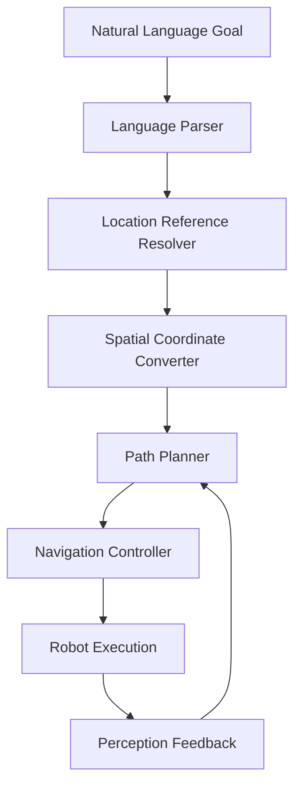

# Path Planning: Navigation from Language Goals

## Overview

Path planning for robotics involves finding optimal routes through environments while considering obstacles, kinematic constraints, and dynamic conditions. In Vision-Language-Action (VLA) systems, path planning must interpret natural language navigation goals and generate feasible trajectories. This chapter explores how to integrate language understanding with navigation planning, enabling robots to navigate to locations specified in natural language.

## Understanding Navigation in VLA Systems

Navigation in VLA systems requires bridging the gap between abstract language goals and concrete spatial navigation:

- **Language Interpretation**: Understanding location references in natural language
- **Spatial Mapping**: Converting language references to coordinate systems
- **Path Planning**: Generating collision-free trajectories
- **Dynamic Adaptation**: Adjusting plans based on environmental changes
- **Multi-Modal Integration**: Combining visual, linguistic, and spatial information

### Navigation Architecture Components



## Language-Based Location Reference Resolution

The first step in navigation from language goals is resolving location references:

```python
import re
import numpy as np
from typing import Dict, List, Tuple, Optional
from dataclasses import dataclass

@dataclass
class LocationReference:
    """Represents a location reference with various forms"""
    text: str
    reference_type: str  # 'landmark', 'relative', 'absolute', 'semantic'
    confidence: float
    coordinates: Optional[List[float]] = None

class LocationReferenceResolver:
    """Resolves natural language location references to coordinates"""

    def __init__(self):
        # Known landmarks in the environment
        self.landmarks = {
            'kitchen': [2.0, 1.0, 0.0],
            'living_room': [-1.0, 0.0, 0.0],
            'bedroom': [0.0, -2.0, 0.0],
            'office': [1.5, -1.0, 0.0],
            'dining_room': [0.5, 1.5, 0.0],
            'bathroom': [-1.5, -1.0, 0.0],
            'entrance': [0.0, 3.0, 0.0],
            'exit': [0.0, -3.0, 0.0]
        }

        # Relative direction patterns
        self.relative_patterns = {
            r'to the left of (.+)': 'left_of',
            r'to the right of (.+)': 'right_of',
            r'behind (.+)': 'behind',
            r'in front of (.+)': 'in_front_of',
            r'near (.+)': 'near',
            r'next to (.+)': 'next_to',
            r'beside (.+)': 'beside',
            r'by (.+)': 'beside',
            r'at (.+)': 'at',
            r'to (.+)': 'to'
        }

        # Distance descriptors
        self.distance_descriptors = {
            'close': 0.5,
            'near': 1.0,
            'far': 3.0,
            'very far': 5.0
        }

    def resolve_location_reference(self, location_text: str) -> LocationReference:
        """Resolve a natural language location reference to coordinates"""
        location_text_lower = location_text.lower().strip()

        # Check for exact landmark matches
        for landmark, coords in self.landmarks.items():
            if landmark in location_text_lower:
                return LocationReference(
                    text=location_text,
                    reference_type='landmark',
                    confidence=0.9,
                    coordinates=coords
                )

        # Check for relative position patterns
        for pattern, relation_type in self.relative_patterns.items():
            match = re.search(pattern, location_text_lower)
            if match:
                reference_object = match.group(1)
                # Find the referenced object in landmarks
                for landmark, coords in self.landmarks.items():
                    if reference_object in landmark or landmark in reference_object:
                        relative_coords = self.calculate_relative_position(
                            coords, relation_type, location_text_lower
                        )
                        return LocationReference(
                            text=location_text,
                            reference_type='relative',
                            confidence=0.8,
                            coordinates=relative_coords
                        )

        # Handle absolute coordinate references (simplified)
        coord_match = re.search(r'x[:\s]+([\d.-]+)[,\s]+y[:\s]+([\d.-]+)[,\s]*z?[:\s]*([\d.-]+)?', location_text_lower)
        if coord_match:
            x = float(coord_match.group(1))
            y = float(coord_match.group(2))
            z = float(coord_match.group(3)) if coord_match.group(3) else 0.0
            return LocationReference(
                text=location_text,
                reference_type='absolute',
                confidence=1.0,
                coordinates=[x, y, z]
            )

        # If no specific location found, return unknown
        return LocationReference(
            text=location_text,
            reference_type='unknown',
            confidence=0.0
        )

    def calculate_relative_position(self, base_coords: List[float], relation: str, context: str = "") -> List[float]:
        """Calculate coordinates relative to a base location"""
        base_x, base_y, base_z = base_coords

        # Default offset distances
        offset_distance = 1.0  # meters

        # Check for distance descriptors in context
        for desc, dist in self.distance_descriptors.items():
            if desc in context:
                offset_distance = dist
                break

        if relation == 'left_of':
            return [base_x - offset_distance, base_y, base_z]
        elif relation == 'right_of':
            return [base_x + offset_distance, base_y, base_z]
        elif relation == 'in_front_of':
            return [base_x, base_y + offset_distance, base_z]
        elif relation == 'behind':
            return [base_x, base_y - offset_distance, base_z]
        elif relation in ['near', 'next_to', 'beside']:
            # Return a position nearby (random direction for simplicity)
            angle = np.random.uniform(0, 2 * np.pi)
            dx = offset_distance * np.cos(angle)
            dy = offset_distance * np.sin(angle)
            return [base_x + dx, base_y + dy, base_z]
        else:
            # Default to base coordinates
            return base_coords

# Example usage
resolver = LocationReferenceResolver()
locations = [
    "the kitchen",
    "to the left of the kitchen",
    "near the bedroom",
    "x: 3.0, y: 2.0, z: 0.0"
]

for loc in locations:
    result = resolver.resolve_location_reference(loc)
    print(f"'{loc}' -> {result.coordinates} (confidence: {result.confidence:.2f})")
```

## Path Planning Algorithms for Robotics

For navigation, we need robust path planning algorithms that can handle robot kinematics and environmental constraints:

```python
import heapq
from typing import List, Tuple, Set
import math

class GridMap:
    """Represents a 2D grid map for path planning"""

    def __init__(self, width: int, height: int, resolution: float = 0.1):
        self.width = width
        self.height = height
        self.resolution = resolution
        self.grid = [[0 for _ in range(width)] for _ in range(height)]  # 0 = free, 1 = occupied

    def world_to_grid(self, x: float, y: float) -> Tuple[int, int]:
        """Convert world coordinates to grid coordinates"""
        grid_x = int((x / self.resolution) + (self.width / 2))
        grid_y = int((y / self.resolution) + (self.height / 2))
        return max(0, min(grid_x, self.width - 1)), max(0, min(grid_y, self.height - 1))

    def grid_to_world(self, grid_x: int, grid_y: int) -> Tuple[float, float]:
        """Convert grid coordinates to world coordinates"""
        x = (grid_x - self.width / 2) * self.resolution
        y = (grid_y - self.height / 2) * self.resolution
        return x, y

    def is_free(self, x: int, y: int) -> bool:
        """Check if a grid cell is free"""
        if 0 <= x < self.width and 0 <= y < self.height:
            return self.grid[y][x] == 0
        return False

    def set_obstacle(self, x: int, y: int):
        """Set a grid cell as occupied"""
        if 0 <= x < self.width and 0 <= y < self.height:
            self.grid[y][x] = 1

    def add_rectangle_obstacle(self, x: float, y: float, width: float, height: float):
        """Add a rectangular obstacle to the map"""
        start_grid_x, start_grid_y = self.world_to_grid(x - width/2, y - height/2)
        end_grid_x, end_grid_y = self.world_to_grid(x + width/2, y + height/2)

        for grid_x in range(start_grid_x, end_grid_x + 1):
            for grid_y in range(start_grid_y, end_grid_y + 1):
                if 0 <= grid_x < self.width and 0 <= grid_y < self.height:
                    self.grid[grid_y][grid_x] = 1

class AStarPlanner:
    """A* path planning algorithm for robotics navigation"""

    def __init__(self, grid_map: GridMap):
        self.grid_map = grid_map
        self.directions = [
            (-1, -1), (-1, 0), (-1, 1),
            (0, -1),           (0, 1),
            (1, -1),  (1, 0),  (1, 1)
        ]
        self.direction_costs = [
            math.sqrt(2), 1, math.sqrt(2),
            1,           1,
            math.sqrt(2), 1, math.sqrt(2)
        ]

    def heuristic(self, pos1: Tuple[int, int], pos2: Tuple[int, int]) -> float:
        """Calculate heuristic distance (Euclidean)"""
        return math.sqrt((pos1[0] - pos2[0])**2 + (pos1[1] - pos2[1])**2)

    def plan_path(self, start: Tuple[float, float], goal: Tuple[float, float]) -> Optional[List[Tuple[float, float]]]:
        """Plan a path from start to goal using A* algorithm"""
        start_grid = self.grid_map.world_to_grid(start[0], start[1])
        goal_grid = self.grid_map.world_to_grid(goal[0], goal[1])

        # Check if start or goal positions are occupied
        if not self.grid_map.is_free(start_grid[0], start_grid[1]) or \
           not self.grid_map.is_free(goal_grid[0], goal_grid[1]):
            return None

        # A* algorithm
        open_set = [(0, start_grid)]
        came_from = {}
        g_score = {start_grid: 0}
        f_score = {start_grid: self.heuristic(start_grid, goal_grid)}

        while open_set:
            current = heapq.heappop(open_set)[1]

            if current == goal_grid:
                # Reconstruct path
                path = []
                while current in came_from:
                    world_x, world_y = self.grid_map.grid_to_world(current[0], current[1])
                    path.append((world_x, world_y))
                    current = came_from[current]
                path.append((start[0], start[1]))
                return path[::-1]

            for i, direction in enumerate(self.directions):
                neighbor = (current[0] + direction[0], current[1] + direction[1])
                tentative_g_score = g_score[current] + self.direction_costs[i]

                if not self.grid_map.is_free(neighbor[0], neighbor[1]):
                    continue

                if neighbor not in g_score or tentative_g_score < g_score[neighbor]:
                    came_from[neighbor] = current
                    g_score[neighbor] = tentative_g_score
                    f_score[neighbor] = tentative_g_score + self.heuristic(neighbor, goal_grid)
                    heapq.heappush(open_set, (f_score[neighbor], neighbor))

        return None  # No path found

class NavigationPlanner:
    """High-level navigation planner that integrates language and path planning"""

    def __init__(self, grid_map: GridMap):
        self.grid_map = grid_map
        self.path_planner = AStarPlanner(grid_map)
        self.location_resolver = LocationReferenceResolver()

    def plan_navigation(self, start_position: Tuple[float, float],
                       language_goal: str) -> Optional[List[Tuple[float, float]]]:
        """Plan navigation from start position to language-specified goal"""
        # Resolve the language goal to coordinates
        location_ref = self.location_resolver.resolve_location_reference(language_goal)

        if location_ref.confidence < 0.5 or location_ref.coordinates is None:
            print(f"Could not resolve location reference: {language_goal}")
            return None

        goal_position = (location_ref.coordinates[0], location_ref.coordinates[1])
        print(f"Resolved '{language_goal}' to coordinates: {goal_position}")

        # Plan path from start to goal
        path = self.path_planner.plan_path(start_position, goal_position)

        if path is None:
            print(f"No path found from {start_position} to {goal_position}")
            return None

        print(f"Found path with {len(path)} waypoints")
        return path

    def smooth_path(self, path: List[Tuple[float, float]],
                   max_deviation: float = 0.1) -> List[Tuple[float, float]]:
        """Smooth the path to reduce unnecessary waypoints"""
        if len(path) < 3:
            return path

        smoothed_path = [path[0]]
        i = 0

        while i < len(path) - 1:
            j = len(path) - 1

            # Find the furthest point that can be reached directly
            while j > i + 1:
                if self.is_line_clear(path[i], path[j]):
                    smoothed_path.append(path[j])
                    i = j
                    break
                j -= 1

            if j == i + 1:  # No intermediate point can be skipped
                smoothed_path.append(path[i + 1])
                i += 1

        return smoothed_path

    def is_line_clear(self, start: Tuple[float, float],
                     end: Tuple[float, float]) -> bool:
        """Check if a straight line between two points is obstacle-free"""
        # Convert to grid coordinates
        start_grid = self.grid_map.world_to_grid(start[0], start[1])
        end_grid = self.grid_map.world_to_grid(end[0], end[1])

        # Use Bresenham's line algorithm to check for obstacles
        dx = abs(end_grid[0] - start_grid[0])
        dy = abs(end_grid[1] - start_grid[1])
        x, y = start_grid[0], start_grid[1]
        sx = 1 if start_grid[0] < end_grid[0] else -1
        sy = 1 if start_grid[1] < end_grid[1] else -1
        err = dx - dy

        while True:
            if not self.grid_map.is_free(x, y):
                return False

            if x == end_grid[0] and y == end_grid[1]:
                break

            e2 = 2 * err
            if e2 > -dy:
                err -= dy
                x += sx
            if e2 < dx:
                err += dx
                y += sy

        return True
```

## Dynamic Path Planning and Obstacle Avoidance

For real-world navigation, we need to handle dynamic obstacles and replanning:

```python
import time
from threading import Thread
from queue import Queue

class DynamicNavigationPlanner:
    """Navigation planner that handles dynamic obstacles and replanning"""

    def __init__(self, grid_map: GridMap):
        self.grid_map = grid_map
        self.base_planner = NavigationPlanner(grid_map)
        self.current_path = []
        self.current_waypoint_idx = 0
        self.is_navigating = False
        self.replan_threshold = 0.5  # Distance threshold to trigger replanning
        self.obstacle_queue = Queue()

    def start_navigation(self, start_pos: Tuple[float, float],
                        language_goal: str) -> bool:
        """Start navigation to a language-specified goal"""
        path = self.base_planner.plan_navigation(start_pos, language_goal)
        if path is None:
            return False

        self.current_path = path
        self.current_waypoint_idx = 0
        self.is_navigating = True

        # Start monitoring thread
        monitor_thread = Thread(target=self._monitor_navigation)
        monitor_thread.daemon = True
        monitor_thread.start()

        return True

    def _monitor_navigation(self):
        """Monitor navigation progress and handle replanning"""
        while self.is_navigating and self.current_waypoint_idx < len(self.current_path):
            # Check for new obstacles
            while not self.obstacle_queue.empty():
                obstacle_info = self.obstacle_queue.get()
                self._handle_obstacle(obstacle_info)

            time.sleep(0.1)  # Check every 100ms

    def _handle_obstacle(self, obstacle_info):
        """Handle a newly detected obstacle"""
        # Add obstacle to map
        if 'position' in obstacle_info and 'radius' in obstacle_info:
            pos = obstacle_info['position']
            radius = obstacle_info['radius']
            self._add_circular_obstacle(pos[0], pos[1], radius)

        # Check if current path is still valid
        if not self._is_path_valid():
            self._replan_path()

    def _add_circular_obstacle(self, x: float, y: float, radius: float):
        """Add a circular obstacle to the grid map"""
        grid_x, grid_y = self.grid_map.world_to_grid(x, y)
        grid_radius = int(radius / self.grid_map.resolution)

        for dx in range(-grid_radius, grid_radius + 1):
            for dy in range(-grid_radius, grid_radius + 1):
                dist_sq = dx*dx + dy*dy
                if dist_sq <= grid_radius * grid_radius:
                    obs_x, obs_y = grid_x + dx, grid_y + dy
                    if 0 <= obs_x < self.grid_map.width and 0 <= obs_y < self.grid_map.height:
                        self.grid_map.grid[obs_y][obs_x] = 1

    def _is_path_valid(self) -> bool:
        """Check if the current path is still obstacle-free"""
        if not self.current_path:
            return False

        for i in range(len(self.current_path) - 1):
            if not self.base_planner.is_line_clear(
                self.current_path[i],
                self.current_path[i + 1]
            ):
                return False
        return True

    def _replan_path(self):
        """Replan the path from current position"""
        if self.current_waypoint_idx >= len(self.current_path):
            return

        # Get current position (simplified as current waypoint)
        current_pos = self.current_path[self.current_waypoint_idx]

        # Get goal position
        if not self.current_path:
            return

        goal_pos = self.current_path[-1]

        # Plan new path
        new_path = self.base_planner.path_planner.plan_path(current_pos, goal_pos)
        if new_path:
            self.current_path = new_path
            self.current_waypoint_idx = 0

    def update_robot_position(self, position: Tuple[float, float]):
        """Update the robot's current position and progress"""
        if not self.current_path or self.current_waypoint_idx >= len(self.current_path):
            return

        # Find the closest waypoint
        min_dist = float('inf')
        closest_idx = self.current_waypoint_idx

        for i in range(self.current_waypoint_idx, len(self.current_path)):
            waypoint = self.current_path[i]
            dist = math.sqrt((position[0] - waypoint[0])**2 + (position[1] - waypoint[1])**2)
            if dist < min_dist:
                min_dist = dist
                closest_idx = i

        self.current_waypoint_idx = closest_idx

        # Check if close enough to current target to move to next
        if (closest_idx < len(self.current_path) - 1 and
            min_dist < self.replan_threshold):
            self.current_waypoint_idx += 1

    def get_next_waypoint(self) -> Optional[Tuple[float, float]]:
        """Get the next waypoint in the path"""
        if (self.current_waypoint_idx < len(self.current_path) and
            self.is_navigating):
            return self.current_path[self.current_waypoint_idx]
        return None

    def stop_navigation(self):
        """Stop the navigation process"""
        self.is_navigating = False
```

## Integration with Isaac Sim Navigation

Now let's create a ROS 2 node that integrates our navigation system with Isaac Sim:

```python
import rclpy
from rclpy.node import Node
from geometry_msgs.msg import PoseStamped, Point
from nav_msgs.msg import Path as NavPath
from sensor_msgs.msg import LaserScan
from std_msgs.msg import String
from visualization_msgs.msg import Marker, MarkerArray
import tf2_ros
import tf2_geometry_msgs

class IsaacNavigationNode(Node):
    """ROS 2 node for Isaac Sim navigation integration"""

    def __init__(self):
        super().__init__('isaac_navigation_node')

        # Initialize navigation components
        self.grid_map = GridMap(200, 200, 0.1)  # 20m x 20m map with 10cm resolution
        self.navigation_planner = DynamicNavigationPlanner(self.grid_map)

        # TF2 for coordinate transformations
        self.tf_buffer = tf2_ros.Buffer()
        self.tf_listener = tf2_ros.TransformListener(self.tf_buffer, self)

        # Publishers
        self.path_pub = self.create_publisher(NavPath, '/navigation_path', 10)
        self.goal_pub = self.create_publisher(PoseStamped, '/move_base_simple/goal', 10)
        self.marker_pub = self.create_publisher(MarkerArray, '/navigation_markers', 10)

        # Subscribers
        self.command_sub = self.create_subscription(
            String,
            '/navigation_commands',
            self.navigation_command_callback,
            10
        )

        self.laser_sub = self.create_subscription(
            LaserScan,
            '/isaac_sim/lidar/scan',
            self.laser_scan_callback,
            10
        )

        self.odom_sub = self.create_subscription(
            # Placeholder for odometry - would be Odometry or PoseStamped
            # Using a placeholder message type for now
        )

        # Navigation state
        self.current_goal = None
        self.is_navigating = False

        self.get_logger().info("Isaac Navigation Node initialized")

    def navigation_command_callback(self, msg):
        """Handle navigation commands with language goals"""
        command = msg.data
        self.get_logger().info(f"Received navigation command: {command}")

        # Extract language goal from command
        # This is a simplified approach - in practice, you'd use NLP to extract intent
        language_goal = command.lower().replace("go to ", "").replace("navigate to ", "").strip()

        # Get current robot position (simplified)
        current_pos = (0.0, 0.0)  # In practice, get from odometry

        # Plan and start navigation
        success = self.navigation_planner.start_navigation(current_pos, language_goal)

        if success:
            # Publish the planned path for visualization
            self.publish_navigation_path()

            # Publish goal for move_base compatibility
            self.publish_goal_pose()

            self.is_navigating = True
            self.get_logger().info(f"Started navigation to: {language_goal}")
        else:
            self.get_logger().error(f"Failed to plan navigation to: {language_goal}")

    def laser_scan_callback(self, msg):
        """Handle laser scan data for obstacle detection"""
        if not self.is_navigating:
            return

        # Process laser scan to detect obstacles
        for i, range_val in enumerate(msg.ranges):
            if range_val < msg.range_min or range_val > msg.range_max:
                continue

            # Calculate angle of this range measurement
            angle = msg.angle_min + i * msg.angle_increment

            # Calculate obstacle position in laser frame
            obstacle_x = range_val * math.cos(angle)
            obstacle_y = range_val * math.sin(angle)

            # Transform to map frame (simplified - would use TF2 in practice)
            # For now, assume laser is at origin of map
            world_x = obstacle_x
            world_y = obstacle_y

            # Add obstacle to navigation planner
            obstacle_info = {
                'position': (world_x, world_y),
                'radius': 0.2  # 20cm radius obstacle
            }
            self.navigation_planner.obstacle_queue.put(obstacle_info)

    def publish_navigation_path(self):
        """Publish the planned navigation path for visualization"""
        if not self.navigation_planner.current_path:
            return

        path_msg = NavPath()
        path_msg.header.stamp = self.get_clock().now().to_msg()
        path_msg.header.frame_id = "map"  # Assuming map frame

        for waypoint in self.navigation_planner.current_path:
            pose_stamped = PoseStamped()
            pose_stamped.header.stamp = path_msg.header.stamp
            pose_stamped.header.frame_id = path_msg.header.frame_id
            pose_stamped.pose.position.x = waypoint[0]
            pose_stamped.pose.position.y = waypoint[1]
            pose_stamped.pose.position.z = 0.0
            pose_stamped.pose.orientation.w = 1.0  # No rotation

            path_msg.poses.append(pose_stamped)

        self.path_pub.publish(path_msg)

    def publish_goal_pose(self):
        """Publish goal pose for compatibility with navigation stack"""
        if not self.navigation_planner.current_path:
            return

        goal_msg = PoseStamped()
        goal_msg.header.stamp = self.get_clock().now().to_msg()
        goal_msg.header.frame_id = "map"

        # Set goal to the last waypoint in the path
        last_waypoint = self.navigation_planner.current_path[-1]
        goal_msg.pose.position.x = last_waypoint[0]
        goal_msg.pose.position.y = last_waypoint[1]
        goal_msg.pose.position.z = 0.0
        goal_msg.pose.orientation.w = 1.0

        self.goal_pub.publish(goal_msg)

    def publish_navigation_markers(self):
        """Publish visualization markers for navigation"""
        marker_array = MarkerArray()

        # Path markers
        if self.navigation_planner.current_path:
            path_marker = Marker()
            path_marker.header.frame_id = "map"
            path_marker.header.stamp = self.get_clock().now().to_msg()
            path_marker.ns = "navigation_path"
            path_marker.id = 0
            path_marker.type = Marker.LINE_STRIP
            path_marker.action = Marker.ADD

            path_marker.pose.orientation.w = 1.0
            path_marker.scale.x = 0.05  # Line width

            path_marker.color.r = 0.0
            path_marker.color.g = 1.0
            path_marker.color.b = 0.0
            path_marker.color.a = 1.0

            for waypoint in self.navigation_planner.current_path:
                point = Point()
                point.x = waypoint[0]
                point.y = waypoint[1]
                point.z = 0.0
                path_marker.points.append(point)

            marker_array.markers.append(path_marker)

        # Current position marker
        current_waypoint = self.navigation_planner.get_next_waypoint()
        if current_waypoint:
            pos_marker = Marker()
            pos_marker.header.frame_id = "map"
            pos_marker.header.stamp = self.get_clock().now().to_msg()
            pos_marker.ns = "current_waypoint"
            pos_marker.id = 1
            pos_marker.type = Marker.SPHERE
            pos_marker.action = Marker.ADD

            pos_marker.pose.position.x = current_waypoint[0]
            pos_marker.pose.position.y = current_waypoint[1]
            pos_marker.pose.position.z = 0.0
            pos_marker.pose.orientation.w = 1.0

            pos_marker.scale.x = 0.3
            pos_marker.scale.y = 0.3
            pos_marker.scale.z = 0.3

            pos_marker.color.r = 1.0
            pos_marker.color.g = 0.0
            pos_marker.color.b = 0.0
            pos_marker.color.a = 1.0

            marker_array.markers.append(pos_marker)

        self.marker_pub.publish(marker_array)

def main(args=None):
    rclpy.init(args=args)

    node = IsaacNavigationNode()

    # Timer to publish visualization markers periodically
    node.create_timer(0.5, node.publish_navigation_markers)

    try:
        rclpy.spin(node)
    except KeyboardInterrupt:
        node.get_logger().info("Shutting down Isaac Navigation Node")
    finally:
        node.navigation_planner.stop_navigation()
        node.destroy_node()
        rclpy.shutdown()

if __name__ == '__main__':
    main()
```

## Advanced Navigation Strategies

For more sophisticated navigation, we can implement additional strategies:

```python
class AdvancedNavigationStrategies:
    """Advanced navigation strategies for complex environments"""

    def __init__(self, grid_map: GridMap):
        self.grid_map = grid_map
        self.planner = AStarPlanner(grid_map)

    def social_navigation(self, start: Tuple[float, float], goal: Tuple[float, float],
                         human_positions: List[Tuple[float, float]],
                         personal_space_radius: float = 1.0) -> Optional[List[Tuple[float, float]]]:
        """Plan navigation that respects human personal space"""
        # Create a temporary map with expanded obstacles around humans
        temp_grid = [row[:] for row in self.grid_map.grid]  # Copy grid

        # Add personal space around each human
        for human_pos in human_positions:
            self._add_personal_space(temp_grid, human_pos, personal_space_radius)

        # Plan path on the modified grid
        original_grid = self.grid_map.grid
        self.grid_map.grid = temp_grid

        path = self.planner.plan_path(start, goal)

        # Restore original grid
        self.grid_map.grid = original_grid

        return path

    def _add_personal_space(self, grid: List[List[int]], pos: Tuple[float, float], radius: float):
        """Add circular obstacle representing personal space around a position"""
        grid_x, grid_y = self.grid_map.world_to_grid(pos[0], pos[1])
        grid_radius = int(radius / self.grid_map.resolution)

        for dx in range(-grid_radius, grid_radius + 1):
            for dy in range(-grid_radius, grid_radius + 1):
                dist_sq = dx*dx + dy*dy
                if dist_sq <= grid_radius * grid_radius:
                    obs_x, obs_y = grid_x + dx, grid_y + dy
                    if 0 <= obs_x < self.grid_map.width and 0 <= obs_y < self.grid_map.height:
                        grid[obs_y][obs_x] = 1

    def multi_goal_navigation(self, start: Tuple[float, float],
                             goals: List[Tuple[float, float]]) -> Optional[List[List[Tuple[float, float]]]]:
        """Plan navigation to visit multiple goals in optimal order"""
        if not goals:
            return None

        # Find the best order to visit goals (simplified greedy approach)
        remaining_goals = goals[:]
        current_pos = start
        all_paths = []

        while remaining_goals:
            # Find closest goal
            closest_goal = min(remaining_goals,
                             key=lambda g: math.sqrt((g[0]-current_pos[0])**2 + (g[1]-current_pos[1])**2))

            # Plan path to closest goal
            path_to_goal = self.planner.plan_path(current_pos, closest_goal)
            if path_to_goal is None:
                return None  # Can't reach this goal

            all_paths.append(path_to_goal)
            current_pos = closest_goal
            remaining_goals.remove(closest_goal)

        return all_paths

    def navigation_with_waypoints(self, start: Tuple[float, float],
                                 waypoints: List[Tuple[float, float]],
                                 goal: Tuple[float, float]) -> Optional[List[Tuple[float, float]]]:
        """Plan navigation that goes through specified waypoints"""
        all_paths = []
        current_pos = start

        # Path to each waypoint
        for waypoint in waypoints:
            path = self.planner.plan_path(current_pos, waypoint)
            if path is None:
                return None
            all_paths.extend(path[:-1])  # Exclude last point to avoid duplication
            current_pos = waypoint

        # Path from last waypoint to goal
        final_path = self.planner.plan_path(current_pos, goal)
        if final_path is None:
            return None

        all_paths.extend(final_path)
        return all_paths

# Example usage of advanced strategies
def demonstrate_advanced_navigation():
    """Demonstrate advanced navigation strategies"""
    grid_map = GridMap(100, 100, 0.1)
    advanced_nav = AdvancedNavigationStrategies(grid_map)

    # Add some obstacles to the map
    grid_map.add_rectangle_obstacle(0, 0, 2, 2)  # Central obstacle
    grid_map.add_rectangle_obstacle(3, 2, 1, 1)  # Another obstacle

    start = (-2.0, -2.0)
    goal = (4.0, 3.0)

    # Test social navigation
    human_positions = [(0.5, 0.5), (-0.5, 1.0)]
    social_path = advanced_nav.social_navigation(start, goal, human_positions)

    if social_path:
        print(f"Social navigation path has {len(social_path)} waypoints")
    else:
        print("Could not find social navigation path")

    # Test multi-goal navigation
    goals = [(2.0, 1.0), (-1.0, 2.0), (3.0, -1.0)]
    multi_goal_paths = advanced_nav.multi_goal_navigation(start, goals)

    if multi_goal_paths:
        total_waypoints = sum(len(path) for path in multi_goal_paths)
        print(f"Multi-goal navigation has {len(multi_goal_paths)} segments with {total_waypoints} total waypoints")
    else:
        print("Could not find multi-goal navigation path")

if __name__ == "__main__":
    demonstrate_advanced_navigation()
```

## Performance Considerations

When implementing navigation for VLA systems, several performance factors must be considered:

- **Real-time Path Planning**: Path planning algorithms must run efficiently to support real-time navigation
- **Dynamic Replanning**: The system must be able to replan quickly when obstacles are detected
- **Memory Usage**: Grid maps and path planning data structures must be memory efficient
- **Accuracy vs. Speed Trade-off**: Balance between path optimality and computation time
- **Robustness**: Navigation must handle various environmental conditions and sensor noise

## Troubleshooting Common Issues

### Navigation Problems

```python
def troubleshoot_navigation_issues():
    """Helper function to diagnose common navigation issues"""

    print("Navigation troubleshooting checklist:")
    print("1. Check if goal coordinates are in map bounds")
    print("2. Verify that start and goal positions are not in obstacles")
    print("3. Ensure laser scanner is publishing data")
    print("4. Check TF transforms between robot and map frames")
    print("5. Verify map resolution is appropriate for robot size")
    print("6. Confirm path planner parameters are tuned for environment")
```

## Summary

This chapter covered path planning for Vision-Language-Action systems, focusing on navigation from language goals. We explored location reference resolution, path planning algorithms, dynamic obstacle handling, and integration with Isaac Sim. The navigation component enables robots to move to locations specified in natural language, forming an essential part of the VLA pipeline.

This chapter connects to:
- [Chapter 5: Integrating Perception with VLA](./05-integrating-perception-vla.md) - Uses perception data for navigation
- [Chapter 7: Manipulation with Language Commands](./07-manipulation-language-commands.md) - Navigation often precedes manipulation tasks
- [Chapter 8: Capstone Autonomous Humanoid](./08-capstone-autonomous-humanoid.md) - Integrates navigation in complete system

In the next chapter, we'll explore manipulation tasks based on language commands, completing the action component of our VLA system.