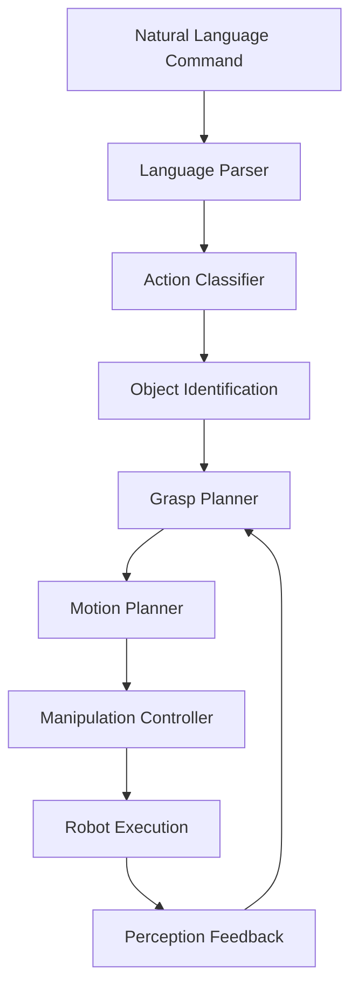

# Manipulation: Executing Language Commands for Robot Interaction

## Overview

Manipulation represents the physical interaction component of Vision-Language-Action (VLA) systems, enabling robots to grasp, move, and manipulate objects based on natural language commands. This chapter explores how to interpret language commands for manipulation tasks, plan appropriate grasps, execute precise movements, and integrate these capabilities with perception and navigation systems.

## Understanding Manipulation in VLA Systems

Manipulation in VLA systems requires sophisticated integration of multiple components:

- **Language Interpretation**: Understanding manipulation verbs and object references
- **Grasp Planning**: Determining appropriate grasp strategies for different objects
- **Motion Planning**: Generating collision-free trajectories for manipulation
- **Force Control**: Managing grip strength and interaction forces
- **Perception Integration**: Using visual feedback for precise manipulation

### Manipulation Architecture Components



## Language Understanding for Manipulation

The first step in manipulation is understanding the specific manipulation action requested:

```python
import re
from typing import Dict, List, Tuple, Optional
from dataclasses import dataclass

@dataclass
class ManipulationCommand:
    """Represents a manipulation command with its components"""
    action: str  # 'grasp', 'lift', 'move', 'place', 'push', 'pull', etc.
    object_name: str
    target_location: Optional[str] = None
    force_level: str = "medium"  # 'light', 'medium', 'firm'
    approach_direction: str = "top"  # 'top', 'side', 'front'
    confidence: float = 1.0

class ManipulationLanguageParser:
    """Parses natural language commands for manipulation tasks"""

    def __init__(self):
        # Action patterns for different manipulation verbs
        self.action_patterns = {
            'grasp': [
                r'grasp the (.+)',
                r'grab the (.+)',
                r'pick up the (.+)',
                r'get the (.+)',
                r'take the (.+)'
            ],
            'lift': [
                r'lift the (.+)',
                r'raise the (.+)',
                r'pick up and lift the (.+)'
            ],
            'move': [
                r'move the (.+) to (.+)',
                r'transport the (.+) to (.+)',
                r'carry the (.+) to (.+)'
            ],
            'place': [
                r'place the (.+) on (.+)',
                r'put the (.+) on (.+)',
                r'put the (.+) at (.+)',
                r'set the (.+) on (.+)'
            ],
            'push': [
                r'push the (.+)',
                r'push (.+) to (.+)',
                r'slide the (.+)'
            ],
            'pull': [
                r'pull the (.+)',
                r'pull (.+) to (.+)'
            ],
            'release': [
                r'release the (.+)',
                r'drop the (.+)',
                r'let go of the (.+)'
            ]
        }

        # Force level descriptors
        self.force_descriptors = {
            'gently': 'light',
            'carefully': 'light',
            'lightly': 'light',
            'softly': 'light',
            'firmly': 'firm',
            'tightly': 'firm',
            'strongly': 'firm',
            'securely': 'firm'
        }

        # Approach direction descriptors
        self.approach_descriptors = {
            'from the top': 'top',
            'from above': 'top',
            'from the side': 'side',
            'from the front': 'front',
            'from below': 'bottom'
        }

    def parse_command(self, command: str) -> Optional[ManipulationCommand]:
        """Parse a natural language command into manipulation components"""
        command_lower = command.lower().strip()

        # Check for force descriptors
        force_level = "medium"
        for desc, level in self.force_descriptors.items():
            if desc in command_lower:
                force_level = level
                command_lower = command_lower.replace(desc, "").strip()

        # Check for approach descriptors
        approach_direction = "top"
        for desc, direction in self.approach_descriptors.items():
            if desc in command_lower:
                approach_direction = direction
                command_lower = command_lower.replace(desc, "").strip()

        # Match against action patterns
        for action, patterns in self.action_patterns.items():
            for pattern in patterns:
                match = re.search(pattern, command_lower)
                if match:
                    if action in ['move', 'place']:
                        # Two-argument actions (object, target)
                        if len(match.groups()) == 2:
                            object_name = match.group(1).strip()
                            target_location = match.group(2).strip()
                            return ManipulationCommand(
                                action=action,
                                object_name=object_name,
                                target_location=target_location,
                                force_level=force_level,
                                approach_direction=approach_direction
                            )
                    else:
                        # Single-argument actions
                        object_name = match.group(1).strip()
                        return ManipulationCommand(
                            action=action,
                            object_name=object_name,
                            force_level=force_level,
                            approach_direction=approach_direction
                        )

        # If no pattern matches, return None
        return None

# Example usage
parser = ManipulationLanguageParser()

commands = [
    "Grasp the red cup",
    "Pick up the book carefully",
    "Place the bottle on the table",
    "Move the box to the kitchen",
    "Push the button firmly",
    "Lift the mug from the top"
]

for cmd in commands:
    result = parser.parse_command(cmd)
    if result:
        print(f"'{cmd}' -> Action: {result.action}, Object: {result.object_name}, "
              f"Target: {result.target_location}, Force: {result.force_level}, "
              f"Approach: {result.approach_direction}")
    else:
        print(f"'{cmd}' -> Could not parse")
```

## Grasp Planning and Object Interaction

Effective manipulation requires sophisticated grasp planning that considers object properties:

```python
import numpy as np
from typing import Dict, List, Tuple
from dataclasses import dataclass

@dataclass
class GraspPose:
    """Represents a grasp pose with position and orientation"""
    position: Tuple[float, float, float]
    orientation: Tuple[float, float, float, float]  # Quaternion (x, y, z, w)
    approach_direction: Tuple[float, float, float]
    grasp_width: float
    grasp_type: str  # 'pinch', 'power', 'suction', etc.

@dataclass
class ObjectProperties:
    """Properties of an object relevant for manipulation"""
    name: str
    shape: str  # 'cylinder', 'box', 'sphere', 'irregular'
    size: Tuple[float, float, float]  # width, height, depth
    weight: float  # in kg
    material: str  # 'plastic', 'metal', 'glass', 'fabric', etc.
    fragility: str  # 'fragile', 'normal', 'durable'
    grasp_points: List[Tuple[float, float, float]]  # Potential grasp points
    center_of_mass: Tuple[float, float, float]

class GraspPlanner:
    """Plans appropriate grasps based on object properties and manipulation goals"""

    def __init__(self):
        self.object_database = self._initialize_object_database()

    def _initialize_object_database(self) -> Dict[str, ObjectProperties]:
        """Initialize a database of known objects and their properties"""
        return {
            'cup': ObjectProperties(
                name='cup',
                shape='cylinder',
                size=(0.08, 0.1, 0.08),  # 8cm diameter, 10cm height
                weight=0.2,
                material='ceramic',
                fragility='fragile',
                grasp_points=[(0.0, 0.05, 0.0)],  # Handle position
                center_of_mass=(0.0, 0.05, 0.0)
            ),
            'book': ObjectProperties(
                name='book',
                shape='box',
                size=(0.2, 0.03, 0.15),  # 20cm x 3cm x 15cm
                weight=0.5,
                material='paper',
                fragility='normal',
                grasp_points=[(0.0, 0.015, 0.075)],  # Middle of spine
                center_of_mass=(0.0, 0.015, 0.075)
            ),
            'bottle': ObjectProperties(
                name='bottle',
                shape='cylinder',
                size=(0.07, 0.25, 0.07),  # 7cm diameter, 25cm height
                weight=0.3,
                material='plastic',
                fragility='normal',
                grasp_points=[(0.0, 0.035, 0.0)],  # Neck of bottle
                center_of_mass=(0.0, 0.125, 0.0)
            ),
            'box': ObjectProperties(
                name='box',
                shape='box',
                size=(0.15, 0.15, 0.15),  # 15cm cube
                weight=1.0,
                material='cardboard',
                fragility='normal',
                grasp_points=[(0.0, 0.075, 0.075)],  # Center of top face
                center_of_mass=(0.0, 0.075, 0.075)
            )
        }

    def plan_grasp(self, object_name: str, manipulation_cmd: ManipulationCommand) -> Optional[GraspPose]:
        """Plan an appropriate grasp for the specified object and action"""
        if object_name not in self.object_database:
            print(f"Unknown object: {object_name}")
            return None

        obj_props = self.object_database[object_name]

        # Determine grasp type based on object properties and action
        grasp_type = self._determine_grasp_type(obj_props, manipulation_cmd.action)

        # Calculate grasp position based on object properties
        grasp_pos = self._calculate_grasp_position(obj_props, manipulation_cmd)

        # Calculate grasp orientation based on approach direction
        grasp_orientation = self._calculate_grasp_orientation(manipulation_cmd.approach_direction)

        # Calculate grasp width based on object size
        grasp_width = self._calculate_grasp_width(obj_props)

        return GraspPose(
            position=grasp_pos,
            orientation=grasp_orientation,
            approach_direction=self._get_approach_vector(manipulation_cmd.approach_direction),
            grasp_width=grasp_width,
            grasp_type=grasp_type
        )

    def _determine_grasp_type(self, obj_props: ObjectProperties, action: str) -> str:
        """Determine appropriate grasp type based on object properties and action"""
        if obj_props.fragility == 'fragile' and action in ['lift', 'move']:
            return 'pinch'  # Use gentle pinch grasp for fragile items
        elif obj_props.weight > 0.5 or action == 'lift':
            return 'power'  # Use power grasp for heavy objects
        else:
            return 'pinch'  # Default to pinch grasp

    def _calculate_grasp_position(self, obj_props: ObjectProperties, cmd: ManipulationCommand) -> Tuple[float, float, float]:
        """Calculate appropriate grasp position based on object and command"""
        # For now, use the first grasp point in the object properties
        # In a real system, this would consider the specific grasp strategy needed
        if obj_props.grasp_points:
            base_pos = obj_props.grasp_points[0]
        else:
            base_pos = obj_props.center_of_mass

        # Adjust for approach direction
        approach_offset = 0.05  # 5cm approach distance
        if cmd.approach_direction == 'top':
            offset = (0, approach_offset, 0)
        elif cmd.approach_direction == 'side':
            offset = (approach_offset, 0, 0)
        elif cmd.approach_direction == 'front':
            offset = (0, 0, approach_offset)
        else:
            offset = (0, approach_offset, 0)  # Default to top

        return (
            base_pos[0] + offset[0],
            base_pos[1] + offset[1],
            base_pos[2] + offset[2]
        )

    def _calculate_grasp_orientation(self, approach_direction: str) -> Tuple[float, float, float, float]:
        """Calculate appropriate grasp orientation based on approach direction"""
        # Default orientation (identity quaternion)
        if approach_direction == 'top':
            # Approach from above, gripper pointing down
            return (0.707, 0.0, 0.0, 0.707)  # 90-degree rotation around X-axis
        elif approach_direction == 'side':
            # Approach from side, gripper horizontal
            return (0.0, 0.0, 0.0, 1.0)  # Identity
        elif approach_direction == 'front':
            # Approach from front, gripper vertical
            return (0.5, 0.5, 0.5, 0.5)  # 90-degree rotation around Y-axis
        else:
            return (0.707, 0.0, 0.0, 0.707)  # Default to top approach

    def _calculate_grasp_width(self, obj_props: ObjectProperties) -> float:
        """Calculate appropriate grasp width based on object size"""
        # For cylindrical objects, grasp width should be slightly larger than diameter
        if obj_props.shape == 'cylinder':
            return obj_props.size[0] * 1.2  # 120% of diameter
        elif obj_props.shape == 'box':
            # Use the average of width and depth
            avg_size = (obj_props.size[0] + obj_props.size[2]) / 2
            return avg_size * 1.1  # 110% of average size
        else:
            return 0.08  # Default grasp width (8cm)

    def _get_approach_vector(self, approach_direction: str) -> Tuple[float, float, float]:
        """Get the approach vector for the given approach direction"""
        if approach_direction == 'top':
            return (0, -1, 0)  # Approach from above (negative Y)
        elif approach_direction == 'side':
            return (-1, 0, 0)  # Approach from side (negative X)
        elif approach_direction == 'front':
            return (0, 0, -1)  # Approach from front (negative Z)
        else:
            return (0, -1, 0)  # Default to top approach

    def update_object_properties(self, object_name: str, new_properties: ObjectProperties):
        """Update or add object properties to the database"""
        self.object_database[object_name] = new_properties

# Example usage
grasp_planner = GraspPlanner()

# Test with different objects and commands
test_cases = [
    ("Grasp the cup", "cup"),
    ("Lift the bottle carefully", "bottle"),
    ("Pick up the book", "book"),
    ("Grasp the box firmly", "box")
]

parser = ManipulationLanguageParser()

for command, obj_name in test_cases:
    cmd = parser.parse_command(command)
    if cmd:
        grasp = grasp_planner.plan_grasp(obj_name, cmd)
        if grasp:
            print(f"Command: '{command}' -> Grasp at {grasp.position}, "
                  f"width: {grasp.grasp_width:.3f}m, type: {grasp.grasp_type}")
```

## Motion Planning for Manipulation

Once we have a grasp plan, we need to generate motion trajectories that are collision-free:

```python
from scipy.spatial.transform import Rotation as R
import math

class ManipulationMotionPlanner:
    """Plans collision-free motion trajectories for manipulation tasks"""

    def __init__(self, robot_workspace_limits: Dict[str, Tuple[float, float]] = None):
        # Define robot workspace limits (x_min, x_max), (y_min, y_max), (z_min, z_max)
        if robot_workspace_limits is None:
            self.workspace_limits = {
                'x': (-1.0, 1.0),
                'y': (0.0, 1.5),
                'z': (-0.5, 0.5)
            }
        else:
            self.workspace_limits = robot_workspace_limits

        # Collision detection grid (simplified for this example)
        self.collision_grid_resolution = 0.05  # 5cm resolution
        self.collision_grid_size = (40, 30, 20)  # 2m x 1.5m x 1m at 5cm resolution
        self.collision_grid = np.zeros(self.collision_grid_size, dtype=bool)

    def plan_manipulation_trajectory(self, start_pose: Tuple[float, float, float, float, float, float],
                                   grasp_pose: GraspPose,
                                   lift_height: float = 0.1) -> Optional[List[Tuple[float, float, float, float, float, float]]]:
        """Plan a trajectory for manipulation including approach, grasp, and lift"""
        trajectory = []

        # Convert start pose (x, y, z, roll, pitch, yaw) to full pose
        start_pos = start_pose[:3]
        start_ori = start_pose[3:]

        # 1. Move to pre-grasp position (above grasp point)
        pre_grasp_pos = (
            grasp_pose.position[0],
            grasp_pose.position[1] + 0.1,  # 10cm above grasp point
            grasp_pose.position[2]
        )

        approach_trajectory = self._plan_linear_trajectory(start_pos, pre_grasp_pos)
        if not approach_trajectory:
            return None

        trajectory.extend(approach_trajectory)

        # 2. Approach grasp position
        approach_trajectory = self._plan_linear_trajectory(pre_grasp_pos, grasp_pose.position)
        if not approach_trajectory:
            return None

        # Add approach trajectory in reverse to slow down near object
        approach_smooth = self._smooth_approach_trajectory(approach_trajectory)
        trajectory.extend(approach_smooth)

        # 3. Grasp - hold position briefly
        grasp_poses = [(*grasp_pose.position, *start_ori)] * 10  # Hold for 10 steps
        trajectory.extend(grasp_poses)

        # 4. Lift object
        lift_pos = (
            grasp_pose.position[0],
            grasp_pose.position[1] + lift_height,
            grasp_pose.position[2]
        )

        lift_trajectory = self._plan_linear_trajectory(grasp_pose.position, lift_pos)
        if not lift_trajectory:
            return None

        trajectory.extend(lift_trajectory)

        return trajectory

    def _plan_linear_trajectory(self, start: Tuple[float, float, float],
                              end: Tuple[float, float, float],
                              step_size: float = 0.01) -> List[Tuple[float, float, float, float, float, float]]:
        """Plan a linear trajectory between two points"""
        # Calculate the distance and number of steps
        dx = end[0] - start[0]
        dy = end[1] - start[1]
        dz = end[2] - start[2]
        distance = math.sqrt(dx*dx + dy*dy + dz*dz)

        if distance == 0:
            return [(*start, 0.0, 0.0, 0.0)]  # Return position with zero orientation

        num_steps = max(1, int(distance / step_size))
        trajectory = []

        for i in range(num_steps + 1):
            t = i / num_steps if num_steps > 0 else 0
            pos = (
                start[0] + t * dx,
                start[1] + t * dy,
                start[2] + t * dz
            )

            # For simplicity, use zero orientation (roll, pitch, yaw = 0)
            trajectory.append((*pos, 0.0, 0.0, 0.0))

        return trajectory

    def _smooth_approach_trajectory(self, trajectory: List[Tuple[float, float, float, float, float, float]],
                                  steps: int = 5) -> List[Tuple[float, float, float, float, float, float]]:
        """Smooth the final part of approach trajectory for gentle contact"""
        if len(trajectory) <= steps:
            return trajectory

        # Take the last few points and add intermediate points for smoother approach
        final_segment = trajectory[-steps:]
        smoothed = []

        for i in range(len(final_segment) - 1):
            start_pose = final_segment[i]
            end_pose = final_segment[i + 1]

            # Add more intermediate points for smoother motion
            for j in range(3):  # Add 3 intermediate points between each pair
                t = j / 3.0
                smooth_pose = (
                    start_pose[0] + t * (end_pose[0] - start_pose[0]),
                    start_pose[1] + t * (end_pose[1] - start_pose[1]),
                    start_pose[2] + t * (end_pose[2] - start_pose[2]),
                    start_pose[3], start_pose[4], start_pose[5]  # Keep orientation
                )
                smoothed.append(smooth_pose)

        # Add the final pose
        smoothed.append(final_segment[-1])
        return smoothed

    def check_collision(self, position: Tuple[float, float, float]) -> bool:
        """Check if a position is in collision"""
        # Convert world coordinates to grid coordinates
        grid_x = int((position[0] - (-1.0)) / self.collision_grid_resolution)
        grid_y = int((position[1] - 0.0) / self.collision_grid_resolution)
        grid_z = int((position[2] - (-0.5)) / self.collision_grid_resolution)

        # Check bounds
        if (0 <= grid_x < self.collision_grid_size[0] and
            0 <= grid_y < self.collision_grid_size[1] and
            0 <= grid_z < self.collision_grid_size[2]):
            return self.collision_grid[grid_z, grid_y, grid_x]

        # If outside grid, consider it free (or you might want to return True for safety)
        return False

    def add_obstacle(self, center: Tuple[float, float, float], size: Tuple[float, float, float]):
        """Add an obstacle to the collision grid"""
        # Calculate grid bounds for the obstacle
        min_x = int((center[0] - size[0]/2 - (-1.0)) / self.collision_grid_resolution)
        max_x = int((center[0] + size[0]/2 - (-1.0)) / self.collision_grid_resolution)
        min_y = int((center[1] - size[1]/2 - 0.0) / self.collision_grid_resolution)
        max_y = int((center[1] + size[1]/2 - 0.0) / self.collision_grid_resolution)
        min_z = int((center[2] - size[2]/2 - (-0.5)) / self.collision_grid_resolution)
        max_z = int((center[2] + size[2]/2 - (-0.5)) / self.collision_grid_resolution)

        # Mark grid cells as occupied
        for x in range(max(0, min_x), min(self.collision_grid_size[0], max_x + 1)):
            for y in range(max(0, min_y), min(self.collision_grid_size[1], max_y + 1)):
                for z in range(max(0, min_z), min(self.collision_grid_size[2], max_z + 1)):
                    self.collision_grid[z, y, x] = True

# Example usage
motion_planner = ManipulationMotionPlanner()

# Add some obstacles
motion_planner.add_obstacle((0.2, 0.5, 0.0), (0.1, 0.1, 0.2))  # Small obstacle
motion_planner.add_obstacle((-0.3, 0.8, 0.1), (0.2, 0.2, 0.1))  # Another obstacle

# Plan a manipulation trajectory
start_pose = (0.0, 0.3, 0.0, 0.0, 0.0, 0.0)  # Start position
grasp_pose = GraspPose(
    position=(0.5, 0.6, 0.0),
    orientation=(0.707, 0.0, 0.0, 0.707),
    approach_direction=(0, -1, 0),
    grasp_width=0.05,
    grasp_type='pinch'
)

trajectory = motion_planner.plan_manipulation_trajectory(start_pose, grasp_pose)

if trajectory:
    print(f"Planned manipulation trajectory with {len(trajectory)} waypoints")
    print(f"Start: {trajectory[0][:3]}, End: {trajectory[-1][:3]}")
else:
    print("Could not plan manipulation trajectory")
```

## Isaac Sim Manipulation Integration

Now let's create a ROS 2 node that integrates manipulation with Isaac Sim:

```python
import rclpy
from rclpy.node import Node
from geometry_msgs.msg import Pose, PoseStamped, Point
from std_msgs.msg import String, Float64MultiArray
from sensor_msgs.msg import JointState
from trajectory_msgs.msg import JointTrajectory, JointTrajectoryPoint
from control_msgs.msg import JointTrajectoryControllerState
from visualization_msgs.msg import MarkerArray, Marker
import numpy as np

class IsaacManipulationNode(Node):
    """ROS 2 node for Isaac Sim manipulation integration"""

    def __init__(self):
        super().__init__('isaac_manipulation_node')

        # Initialize manipulation components
        self.language_parser = ManipulationLanguageParser()
        self.grasp_planner = GraspPlanner()
        self.motion_planner = ManipulationMotionPlanner()

        # Publishers
        self.joint_trajectory_pub = self.create_publisher(
            JointTrajectory, '/isaac_sim/joint_trajectory', 10
        )
        self.gripper_command_pub = self.create_publisher(
            Float64MultiArray, '/isaac_sim/gripper_command', 10
        )
        self.manipulation_feedback_pub = self.create_publisher(
            String, '/manipulation_feedback', 10
        )
        self.marker_pub = self.create_publisher(MarkerArray, '/manipulation_markers', 10)

        # Subscribers
        self.command_sub = self.create_subscription(
            String,
            '/manipulation_commands',
            self.manipulation_command_callback,
            10
        )

        self.joint_state_sub = self.create_subscription(
            JointState,
            '/isaac_sim/joint_states',
            self.joint_state_callback,
            10
        )

        # Manipulation state
        self.current_joint_positions = {}
        self.is_executing = False
        self.current_trajectory = []
        self.trajectory_index = 0

        self.get_logger().info("Isaac Manipulation Node initialized")

    def manipulation_command_callback(self, msg):
        """Handle manipulation commands with natural language"""
        command = msg.data
        self.get_logger().info(f"Received manipulation command: {command}")

        # Parse the command
        manipulation_cmd = self.language_parser.parse_command(command)
        if not manipulation_cmd:
            feedback_msg = String()
            feedback_msg.data = f"Could not understand manipulation command: {command}"
            self.manipulation_feedback_pub.publish(feedback_msg)
            return

        self.get_logger().info(f"Parsed command: {manipulation_cmd.action} {manipulation_cmd.object_name}")

        # Plan the manipulation
        success = self.execute_manipulation(manipulation_cmd)

        if success:
            feedback_msg = String()
            feedback_msg.data = f"Successfully executed: {command}"
            self.manipulation_feedback_pub.publish(feedback_msg)
        else:
            feedback_msg = String()
            feedback_msg.data = f"Failed to execute: {command}"
            self.manipulation_feedback_pub.publish(feedback_msg)

    def execute_manipulation(self, manipulation_cmd: ManipulationCommand) -> bool:
        """Execute a manipulation command"""
        if self.is_executing:
            self.get_logger().warn("Already executing a manipulation task")
            return False

        self.is_executing = True

        # Get object information (in a real system, this would come from perception)
        # For now, we'll use the object database
        if manipulation_cmd.object_name not in self.grasp_planner.object_database:
            self.get_logger().error(f"Unknown object: {manipulation_cmd.object_name}")
            self.is_executing = False
            return False

        # Plan grasp
        grasp_pose = self.grasp_planner.plan_grasp(manipulation_cmd.object_name, manipulation_cmd)
        if not grasp_pose:
            self.get_logger().error(f"Could not plan grasp for {manipulation_cmd.object_name}")
            self.is_executing = False
            return False

        # Get current robot position (simplified - would come from joint states)
        current_pos = (0.0, 0.5, 0.2)  # Placeholder
        current_ori = (0.0, 0.0, 0.0)  # Placeholder

        # Plan manipulation trajectory
        start_pose = (*current_pos, *current_ori)
        trajectory = self.motion_planner.plan_manipulation_trajectory(
            start_pose, grasp_pose
        )

        if not trajectory:
            self.get_logger().error("Could not plan manipulation trajectory")
            self.is_executing = False
            return False

        # Execute trajectory
        self.current_trajectory = trajectory
        self.trajectory_index = 0

        # Start execution timer
        self.trajectory_timer = self.create_timer(0.05, self.execute_trajectory_step)

        self.get_logger().info(f"Started manipulation execution with {len(trajectory)} steps")

        return True

    def execute_trajectory_step(self):
        """Execute one step of the manipulation trajectory"""
        if (not self.current_trajectory or
            self.trajectory_index >= len(self.current_trajectory) or
            not self.is_executing):
            # Trajectory completed
            self.is_executing = False
            self.trajectory_timer.destroy()

            # If this was a grasp action, close the gripper
            # This is a simplified approach - in reality, you'd have more sophisticated control
            self.close_gripper()

            self.get_logger().info("Manipulation trajectory completed")
            return

        # Get current trajectory point
        target_pose = self.current_trajectory[self.trajectory_index]

        # Create joint trajectory message
        joint_trajectory = JointTrajectory()
        joint_trajectory.header.stamp = self.get_clock().now().to_msg()
        joint_trajectory.header.frame_id = "base_link"

        # Set joint names (placeholder - would match your robot's joint names)
        joint_trajectory.joint_names = [
            'joint1', 'joint2', 'joint3', 'joint4', 'joint5', 'joint6'
        ]

        # Create trajectory point
        point = JointTrajectoryPoint()

        # Calculate joint positions for target pose (simplified inverse kinematics)
        # In a real system, you'd use a proper IK solver
        joint_positions = self.calculate_joint_positions_for_pose(target_pose)
        point.positions = joint_positions
        point.velocities = [0.0] * len(joint_positions)  # Start with zero velocities
        point.accelerations = [0.0] * len(joint_positions)

        point.time_from_start.sec = 0
        point.time_from_start.nanosec = 50000000  # 50ms

        joint_trajectory.points.append(point)

        # Publish trajectory
        self.joint_trajectory_pub.publish(joint_trajectory)

        # Move to next trajectory point
        self.trajectory_index += 1

        # Publish visualization markers
        self.publish_manipulation_markers(target_pose[:3])

    def calculate_joint_positions_for_pose(self, pose: Tuple[float, float, float, float, float, float]) -> List[float]:
        """Calculate joint positions for a given end-effector pose (simplified)"""
        # This is a very simplified inverse kinematics calculation
        # In a real system, you'd use a proper IK solver like KDL, MoveIt, or PyKDL

        x, y, z = pose[0], pose[1], pose[2]

        # Simple 3DOF arm approximation (shoulder, elbow, wrist)
        # This is not realistic but serves as an example
        shoulder_angle = math.atan2(y, x) if x != 0 else 0
        r = math.sqrt(x*x + y*y)
        l1, l2 = 0.5, 0.5  # Link lengths (1m each)

        # Calculate elbow angle using law of cosines
        distance_to_target = math.sqrt(r*r + z*z)

        if distance_to_target > l1 + l2:
            # Target is out of reach, extend fully
            elbow_angle = 0
            shoulder_lift = math.atan2(z, r)
        else:
            # Calculate angles using inverse kinematics
            cos_elbow = (l1*l1 + l2*l2 - distance_to_target*distance_to_target) / (2*l1*l2)
            elbow_angle = math.pi - math.acos(max(-1, min(1, cos_elbow)))

            k1 = l1 + l2 * math.cos(math.pi - elbow_angle)
            k2 = l2 * math.sin(math.pi - elbow_angle)
            shoulder_lift = math.atan2(z, r) - math.atan2(k2, k1)

        # Return placeholder joint angles
        return [
            shoulder_angle,    # Joint 1 - shoulder rotation
            shoulder_lift,     # Joint 2 - shoulder lift
            elbow_angle,       # Joint 3 - elbow
            0.0,              # Joint 4 - wrist rotation
            0.0,              # Joint 5 - wrist pitch
            0.0               # Joint 6 - wrist roll
        ]

    def close_gripper(self):
        """Close the gripper to grasp an object"""
        gripper_cmd = Float64MultiArray()
        gripper_cmd.data = [0.8]  # Close to 80% (simplified single value)
        self.gripper_command_pub.publish(gripper_cmd)

    def open_gripper(self):
        """Open the gripper to release an object"""
        gripper_cmd = Float64MultiArray()
        gripper_cmd.data = [0.0]  # Open completely
        self.gripper_command_pub.publish(gripper_cmd)

    def joint_state_callback(self, msg: JointState):
        """Update current joint positions"""
        for i, name in enumerate(msg.name):
            if i < len(msg.position):
                self.current_joint_positions[name] = msg.position[i]

    def publish_manipulation_markers(self, target_position: Tuple[float, float, float]):
        """Publish visualization markers for manipulation"""
        marker_array = MarkerArray()

        # Target position marker
        target_marker = Marker()
        target_marker.header.frame_id = "base_link"
        target_marker.header.stamp = self.get_clock().now().to_msg()
        target_marker.ns = "manipulation_target"
        target_marker.id = 0
        target_marker.type = Marker.SPHERE
        target_marker.action = Marker.ADD

        target_marker.pose.position.x = target_position[0]
        target_marker.pose.position.y = target_position[1]
        target_marker.pose.position.z = target_position[2]
        target_marker.pose.orientation.w = 1.0

        target_marker.scale.x = 0.05
        target_marker.scale.y = 0.05
        target_marker.scale.z = 0.05

        target_marker.color.r = 1.0
        target_marker.color.g = 0.0
        target_marker.color.b = 0.0
        target_marker.color.a = 1.0

        marker_array.markers.append(target_marker)

        # Current end-effector position marker
        current_marker = Marker()
        current_marker.header.frame_id = "base_link"
        current_marker.header.stamp = self.get_clock().now().to_msg()
        current_marker.ns = "end_effector"
        current_marker.id = 1
        current_marker.type = Marker.CUBE
        current_marker.action = Marker.ADD

        # For this example, we'll use a fixed position
        # In a real system, you'd get this from forward kinematics
        current_marker.pose.position.x = 0.3
        current_marker.pose.position.y = 0.4
        current_marker.pose.position.z = 0.2
        current_marker.pose.orientation.w = 1.0

        current_marker.scale.x = 0.03
        current_marker.scale.y = 0.03
        current_marker.scale.z = 0.03

        current_marker.color.r = 0.0
        current_marker.color.g = 1.0
        current_marker.color.b = 0.0
        current_marker.color.a = 1.0

        marker_array.markers.append(current_marker)

        self.marker_pub.publish(marker_array)

def main(args=None):
    rclpy.init(args=args)

    node = IsaacManipulationNode()

    try:
        rclpy.spin(node)
    except KeyboardInterrupt:
        node.get_logger().info("Shutting down Isaac Manipulation Node")
    finally:
        node.destroy_node()
        rclpy.shutdown()

if __name__ == '__main__':
    main()
```

## Advanced Manipulation Techniques

For more sophisticated manipulation, we can implement additional techniques:

```python
class AdvancedManipulationTechniques:
    """Advanced manipulation techniques for complex tasks"""

    def __init__(self, robot_info: Dict = None):
        self.robot_info = robot_info or {
            'max_force': 100.0,  # Newtons
            'gripper_range': (0.0, 0.1),  # meters
            'end_effector_speed': 0.5  # m/s
        }

    def adaptive_grasp_control(self, object_weight: float, fragility: str,
                             desired_force: str = "medium") -> Dict[str, float]:
        """Calculate appropriate grasp parameters based on object properties"""
        # Calculate force based on object weight and fragility
        base_force = min(5.0 + object_weight * 2.0, self.robot_info['max_force'])

        if fragility == 'fragile':
            force_multiplier = 0.3  # Gentle grasp
        elif fragility == 'durable':
            force_multiplier = 1.0  # Full force if needed
        else:
            force_multiplier = 0.6  # Normal grasp

        force_map = {
            'light': 0.3,
            'medium': 0.6,
            'firm': 1.0
        }

        final_force = base_force * force_multiplier * force_map.get(desired_force, 0.6)
        final_force = max(0.5, min(final_force, self.robot_info['max_force']))  # Clamp to safe range

        return {
            'force': final_force,
            'speed': self.robot_info['end_effector_speed'] * 0.3 if fragility == 'fragile' else self.robot_info['end_effector_speed'],
            'grip_width': self.calculate_grip_width_for_object(object_weight)
        }

    def calculate_grip_width_for_object(self, weight: float) -> float:
        """Calculate appropriate grip width based on object weight"""
        # Heuristic: heavier objects need wider grip for stability
        base_width = 0.03  # 3cm base grip
        additional_width = min(weight * 0.01, 0.05)  # Up to 5cm additional for heavy objects
        return min(base_width + additional_width, self.robot_info['gripper_range'][1])

    def dual_arm_coordination(self, left_arm_task: str, right_arm_task: str) -> List[Dict]:
        """Plan coordinated dual-arm manipulation"""
        # This would plan synchronized movements for two arms
        # For example: one arm holds an object while the other manipulates it
        tasks = []

        if "hold" in left_arm_task and "manipulate" in right_arm_task:
            tasks = [
                {
                    'arm': 'left',
                    'action': 'grasp',
                    'object': self.extract_object_name(left_arm_task),
                    'timing': 'early'
                },
                {
                    'arm': 'right',
                    'action': 'manipulate',
                    'operation': self.extract_operation(right_arm_task),
                    'object': self.extract_object_name(right_arm_task),
                    'timing': 'late'
                }
            ]
        elif "assemble" in left_arm_task or "assemble" in right_arm_task:
            # Plan assembly task with both arms
            tasks = [
                {
                    'arm': 'left',
                    'action': 'hold',
                    'object': 'part1',
                    'timing': 'early'
                },
                {
                    'arm': 'right',
                    'action': 'align',
                    'object': 'part2',
                    'timing': 'mid'
                },
                {
                    'arm': 'right',
                    'action': 'insert',
                    'object': 'part2',
                    'timing': 'late'
                }
            ]

        return tasks

    def extract_object_name(self, command: str) -> str:
        """Extract object name from command (simplified)"""
        # This would use more sophisticated NLP in practice
        import re
        match = re.search(r'the (\w+)', command)
        return match.group(1) if match else "unknown"

    def extract_operation(self, command: str) -> str:
        """Extract operation from command (simplified)"""
        operations = ['rotate', 'push', 'pull', 'lift', 'align', 'insert', 'screw', 'unscrew']
        for op in operations:
            if op in command:
                return op
        return "manipulate"

    def force_controlled_manipulation(self, target_force: float, max_attempts: int = 5) -> bool:
        """Execute manipulation with force feedback control"""
        # This would implement force control algorithms
        # For example, adjusting grip strength based on force sensor feedback
        attempt = 0
        success = False

        while attempt < max_attempts and not success:
            # In a real system, you'd read force sensors here
            current_force = self.simulate_force_reading()  # Placeholder

            if abs(current_force - target_force) < 2.0:  # 2N tolerance
                success = True
                break
            elif current_force < target_force:
                # Increase grip strength
                self.adjust_grip_strength(target_force * 1.1)
            else:
                # Decrease grip strength
                self.adjust_grip_strength(target_force * 0.9)

            attempt += 1

        return success

    def simulate_force_reading(self) -> float:
        """Simulate force sensor reading (placeholder)"""
        return np.random.uniform(0.0, 20.0)

    def adjust_grip_strength(self, force: float):
        """Adjust grip strength to target force (placeholder)"""
        pass

# Example usage of advanced techniques
def demonstrate_advanced_manipulation():
    """Demonstrate advanced manipulation techniques"""
    advanced_manip = AdvancedManipulationTechniques()

    # Test adaptive grasp control
    grasp_params = advanced_manip.adaptive_grasp_control(
        object_weight=0.3,  # 300g object
        fragility='normal',
        desired_force='medium'
    )
    print(f"Adaptive grasp parameters: {grasp_params}")

    # Test dual arm coordination
    dual_tasks = advanced_manip.dual_arm_coordination(
        "hold the bottle",
        "remove the cap"
    )
    print(f"Dual arm tasks: {dual_tasks}")

    # Test force controlled manipulation
    force_success = advanced_manip.force_controlled_manipulation(target_force=5.0)
    print(f"Force controlled manipulation success: {force_success}")

if __name__ == "__main__":
    demonstrate_advanced_manipulation()
```

## Manipulation Safety and Error Handling

Safety is crucial in manipulation tasks:

```python
class ManipulationSafetyManager:
    """Manages safety aspects of manipulation tasks"""

    def __init__(self):
        self.safety_limits = {
            'max_force': 50.0,  # Newtons
            'max_speed': 0.3,   # m/s
            'max_acceleration': 1.0,  # m/s^2
        }
        self.emergency_stop = False
        self.collision_detected = False

    def check_safety_constraints(self, proposed_action: Dict) -> Tuple[bool, str]:
        """Check if a proposed action is safe to execute"""
        # Check force limits
        if 'force' in proposed_action and proposed_action['force'] > self.safety_limits['max_force']:
            return False, f"Force limit exceeded: {proposed_action['force']} > {self.safety_limits['max_force']}"

        # Check speed limits
        if 'speed' in proposed_action and proposed_action['speed'] > self.safety_limits['max_speed']:
            return False, f"Speed limit exceeded: {proposed_action['speed']} > {self.safety_limits['max_speed']}"

        # Check for emergency stop
        if self.emergency_stop:
            return False, "Emergency stop activated"

        # Check for collision
        if self.collision_detected:
            return False, "Collision detected"

        return True, "Action is safe"

    def emergency_stop_manipulation(self):
        """Immediately stop all manipulation activities"""
        self.emergency_stop = True
        self.release_all_grippers()
        print("EMERGENCY STOP: All manipulation activities halted")

    def release_all_grippers(self):
        """Release all grippers in emergency"""
        # This would send commands to open all grippers
        pass

    def reset_safety_system(self):
        """Reset safety system after emergency"""
        self.emergency_stop = False
        self.collision_detected = False
        print("Safety system reset")

# Integration with the main manipulation node
class SafeIsaacManipulationNode(IsaacManipulationNode):
    """Isaac manipulation node with integrated safety management"""

    def __init__(self):
        super().__init__()
        self.safety_manager = ManipulationSafetyManager()

        # Add safety-related subscribers
        self.force_sensor_sub = self.create_subscription(
            # Placeholder for force sensor data
        )

    def execute_trajectory_step(self):
        """Execute one step of the manipulation trajectory with safety checks"""
        # Check safety constraints before executing
        proposed_action = {
            'force': 10.0,  # Placeholder
            'speed': 0.2    # Placeholder
        }

        is_safe, reason = self.safety_manager.check_safety_constraints(proposed_action)
        if not is_safe:
            self.get_logger().error(f"Safety check failed: {reason}")
            self.safety_manager.emergency_stop_manipulation()
            return

        # Continue with normal trajectory execution
        super().execute_trajectory_step()
```

## Performance Considerations

When implementing manipulation for VLA systems, several performance factors must be considered:

- **Real-time Control**: Manipulation requires precise, real-time control of robot joints
- **Force Control**: Proper force management prevents damage to objects and robot
- **Precision**: Manipulation tasks require high positional accuracy
- **Safety**: Multiple safety checks and emergency stops are essential
- **Integration**: Manipulation must be tightly integrated with perception and navigation

## Troubleshooting Common Issues

### Manipulation Problems

```python
def troubleshoot_manipulation_issues():
    """Helper function to diagnose common manipulation issues"""

    print("Manipulation troubleshooting checklist:")
    print("1. Check if object is in robot's reachable workspace")
    print("2. Verify gripper calibration and range")
    print("3. Ensure sufficient friction for grasping")
    print("4. Check joint limits and collisions")
    print("5. Verify force control parameters")
    print("6. Confirm object recognition accuracy")
    print("7. Check trajectory planning for singularities")
```

## Summary

This chapter covered manipulation in Vision-Language-Action systems, focusing on executing language commands for robot interaction. We explored language understanding for manipulation, grasp planning based on object properties, motion planning for collision-free trajectories, and integration with Isaac Sim. The manipulation component enables robots to physically interact with objects based on natural language commands, completing the action component of the VLA pipeline.

This chapter connects to:
- [Chapter 5: Integrating Perception with VLA](./05-integrating-perception-vla.md) - Uses perception data for object manipulation
- [Chapter 6: Path Planning from Language Goals](./06-path-planning-language-goals.md) - Often requires navigation before manipulation
- [Chapter 8: Capstone Autonomous Humanoid](./08-capstone-autonomous-humanoid.md) - Integrates manipulation in complete system

In the next and final chapter, we'll bring all components together in a capstone project featuring an autonomous humanoid robot.