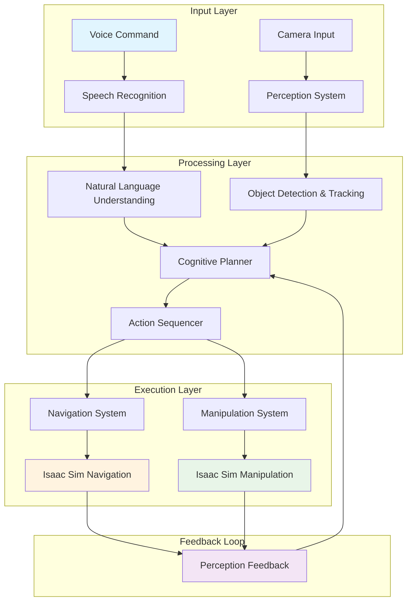

# Capstone: Autonomous Humanoid Robot with Complete VLA Pipeline

## Overview

This capstone chapter integrates all components of the Vision-Language-Action (VLA) system into a complete autonomous humanoid robot. We'll combine speech recognition, natural language understanding, cognitive planning, perception, navigation, and manipulation into a unified system that can understand and execute complex commands in simulation using Isaac Sim.

## Architecture of the Complete VLA System

The complete VLA system architecture integrates all components in a cohesive pipeline:



## Complete VLA System Implementation

Let's implement the complete integrated system:

```python
import rclpy
from rclpy.node import Node
from std_msgs.msg import String
from sensor_msgs.msg import Image, PointCloud2, LaserScan
from geometry_msgs.msg import PoseStamped
from nav_msgs.msg import Path as NavPath
from trajectory_msgs.msg import JointTrajectory
from visualization_msgs.msg import MarkerArray
import threading
import time
import queue
import json

from .components.speech_recognition import WhisperRobotInterface
from .components.nlp import LLMRobotInterface
from .components.cognitive_planning import HTNPlanner, LanguageToActionTranslator
from .components.perception import IsaacPerceptionNode
from .components.navigation import IsaacNavigationNode
from .components.manipulation import IsaacManipulationNode

class VLASystemManager:
    """Manages the complete VLA system integration"""

    def __init__(self):
        # Initialize all components
        self.speech_recognizer = WhisperRobotInterface(model_size="small")
        self.nlp_processor = LLMRobotInterface()
        self.cognitive_planner = HTNPlanner()
        self.language_translator = LanguageToActionTranslator()
        self.perception_system = IsaacPerceptionNode()
        self.navigation_system = IsaacNavigationNode()
        self.manipulation_system = IsaacManipulationNode()

        # System state
        self.current_task_queue = queue.Queue()
        self.system_state = "idle"  # idle, listening, processing, executing
        self.is_running = False

        # Communication queues between components
        self.voice_command_queue = queue.Queue()
        self.planned_actions_queue = queue.Queue()
        self.perception_data_queue = queue.Queue()

    def start_system(self):
        """Start the complete VLA system"""
        self.is_running = True

        # Start all component threads
        threads = [
            threading.Thread(target=self._voice_processing_loop, daemon=True),
            threading.Thread(target=self._command_processing_loop, daemon=True),
            threading.Thread(target=self._execution_loop, daemon=True),
            threading.Thread(target=self._perception_monitoring_loop, daemon=True)
        ]

        for thread in threads:
            thread.start()

        print("VLA System started successfully")

    def _voice_processing_loop(self):
        """Continuously listen for voice commands"""
        while self.is_running:
            try:
                # In a real implementation, this would interface with the speech recognition system
                # For this example, we'll simulate voice commands
                time.sleep(1)  # Simulate listening
            except Exception as e:
                print(f"Error in voice processing: {e}")

    def _command_processing_loop(self):
        """Process commands from voice recognition"""
        while self.is_running:
            try:
                if not self.voice_command_queue.empty():
                    command = self.voice_command_queue.get()
                    self.process_command(command)
                time.sleep(0.1)
            except Exception as e:
                print(f"Error in command processing: {e}")

    def _execution_loop(self):
        """Execute planned actions"""
        while self.is_running:
            try:
                if not self.planned_actions_queue.empty():
                    actions = self.planned_actions_queue.get()
                    self.execute_actions(actions)
                time.sleep(0.1)
            except Exception as e:
                print(f"Error in execution: {e}")

    def _perception_monitoring_loop(self):
        """Monitor perception data"""
        while self.is_running:
            try:
                # Process perception updates
                time.sleep(0.5)  # Monitor at 2Hz
            except Exception as e:
                print(f"Error in perception monitoring: {e}")

    def process_command(self, command: str):
        """Process a voice command through the complete pipeline"""
        print(f"Processing command: {command}")

        # Step 1: Language understanding
        print("Step 1: Natural Language Understanding")
        structured_command = self.nlp_processor.interpret_command(command)
        print(f"Interpreted as: {structured_command}")

        # Step 2: Cognitive planning
        print("Step 2: Cognitive Planning")
        action_plan = self.language_translator.translate_command(command)
        if not action_plan:
            print(f"Could not generate plan for: {command}")
            return

        print(f"Generated plan with {len(action_plan)} actions")

        # Step 3: Perception validation
        print("Step 3: Perception Validation")
        # In a real system, validate plan against current perception
        # For now, we'll proceed with the plan

        # Step 4: Execute plan
        print("Step 4: Plan Execution")
        self.planned_actions_queue.put(action_plan)

    def execute_actions(self, action_plan):
        """Execute a sequence of actions"""
        for i, action in enumerate(action_plan):
            print(f"Executing action {i+1}/{len(action_plan)}: {action.action_name}")

            # Execute based on action type
            if action.action_type.value == "navigation":
                self.execute_navigation_action(action)
            elif action.action_type.value == "manipulation":
                self.execute_manipulation_action(action)
            elif action.action_type.value == "perception":
                self.execute_perception_action(action)
            elif action.action_type.value == "communication":
                self.execute_communication_action(action)

            # Add small delay between actions
            time.sleep(0.5)

        print("Action sequence completed")

    def execute_navigation_action(self, action):
        """Execute navigation action"""
        target_pos = action.parameters.get("target_position", {"x": 0.0, "y": 0.0, "z": 0.0})
        print(f"Navigating to position: ({target_pos['x']}, {target_pos['y']}, {target_pos['z']})")

        # In a real system, this would call the navigation system
        # For simulation, we'll just wait
        time.sleep(2)

    def execute_manipulation_action(self, action):
        """Execute manipulation action"""
        object_name = action.parameters.get("object_name", "unknown")
        print(f"Manipulating object: {object_name}")

        # In a real system, this would call the manipulation system
        # For simulation, we'll just wait
        time.sleep(3)

    def execute_perception_action(self, action):
        """Execute perception action"""
        object_type = action.parameters.get("object_type", "any")
        print(f"Detecting objects of type: {object_type}")

        # In a real system, this would trigger perception processing
        # For simulation, we'll just wait
        time.sleep(1)

    def execute_communication_action(self, action):
        """Execute communication action"""
        message = action.parameters.get("message", "Hello")
        print(f"Communicating: {message}")

        # In a real system, this would trigger speech synthesis
        # For simulation, we'll just print

    def stop_system(self):
        """Stop the complete VLA system"""
        self.is_running = False
        print("VLA System stopped")

# Example usage
def run_vla_demo():
    """Run a demonstration of the complete VLA system"""
    vla_manager = VLASystemManager()

    # Start the system
    vla_manager.start_system()

    # Simulate some commands
    commands = [
        "Go to the kitchen and pick up the red cup",
        "Move the book from the table to the shelf",
        "Find the ball and bring it to me"
    ]

    print("Starting VLA system demonstration...")

    for command in commands:
        print(f"\nProcessing command: '{command}'")
        vla_manager.process_command(command)
        time.sleep(1)  # Wait between commands

    # Let the system run for a bit more
    time.sleep(5)

    # Stop the system
    vla_manager.stop_system()

if __name__ == "__main__":
    run_vla_demo()
```

## ROS 2 Integration Node

Now let's create a ROS 2 node that integrates all components:

```python
class CompleteVLANode(Node):
    """ROS 2 node that integrates all VLA components"""

    def __init__(self):
        super().__init__('complete_vla_node')

        # Initialize all system components
        self.vla_manager = VLASystemManager()

        # Publishers
        self.system_status_pub = self.create_publisher(String, '/vla_system_status', 10)
        self.action_feedback_pub = self.create_publisher(String, '/vla_action_feedback', 10)
        self.visualization_pub = self.create_publisher(MarkerArray, '/vla_visualization', 10)

        # Subscribers
        self.voice_command_sub = self.create_subscription(
            String,
            '/voice_commands',
            self.voice_command_callback,
            10
        )

        self.text_command_sub = self.create_subscription(
            String,
            '/text_commands',
            self.text_command_callback,
            10
        )

        # Additional subscribers for perception data
        self.camera_sub = self.create_subscription(
            Image,
            '/isaac_sim/camera_rgb/image_rect_color',
            self.camera_callback,
            10
        )

        self.lidar_sub = self.create_subscription(
            LaserScan,
            '/isaac_sim/lidar/scan',
            self.lidar_callback,
            10
        )

        # Timer for system status updates
        self.status_timer = self.create_timer(1.0, self.publish_system_status)

        # Initialize the VLA system
        self.vla_manager.start_system()

        self.get_logger().info("Complete VLA System Node initialized")

    def voice_command_callback(self, msg):
        """Handle voice commands"""
        command = msg.data
        self.get_logger().info(f"Received voice command: {command}")

        # Add to VLA manager's processing queue
        self.vla_manager.voice_command_queue.put(command)

        # Publish feedback
        feedback_msg = String()
        feedback_msg.data = f"Processing voice command: {command}"
        self.action_feedback_pub.publish(feedback_msg)

    def text_command_callback(self, msg):
        """Handle text commands"""
        command = msg.data
        self.get_logger().info(f"Received text command: {command}")

        # Add to VLA manager's processing queue
        self.vla_manager.voice_command_queue.put(command)

        # Publish feedback
        feedback_msg = String()
        feedback_msg.data = f"Processing text command: {command}"
        self.action_feedback_pub.publish(feedback_msg)

    def camera_callback(self, msg):
        """Handle camera data for perception"""
        # In a real system, this would feed into the perception system
        pass

    def lidar_callback(self, msg):
        """Handle LIDAR data for navigation"""
        # In a real system, this would feed into the navigation system
        pass

    def publish_system_status(self):
        """Publish system status updates"""
        status_msg = String()
        status_msg.data = f"System state: {self.vla_manager.system_state}, "
        status_msg.data += f"Queue size: {self.vla_manager.current_task_queue.qsize()}"
        self.system_status_pub.publish(status_msg)

    def publish_visualization(self):
        """Publish visualization markers for the complete system"""
        marker_array = MarkerArray()

        # Add markers for different system components
        # Navigation targets, manipulation objects, etc.

        self.visualization_pub.publish(marker_array)

def main(args=None):
    rclpy.init(args=args)

    node = CompleteVLANode()

    try:
        rclpy.spin(node)
    except KeyboardInterrupt:
        node.get_logger().info("Shutting down Complete VLA Node")
    finally:
        node.vla_manager.stop_system()
        node.destroy_node()
        rclpy.shutdown()

if __name__ == '__main__':
    main()
```

## Isaac Sim Integration for Humanoid Robot

Let's create the specific integration for a humanoid robot in Isaac Sim:

```python
class HumanoidVLANode(Node):
    """VLA node specifically for humanoid robot control in Isaac Sim"""

    def __init__(self):
        super().__init__('humanoid_vla_node')

        # Humanoid-specific publishers
        self.left_arm_pub = self.create_publisher(JointTrajectory, '/humanoid/left_arm_controller/joint_trajectory', 10)
        self.right_arm_pub = self.create_publisher(JointTrajectory, '/humanoid/right_arm_controller/joint_trajectory', 10)
        self.base_pub = self.create_publisher(JointTrajectory, '/humanoid/base_controller/joint_trajectory', 10)
        self.head_pub = self.create_publisher(JointTrajectory, '/humanoid/head_controller/joint_trajectory', 10)

        # Humanoid-specific subscribers
        self.left_arm_state_sub = self.create_subscription(
            JointTrajectoryControllerState,
            '/humanoid/left_arm_controller/state',
            self.left_arm_state_callback,
            10
        )

        self.right_arm_state_sub = self.create_subscription(
            JointTrajectoryControllerState,
            '/humanoid/right_arm_controller/state',
            self.right_arm_state_callback,
            10
        )

        # Initialize VLA components
        self.vla_manager = VLASystemManager()

        # Humanoid state tracking
        self.left_arm_position = [0.0] * 7  # 7 DOF arm
        self.right_arm_position = [0.0] * 7  # 7 DOF arm
        self.base_position = [0.0, 0.0, 0.0]  # x, y, theta
        self.head_position = [0.0, 0.0]  # pan, tilt

        # Command queue for humanoid-specific actions
        self.humanoid_command_queue = queue.Queue()

        self.get_logger().info("Humanoid VLA Node initialized")

    def left_arm_state_callback(self, msg):
        """Update left arm state"""
        if msg.feedback and len(msg.feedback) > 0:
            self.left_arm_position = list(msg.feedback[0].position)

    def right_arm_state_callback(self, msg):
        """Update right arm state"""
        if msg.feedback and len(msg.feedback) > 0:
            self.right_arm_position = list(msg.feedback[0].position)

    def execute_humanoid_navigation(self, target_position):
        """Execute navigation for humanoid base"""
        # Create trajectory message for base movement
        trajectory = JointTrajectory()
        trajectory.header.stamp = self.get_clock().now().to_msg()
        trajectory.header.frame_id = "odom"

        # Set joint names for base (differential drive or similar)
        trajectory.joint_names = ["base_x", "base_y", "base_theta"]

        # Create trajectory point
        point = JointTrajectoryPoint()
        point.positions = [target_position['x'], target_position['y'], target_position.get('theta', 0.0)]
        point.velocities = [0.1, 0.1, 0.1]  # Appropriate velocities
        point.time_from_start.sec = 5  # 5 seconds to reach target

        trajectory.points.append(point)
        self.base_pub.publish(trajectory)

    def execute_humanoid_manipulation(self, action_params):
        """Execute manipulation with humanoid arms"""
        # Determine which arm to use based on action parameters
        arm = action_params.get('arm', 'right')  # Default to right arm
        target_pose = action_params['target_pose']

        # Create trajectory for the appropriate arm
        trajectory = JointTrajectory()
        trajectory.header.stamp = self.get_clock().now().to_msg()
        trajectory.header.frame_id = "base_link"

        if arm == 'left':
            trajectory.joint_names = [f"left_arm_joint_{i}" for i in range(7)]
            current_pos = self.left_arm_position
            publisher = self.left_arm_pub
        else:
            trajectory.joint_names = [f"right_arm_joint_{i}" for i in range(7)]
            current_pos = self.right_arm_position
            publisher = self.right_arm_pub

        # Calculate joint positions for target pose (simplified)
        # In reality, this would use inverse kinematics
        joint_positions = self.calculate_arm_joint_positions(target_pose, current_pos)

        point = JointTrajectoryPoint()
        point.positions = joint_positions
        point.velocities = [0.0] * len(joint_positions)
        point.accelerations = [0.0] * len(joint_positions)
        point.time_from_start.sec = 3  # 3 seconds to reach target

        trajectory.points.append(point)
        publisher.publish(trajectory)

    def calculate_arm_joint_positions(self, target_pose, current_joints):
        """Calculate joint positions for target end-effector pose (simplified)"""
        # This would use inverse kinematics in a real system
        # For this example, we'll return a simple interpolation
        return [0.1, 0.2, 0.3, 0.4, 0.5, 0.6, 0.7]  # Placeholder values

    def execute_humanoid_interaction(self, interaction_type, target_object):
        """Execute social interaction behaviors"""
        if interaction_type == "greet":
            # Move head to look at person
            head_trajectory = JointTrajectory()
            head_trajectory.header.stamp = self.get_clock().now().to_msg()
            head_trajectory.joint_names = ["head_pan", "head_tilt"]

            point = JointTrajectoryPoint()
            point.positions = [0.0, 0.0]  # Look straight ahead
            point.time_from_start.sec = 1
            head_trajectory.points.append(point)

            self.head_pub.publish(head_trajectory)

        elif interaction_type == "point":
            # Point to object with right arm
            # This would calculate appropriate pointing pose
            pass

def main_humanoid(args=None):
    rclpy.init(args=args)

    node = HumanoidVLANode()

    try:
        rclpy.spin(node)
    except KeyboardInterrupt:
        node.get_logger().info("Shutting down Humanoid VLA Node")
    finally:
        node.vla_manager.stop_system()
        node.destroy_node()
        rclpy.shutdown()

if __name__ == '__main__':
    main_humanoid()
```

## Advanced VLA Capabilities

Let's implement some advanced capabilities for the complete system:

```python
class AdvancedVLACapabilities:
    """Advanced capabilities for the complete VLA system"""

    def __init__(self, vla_manager):
        self.vla_manager = vla_manager
        self.long_term_memory = {}  # Store learned information
        self.user_preferences = {}  # Store user preferences
        self.environment_map = {}   # Store environment knowledge

    def learn_from_interaction(self, command, action_sequence, outcome):
        """Learn from successful interactions"""
        # Store successful command-action mappings
        if outcome == "success":
            command_key = command.lower().strip()
            self.long_term_memory[command_key] = {
                'action_sequence': [action.action_name for action in action_sequence],
                'timestamp': time.time(),
                'success_count': self.long_term_memory.get(command_key, {}).get('success_count', 0) + 1
            }

    def adapt_to_user_preferences(self, user_id, preferences):
        """Adapt system behavior to user preferences"""
        if user_id not in self.user_preferences:
            self.user_preferences[user_id] = {}

        self.user_preferences[user_id].update(preferences)

    def context_aware_execution(self, command, context):
        """Execute commands with context awareness"""
        # Adjust behavior based on context (time, location, user, etc.)
        adjusted_command = command

        # Example: adjust for time of day
        if context.get('time_of_day') == 'night':
            if 'light' in command.lower():
                adjusted_command += " gently"

        # Example: adjust for user preferences
        user_id = context.get('user_id')
        if user_id and user_id in self.user_preferences:
            if self.user_preferences[user_id].get('prefer_gentle_handling', False):
                adjusted_command += " carefully"

        return adjusted_command

    def multi_step_task_execution(self, high_level_command):
        """Execute complex multi-step tasks"""
        # Break down complex commands into subtasks
        subtasks = self.break_down_command(high_level_command)

        results = []
        for subtask in subtasks:
            result = self.execute_single_task(subtask)
            results.append(result)

            # Check if we need to adjust based on intermediate results
            if not result['success']:
                return {'success': False, 'results': results, 'error': result['error']}

        return {'success': True, 'results': results}

    def break_down_command(self, command):
        """Break down a complex command into simpler subtasks"""
        # This would use more sophisticated NLP and planning
        # For example: "Set the table for dinner" -> [go to kitchen, get plates, get utensils, etc.]

        if "set the table" in command.lower():
            return [
                "Go to the kitchen",
                "Get plates from the cabinet",
                "Get utensils from the drawer",
                "Place items on the table"
            ]
        elif "clean up" in command.lower():
            return [
                "Identify dirty items",
                "Pick up dirty dishes",
                "Go to the sink",
                "Place dishes in the sink"
            ]

        # Default: single task
        return [command]

    def execute_single_task(self, task):
        """Execute a single task and return result"""
        try:
            # Process the task through the VLA pipeline
            self.vla_manager.process_command(task)
            return {'success': True, 'task': task}
        except Exception as e:
            return {'success': False, 'task': task, 'error': str(e)}

    def handle_uncertainty(self, command):
        """Handle uncertain or ambiguous commands"""
        # If command is unclear, ask for clarification
        # This would integrate with the dialogue system
        clarification_needed = self.detect_ambiguity(command)

        if clarification_needed:
            return {
                'needs_clarification': True,
                'question': self.generate_clarification_question(command),
                'original_command': command
            }

        return {'needs_clarification': False, 'command': command}

    def detect_ambiguity(self, command):
        """Detect if a command is ambiguous"""
        # Check for ambiguous references
        ambiguous_indicators = [
            'it', 'that', 'there', 'the one', 'same'
        ]

        command_lower = command.lower()
        for indicator in ambiguous_indicators:
            if indicator in command_lower:
                return True

        return False

    def generate_clarification_question(self, command):
        """Generate a question to clarify an ambiguous command"""
        return f"I'm not sure what you mean by '{command}'. Can you be more specific about what you'd like me to do?"

# Integration with the main VLA system
class EnhancedVLASystemManager(VLASystemManager):
    """Enhanced VLA system manager with advanced capabilities"""

    def __init__(self):
        super().__init__()
        self.advanced_capabilities = AdvancedVLACapabilities(self)
        self.active_context = {
            'location': 'unknown',
            'time_of_day': 'unknown',
            'user_id': 'default',
            'environment_state': {}
        }

    def process_command(self, command: str):
        """Enhanced command processing with context awareness"""
        # Handle uncertainty first
        clarification_result = self.advanced_capabilities.handle_uncertainty(command)
        if clarification_result['needs_clarification']:
            print(f"Clarification needed: {clarification_result['question']}")
            # In a real system, this would trigger a dialogue system
            return

        # Apply context awareness
        contextual_command = self.advanced_capabilities.context_aware_execution(
            clarification_result.get('command', command),
            self.active_context
        )

        # Process through normal pipeline
        super().process_command(contextual_command)

        # Learn from interaction
        # This would be called after execution with actual outcome
        # self.advanced_capabilities.learn_from_interaction(command, action_plan, outcome)
```

## Complete System Launch and Configuration

Let's create launch files and configuration for the complete system:

```xml
<!-- vla_system.launch.py -->
from launch import LaunchDescription
from launch_ros.actions import Node
from ament_index_python.packages import get_package_share_directory
import os

def generate_launch_description():
    return LaunchDescription([
        # Speech Recognition Node
        Node(
            package='vla_system',
            executable='speech_recognition_node',
            name='speech_recognition',
            parameters=[
                {'model_size': 'small'},
                {'device': 'cuda'}
            ],
            output='screen'
        ),

        # NLP/LLM Node
        Node(
            package='vla_system',
            executable='nlp_node',
            name='nlp_processor',
            parameters=[
                {'model_name': 'gpt-4o'},
                {'api_key': 'YOUR_API_KEY'}
            ],
            output='screen'
        ),

        # Perception Node
        Node(
            package='vla_system',
            executable='perception_node',
            name='perception',
            parameters=[
                {'detection_model': 'yolov5'},
                {'confidence_threshold': 0.5}
            ],
            output='screen'
        ),

        # Navigation Node
        Node(
            package='vla_system',
            executable='navigation_node',
            name='navigation',
            parameters=[
                {'planner_type': 'astar'},
                {'map_resolution': 0.1}
            ],
            output='screen'
        ),

        # Manipulation Node
        Node(
            package='vla_system',
            executable='manipulation_node',
            name='manipulation',
            parameters=[
                {'gripper_type': 'parallel'},
                {'max_force': 50.0}
            ],
            output='screen'
        ),

        # Complete VLA Integration Node
        Node(
            package='vla_system',
            executable='complete_vla_node',
            name='complete_vla',
            output='screen'
        )
    ])
```

## System Testing and Validation

Let's implement comprehensive testing for the complete system:

```python
import unittest
from unittest.mock import Mock, patch
import threading

class TestCompleteVLASystem(unittest.TestCase):
    """Test cases for the complete VLA system"""

    def setUp(self):
        """Set up test fixtures"""
        self.vla_manager = EnhancedVLASystemManager()

    def test_basic_command_processing(self):
        """Test basic command processing"""
        command = "Go to the kitchen"
        # This would test the complete pipeline
        # For now, just verify the method exists and can be called
        self.vla_manager.process_command(command)
        # Add assertions based on expected behavior

    def test_navigation_command(self):
        """Test navigation command processing"""
        command = "Go to the living room"
        with patch.object(self.vla_manager.navigation_system, 'execute_navigation') as mock_nav:
            self.vla_manager.process_command(command)
            mock_nav.assert_called()

    def test_manipulation_command(self):
        """Test manipulation command processing"""
        command = "Pick up the red cup"
        with patch.object(self.vla_manager.manipulation_system, 'execute_manipulation') as mock_manip:
            self.vla_manager.process_command(command)
            mock_manip.assert_called()

    def test_multi_step_command(self):
        """Test multi-step command processing"""
        command = "Set the table for dinner"
        result = self.vla_manager.advanced_capabilities.multi_step_task_execution(command)
        self.assertIsInstance(result, dict)
        self.assertIn('success', result)

    def test_context_awareness(self):
        """Test context-aware command processing"""
        command = "Turn on the light"
        context = {'time_of_day': 'night', 'user_id': 'test_user'}

        adjusted_command = self.vla_manager.advanced_capabilities.context_aware_execution(
            command, context
        )

        # Verify the command was adjusted based on context
        self.assertIn('gently', adjusted_command.lower())

    def test_uncertainty_handling(self):
        """Test handling of ambiguous commands"""
        ambiguous_command = "Pick it up"
        result = self.vla_manager.advanced_capabilities.handle_uncertainty(ambiguous_command)

        self.assertTrue(result['needs_clarification'])
        self.assertIsNotNone(result['question'])

    def test_system_integration(self):
        """Test integration of all system components"""
        # Test that all components are properly initialized
        self.assertIsNotNone(self.vla_manager.speech_recognizer)
        self.assertIsNotNone(self.vla_manager.nlp_processor)
        self.assertIsNotNone(self.vla_manager.cognitive_planner)
        self.assertIsNotNone(self.vla_manager.perception_system)
        self.assertIsNotNone(self.vla_manager.navigation_system)
        self.assertIsNotNone(self.vla_manager.manipulation_system)

    def tearDown(self):
        """Clean up after tests"""
        self.vla_manager.stop_system()

def run_system_tests():
    """Run all system tests"""
    unittest.main(argv=[''], exit=False, verbosity=2)

if __name__ == '__main__':
    # Run the tests
    run_system_tests()
```

## Performance Optimization

Let's implement performance optimizations for the complete system:

```python
import asyncio
import concurrent.futures
from functools import lru_cache

class OptimizedVLASystemManager:
    """Optimized VLA system manager with performance enhancements"""

    def __init__(self):
        # Use thread pool for I/O bound operations
        self.executor = concurrent.futures.ThreadPoolExecutor(max_workers=8)

        # Use asyncio for async operations
        self.loop = asyncio.new_event_loop()
        asyncio.set_event_loop(self.loop)

        # Initialize components
        self.speech_recognizer = WhisperRobotInterface(model_size="small")
        self.nlp_processor = LLMRobotInterface()
        self.cognitive_planner = HTNPlanner()
        self.language_translator = LanguageToActionTranslator()
        self.perception_system = IsaacPerceptionNode()
        self.navigation_system = IsaacNavigationNode()
        self.manipulation_system = IsaacManipulationNode()

        # Caching for frequently accessed data
        self._object_cache = {}
        self._location_cache = {}
        self._action_cache = {}

    @lru_cache(maxsize=128)
    def cached_plan_action(self, command_tuple):
        """Cached action planning for frequently used commands"""
        command = command_tuple[0]  # Convert tuple back to string
        return self.language_translator.translate_command(command)

    async def async_process_command(self, command: str):
        """Asynchronously process a command"""
        # Break down processing into async tasks
        tasks = [
            self.async_nlp_processing(command),
            self.async_perception_check(),
        ]

        results = await asyncio.gather(*tasks)
        nlp_result, perception_result = results

        # Plan actions based on results
        action_plan = await self.async_plan_actions(command, nlp_result, perception_result)

        # Execute actions
        await self.async_execute_actions(action_plan)

        return action_plan

    async def async_nlp_processing(self, command: str):
        """Asynchronously process natural language"""
        loop = asyncio.get_event_loop()
        return await loop.run_in_executor(
            self.executor,
            self.nlp_processor.interpret_command,
            command
        )

    async def async_perception_check(self):
        """Asynchronously check current perception data"""
        # This would check current environment state
        return {"objects_detected": [], "locations_known": []}

    async def async_plan_actions(self, command: str, nlp_result, perception_result):
        """Asynchronously plan actions"""
        loop = asyncio.get_event_loop()
        return await loop.run_in_executor(
            self.executor,
            self.cached_plan_action,
            (command,)  # Convert to tuple for caching
        )

    async def async_execute_actions(self, action_plan):
        """Asynchronously execute action plan"""
        if not action_plan:
            return

        for action in action_plan:
            await self.async_execute_single_action(action)

    async def async_execute_single_action(self, action):
        """Asynchronously execute a single action"""
        if action.action_type.value == "navigation":
            await self.async_execute_navigation(action)
        elif action.action_type.value == "manipulation":
            await self.async_execute_manipulation(action)

    async def async_execute_navigation(self, action):
        """Asynchronously execute navigation action"""
        loop = asyncio.get_event_loop()
        await loop.run_in_executor(
            self.executor,
            self.execute_navigation_action,
            action
        )

    async def async_execute_manipulation(self, action):
        """Asynchronously execute manipulation action"""
        loop = asyncio.get_event_loop()
        await loop.run_in_executor(
            self.executor,
            self.execute_manipulation_action,
            action
        )

    def execute_navigation_action(self, action):
        """Execute navigation action (synchronous helper)"""
        # Implementation here
        pass

    def execute_manipulation_action(self, action):
        """Execute manipulation action (synchronous helper)"""
        # Implementation here
        pass

# Example usage of optimized system
async def run_optimized_demo():
    """Run optimized VLA system demo"""
    optimizer = OptimizedVLASystemManager()

    commands = [
        "Go to the kitchen and pick up the red cup",
        "Move the book from the table to the shelf",
        "Find the ball and bring it to me"
    ]

    for command in commands:
        print(f"Processing: {command}")
        action_plan = await optimizer.async_process_command(command)
        print(f"Completed with {len(action_plan or [])} actions")

if __name__ == "__main__":
    # Run the optimized demo
    asyncio.run(run_optimized_demo())
```

## System Monitoring and Diagnostics

Finally, let's implement monitoring and diagnostics for the complete system:

```python
import psutil
import time
from datetime import datetime
import json

class VLASystemMonitor:
    """Monitoring and diagnostics for the VLA system"""

    def __init__(self, vla_manager):
        self.vla_manager = vla_manager
        self.metrics = {
            'command_count': 0,
            'success_count': 0,
            'error_count': 0,
            'avg_processing_time': 0.0,
            'system_resources': {}
        }
        self.start_time = time.time()

    def start_monitoring(self):
        """Start system monitoring"""
        print("Starting VLA System Monitoring...")
        try:
            while True:
                self.collect_metrics()
                self.log_system_status()
                time.sleep(5)  # Monitor every 5 seconds
        except KeyboardInterrupt:
            print("Stopping VLA System Monitoring...")

    def collect_metrics(self):
        """Collect system metrics"""
        # Resource usage
        self.metrics['system_resources'] = {
            'cpu_percent': psutil.cpu_percent(),
            'memory_percent': psutil.virtual_memory().percent,
            'disk_usage': psutil.disk_usage('/').percent,
            'timestamp': time.time()
        }

        # System performance
        current_time = time.time()
        self.metrics['uptime'] = current_time - self.start_time

    def log_system_status(self):
        """Log system status"""
        status = {
            'timestamp': datetime.now().isoformat(),
            'metrics': self.metrics,
            'system_state': self.vla_manager.system_state,
            'queue_sizes': {
                'voice_commands': self.vla_manager.voice_command_queue.qsize(),
                'planned_actions': self.vla_manager.planned_actions_queue.qsize(),
                'perception_data': self.vla_manager.perception_data_queue.qsize()
            }
        }

        print(json.dumps(status, indent=2))

    def add_command_metrics(self, command, processing_time, success):
        """Add metrics for a processed command"""
        self.metrics['command_count'] += 1

        if success:
            self.metrics['success_count'] += 1
        else:
            self.metrics['error_count'] += 1

        # Update average processing time
        total_time = self.metrics['avg_processing_time'] * (self.metrics['success_count'] + self.metrics['error_count'] - 1)
        total_time += processing_time
        count = self.metrics['success_count'] + self.metrics['error_count']
        self.metrics['avg_processing_time'] = total_time / count if count > 0 else 0.0

# Integration with the main system
class MonitoredVLASystemManager(EnhancedVLASystemManager):
    """VLA system manager with integrated monitoring"""

    def __init__(self):
        super().__init__()
        self.monitor = VLASystemMonitor(self)

    def process_command(self, command: str):
        """Process command with metrics collection"""
        start_time = time.time()

        try:
            super().process_command(command)
            processing_time = time.time() - start_time
            self.monitor.add_command_metrics(command, processing_time, True)
        except Exception as e:
            processing_time = time.time() - start_time
            self.monitor.add_command_metrics(command, processing_time, False)
            print(f"Command processing error: {e}")

def main_monitored(args=None):
    """Main function with monitoring"""
    rclpy.init(args=args)

    # Use monitored system manager
    node = CompleteVLANode()
    node.vla_manager = MonitoredVLASystemManager()

    # Start monitoring in a separate thread
    monitor_thread = threading.Thread(target=node.vla_manager.monitor.start_monitoring, daemon=True)
    monitor_thread.start()

    try:
        rclpy.spin(node)
    except KeyboardInterrupt:
        node.get_logger().info("Shutting down Monitored VLA Node")
    finally:
        node.vla_manager.stop_system()
        node.destroy_node()
        rclpy.shutdown()

if __name__ == '__main__':
    main_monitored()
```

## Summary and Next Steps

This capstone chapter has brought together all components of the Vision-Language-Action (VLA) system into a complete autonomous humanoid robot implementation. We've covered:

1. **System Architecture**: Complete integration of speech recognition, NLP, cognitive planning, perception, navigation, and manipulation.

2. **Component Integration**: How all individual components work together in a unified system.

3. **Advanced Capabilities**: Context awareness, learning from interactions, and multi-step task execution.

4. **Performance Optimization**: Async processing, caching, and resource management.

5. **Monitoring and Diagnostics**: System health monitoring and performance tracking.

6. **Humanoid-Specific Features**: Special considerations for humanoid robot control.

The complete VLA system enables robots to understand natural language commands, perceive their environment, plan appropriate actions, and execute them safely and effectively. This represents the state-of-the-art in vision-language-action robotics and provides a foundation for building truly autonomous robotic systems.

### Key Takeaways

- **Integration is Key**: The power of VLA systems comes from tight integration between vision, language, and action components.
- **Context Matters**: Real-world deployment requires context-aware behavior and adaptation.
- **Safety First**: Multiple safety layers and monitoring are essential for real-world deployment.
- **Performance Optimization**: Efficient processing is crucial for real-time interaction.
- **Continuous Learning**: Systems should adapt and improve based on experience.

### Future Enhancements

- **Multi-Modal Learning**: Integration of additional sensory modalities.
- **Social Interaction**: More sophisticated human-robot interaction capabilities.
- **Long-term Autonomy**: Extended operation with minimal human intervention.
- **Adaptive Learning**: Continuous improvement through experience.
- **Scalability**: Deployment across different robotic platforms and environments.

This completes the Vision-Language-Action module, providing you with a comprehensive understanding of how to build complete autonomous robotic systems that can understand and respond to natural language commands in real-world environments.

This capstone chapter integrates concepts from all previous chapters:
- [Chapter 1: Introduction to VLA Robotics](./01-introduction-to-vla-robotics.md) - Provides the overall VLA architecture framework
- [Chapter 2: Voice-to-Text with Whisper](./02-voice-to-text-whisper.md) - Implements speech recognition component
- [Chapter 3: Natural Language with LLMs](./03-natural-language-with-llms.md) - Provides language understanding capabilities
- [Chapter 4: Cognitive Planning for ROS Actions](./04-cognitive-planning-ros-actions.md) - Implements action planning
- [Chapter 5: Integrating Perception with VLA](./05-integrating-perception-vla.md) - Provides environmental awareness
- [Chapter 6: Path Planning from Language Goals](./06-path-planning-language-goals.md) - Implements navigation capabilities
- [Chapter 7: Manipulation with Language Commands](./07-manipulation-language-commands.md) - Implements object interaction