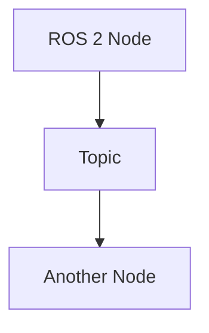

# Quickstart: ROS 2 Book Module 1 - The Robotic Nervous System

## Prerequisites

- Node.js v18 or higher
- npm or yarn package manager
- Git for version control
- ROS 2 Humble Hawksbill installed (for testing code examples)
- Python 3.8+ (for ROS 2 rclpy examples)

## Setup Instructions

1. **Initialize Docusaurus Project**
   ```bash
   npx create-docusaurus@latest physical-ai-book classic --typescript
   cd physical-ai-book
   ```

2. **Install Additional Dependencies**
   ```bash
   npm install --save-dev @docusaurus/module-type-aliases @docusaurus/tsconfig @docusaurus/preset-classic
   ```

3. **Create Module Directory Structure**
   ```bash
   mkdir -p docs/module-1-robotic-nervous-system
   ```

4. **Create Module Category Configuration**
   Create `docs/module-1-robotic-nervous-system/category.json`:
   ```json
   {
     "label": "Module 1: The Robotic Nervous System (ROS 2)",
     "position": 1,
     "link": {
       "type": "generated-index",
       "description": "Mastering ROS 2 as the foundational middleware for controlling humanoid robots"
     }
   }
   ```

5. **Add Chapter Files**
   Create the 8 chapter files in the module directory:
   - `01-introduction-to-ros2.md`
   - `02-core-concepts-nodes-topics-messages.md`
   - `03-services-and-actions.md`
   - `04-parameters-and-dynamic-configuration.md`
   - `05-launch-files-and-composing-systems.md`
   - `06-urdf-fundamentals.md`
   - `07-bridging-python-ai-agents-with-rclpy.md`
   - `08-debugging-visualization-best-practices.md`

6. **Update Sidebar Configuration**
   Add the module to `sidebars.js`:
   ```javascript
   module.exports = {
     tutorial: [
       {
         type: 'category',
         label: 'Module 1: The Robotic Nervous System (ROS 2)',
         items: [
           'module-1-robotic-nervous-system/01-introduction-to-ros2',
           'module-1-robotic-nervous-system/02-core-concepts-nodes-topics-messages',
           'module-1-robotic-nervous-system/03-services-and-actions',
           'module-1-robotic-nervous-system/04-parameters-and-dynamic-configuration',
           'module-1-robotic-nervous-system/05-launch-files-and-composing-systems',
           'module-1-robotic-nervous-system/06-urdf-fundamentals',
           'module-1-robotic-nervous-system/07-bridging-python-ai-agents-with-rclpy',
           'module-1-robotic-nervous-system/08-debugging-visualization-best-practices',
         ],
       },
     ],
   };
   ```

7. **Start Development Server**
   ```bash
   npm start
   ```

## Chapter Template

Each chapter should follow this template:

```markdown
---
title: [Chapter Title]
description: [Brief description of chapter content]
---

# [Chapter Title]

[Content with 800-1500 words]

## Code Example

```python
# ROS 2 Python example
import rclpy
from rclpy.node import Node

class MinimalPublisher(Node):
    def __init__(self):
        super().__init__('minimal_publisher')
        # Implementation details
```

## Diagram



```

## Building for Production

```bash
npm run build
```

The static site will be generated in the `build/` directory and ready for deployment to GitHub Pages.