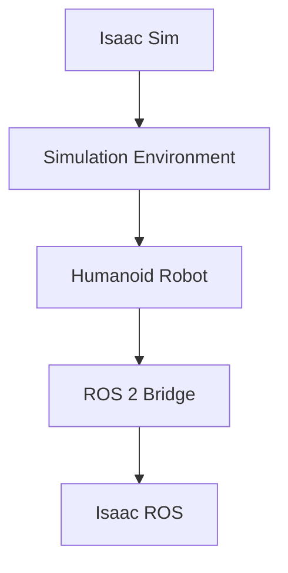

# Template Title

## Overview

## Section 1

## Section 2

## Code Examples

```python
# Example Python code
print("Hello Isaac Sim!")
```

```yaml
# Example YAML configuration
example_config:
  param1: value1
  param2: value2
```

```usd
# Example USD code
#usda 1.0
(
    doc = "Example USD scene"
    metersPerUnit = 1
)

def Xform "World"
{
    # Add your USD content here
}
```

## Mermaid Diagram



## Summary
